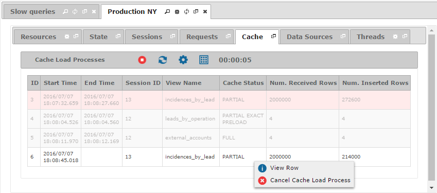

==================
Monitoring - Cache
==================

The “Cache” tab displays the
last load processes of the cache on the Virtual DataPort server. Those rows that
are blurred refer to load processes that have already
finished. If there was a problem loading the cache, its corresponding
row will appear in red.

   Cache tab of a monitored server

To interrupt an ongoing load process, right-click on it and click
|image0| **Cancel Cache Load Process**.

The fields that are available in the “Cache Load Processes” table are:

-  **ID**: Unique identifier of the cache load process.
-  **Start Time**: Moment at which the cache load process started.
-  **End Time**: Instant when the cache load process ended.
-  **Duration**: Number of milliseconds between the start and end time
   for the cache load process.
-  **Session ID**: Identifier of the session that this cache load
   process belongs to.
-  **VDP Database**: Name of the Virtual DataPort database that the
   cached view belongs to.
-  **View Name**: Name of the Virtual DataPort view whose data is loaded
   in cache.
-  **SQL View Name**: Name of the SQL table where the data is stored.
-  **Cache Status**: Mode of the cache, which can be one of the
   following values: ``OFF``, ``PARTIAL``, ``PARTIAL_EXACT``,
   ``PARTIAL_PRELOAD``, ``PARTIAL_EXACT_PRELOAD`` and ``FULL``.
-  **Query Pattern ID**: Identifier of the query pattern. A query
   pattern represents the queries that can be resolved with the cached
   data.
-  **Query Pattern State**: State of the query pattern, which can take
   one of the following values: ``PROCESSING``, ``VALID`` or
   ``INVALID``.
-  **Num. Received Rows**: Number of rows that have been inserted in the
   cache so far.
-  **Num. Inserted Rows**: Number of rows returned by the query and that
   have to be inserted in the cache.
-  **Conditions**: List of conditions in the query.
-  **Num. Conditions**: Number of conditions of the executed query.
-  **Projected Fields**: List of fields projected by the query.
-  **TTL Status**: Status of the ``TTL`` configuration. It has one of
   the following values: ``CUSTOM``, ``DEFAULT`` or ``NOEXPIRE``.
-  **TTL**: Time to live (in seconds) of the data stored by the cache
   load process.
-  **Exception**: Cause of the problem, if there was a problem while
   inserting data into the cache.

.. |image0| image:: ../../common_images/cancel.png

