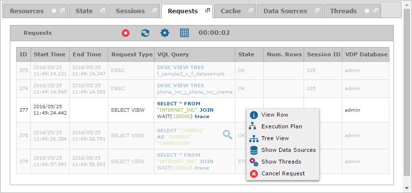

=====================
Monitoring - Requests
=====================

The “Requests” tab
displays information about the last requests processed by the Virtual
DataPort server. The blurred rows represent queries that finished.

   Requests tab of a monitored server

Right-click on a row to:

-  |execution_plan| **Execution Plan**: Displays the execution plan of the query in a
   new tab. You can click on each node of the execution plan to inspect the
   runtime information about it. This option is only available for requests of
   type ``SELECT VIEW``, ``SELECT BASE VIEW``, ``CALL PROCEDURE``, ``QUERY
   WRAPPER``, ``SELECT INTO``, ``INSERT INTO``  or ``CREATE REMOTE TABLE``.

   .. figure:: MonitoringAndDiagnosticTool-65.png
      :align: center
      :alt: Execution plan tab of a request
      :name: Execution plan tab of a request

      Execution plan tab of a request

-  |tree_view| **Tree View**: Opens a new tab with the tree view of the query, a
   static picture of the view dependencies of a query. The result of this action
   depends on the privileges
   :ref:`the user account set on the server <dmt-creating-servers>` has over the
   views that participate in the query and on their dependencies. This option is
   only available for requests of type ``SELECT VIEW`` or ``SELECT BASE VIEW``.

   .. figure:: MonitoringAndDiagnosticTool-66.png
      :align: center
      :alt: Tree view tab of a request
      :name: Tree view tab of a request

      Tree view tab of a request

-  |database| **Show Data Sources**: Displays in a new tab information about the
   data sources that participate in the query. This option is only available for
   requests of type ``SELECT VIEW``, ``SELECT BASE VIEW``, ``QUERY WRAPPER``,
   ``SELECT INTO``, ``INSERT INTO`` or ``CREATE REMOTE TABLE``.

-  |threads| **Show Threads**: Displays in a new tab information about the
   threads that participate in the query and a graph with the query CPU usage.
   This option is only available for active requests of type
   ``SELECT VIEW``, ``SELECT BASE VIEW``, ``CALL PROCEDURE``, ``QUERY WRAPPER``,
   ``SELECT INTO``, ``INSERT INTO`` or ``CREATE REMOTE TABLE``.

   .. figure:: moniroring-query-cpu.png
      :align: center
      :alt: Threads tab of a request
      :name: Threads tab of a request

      Threads tab of a request

-  |cancel| **Cancel Request**: Stops the request. This option is only available
   for active requests of type ``SELECT VIEW``, ``SELECT BASE VIEW``,
   ``CALL PROCEDURE``, ``QUERY WRAPPER``, ``SELECT INTO``, ``INSERT INTO`` or
   ``CREATE REMOTE TABLE``.

The fields that are available in the “Requests” table are:

-  **ID**: Unique identifier of the request.
-  **Start Time**: Moment at which the request was started.
-  **End Time**: Instant when the request ended.
-  **Duration**: Number of milliseconds between the start and end time
   for the request.
-  **Request Type**: Type of statement. It can take the following
   values: ``ALTER``, ``BEGIN``, ``CALL PROCEDURE``, ``CLOSE``,
   ``COMMIT``, ``CONNECT``, ``CREATE``, ``CREATE REMOTE TABLE``,
   ``DELETE``, ``DEPLOY``, ``DESC``,
   ``DESC SOURCE``, ``DROP``, ``EXPORT``, ``HELP``, ``INSERT``, ``INSERT INTO``,
   ``LIST``, ``QUERY WRAPPER``, ``REDEPLOY``, ``ROLLBACK``,
   ``SELECT BASE VIEW``, ``SELECT INTO``, ``SELECT VIEW``, ``SET``, ``SHOW``,
   ``UNDEPLOY``, ``UNKNOWN``, ``UPDATE``, ``UPDATE SCRIPTS``,
   ``USER MODE``, ``VCS`` and ``WEBCONTAINER``.
-  **VQL Query**: VQL code for the statement.
-  **State**: State of the top node of the execution plan. Find the
   possible values of this attribute in the table :ref:`Values of the "State"
   attribute of the nodes of a query's execution trace` of the
   Administration Guide.
-  **Uses Cache**: ``true`` if the query has accessed the cache during
   its execution; ``false`` otherwise.
-  **Num. Rows**: Number of rows returned by the query.
-  **Waiting Time**: Number of milliseconds the query was waiting in the
   queue of queries before the Virtual DataPort server began executing
   it.
-  **Elements**: Name of the views and/or stored procedures referenced
   in the query and the database to which the views/stored procedures belong.
   This property has the format "<database name of the view/stored procedure>"."<name of the view/stored procedure>".
-  **Session ID**: Identifier of the session that this request belongs
   to.
-  **VDP Database**: Name of the Virtual DataPort database on which the
   statement is executed.
-  **User**: Name of the user running the statement.
-  **Access Interface**: Type of client that performed the request. The
   possible values of this attribute are: ``Diagnostic-Monitoring-Tool``,
   ``ITP``, ``JDBC``, ``JMS``, ``JMX``, ``ODATA``, ``ODBC``, ``PORTLET``,
   ``SCHED``, ``Solution-Manager``, ``VDP``, ``VDP-AdminTool``, ``WS-REST``,
   ``WS-REST-Generic`` and ``WS-SOAP``.
-  **User Agent**: Name of the application that opens the session that
   this request belongs to.
-  **Client IP**: IP address of the client that execute the statement.
   In case of web services, this is the IP address of the final client.
-  **Web Service**: Name of the web service, following the pattern
   "<database name>"."<web service name>" (only for SOAP or REST Web services).
-  **Transaction ID**: Identifier of the transaction that this request
   belongs to (only if the statement is executed inside a transaction).

.. |cancel| image:: ../../common_images/cancel.png

