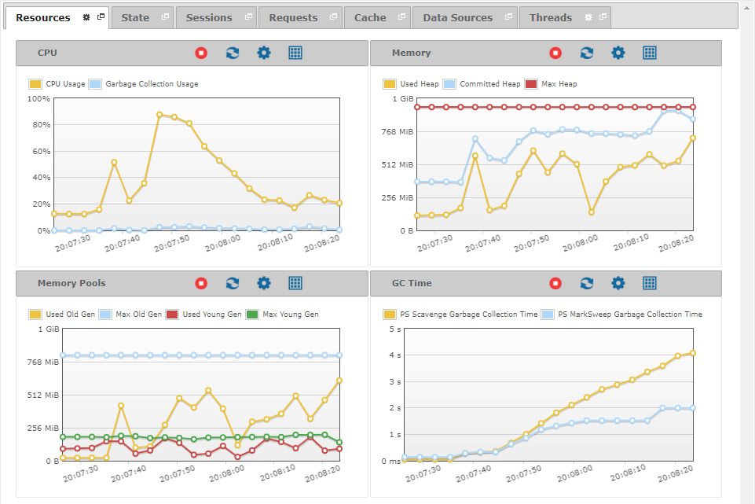

======================
Monitoring - Resources
======================

The “Resources” tab
displays the status of the resources of the Virtual DataPort server:
CPU, memory and garbage collector.

   Resources tab of a monitored server

Before explaining all the measures in the tab, you need to understand
the following concepts:

-  Heap Memory: Runtime data area maintained by the JVM where the memory
   is allocated dynamically.
-  Garbage Collector: Automatic memory management system that reclaims
   unused memory from the heap region.
-  Memory Pool: Memory area in which the JVM divides the memory
   according to the times their content has survived a garbage
   collection. The region that has survived several garbage collections
   is called “Old Generation Memory Pool”; otherwise, it is called
   “Young Generation Memory Pool” [#f1]_. Each pool has its own garbage
   collection algorithm.

The measures displayed in the “Resources” tab are:

-  **CPU Usage**: Percentage of usage of the CPU.
-  **Garbage Collection Usage**: Percentage of usage of the garbage
   collector.
-  **Used Heap**: Amount of heap memory (in MB) occupied with actual
   data.
-  **Committed Heap**: Amount of heap memory (in MB) reserved by the
   JVM.
-  **Max Heap**: Maximum amount of heap memory (in MB) that can be used.
-  **Used Old Gen**: Amount of memory (in MB) in the old generation pool
   occupied with actual data.
-  **Max Old Gen**: Maximum amount of memory (in MB) in the old
   generation pool that can be used.
-  **Used Young Gen**: Amount of memory (in MB) in the young generation
   pool occupied with actual data.
-  **Max Young Gen**: Maximum amount of memory (in MB) in the young
   generation pool that can be used.
-  **Old Gen Collection Time**: Accumulated time (in milliseconds) the
   garbage collection has elapsed in the old generation pool.
-  **Young Gen Collection Time**: Accumulated time (in milliseconds) the
   garbage collection has elapsed in the young generation pool.
-  **Old Gen Collection Usage**: Percentage of usage of the garbage
   collection in the old generation pool.
-  **Young Gen Collection Usage**: Percentage of usage of the garbage
   collection in the young generation pool.
-  **Old Gen Collection Count**: Number of times the garbage collection
   has occurred in the old generation pool.
-  **Young Gen Collection Count**: Number of times the garbage
   collection has occurred in the young generation pool.

--------------

.. rubric:: Footnotes

.. [#f1] The JVM can manage several young generation pools, like “Eden space”
   and “Survivor space”. The Diagnostic & Monitoring Tool considers the sum
   of all of them.
