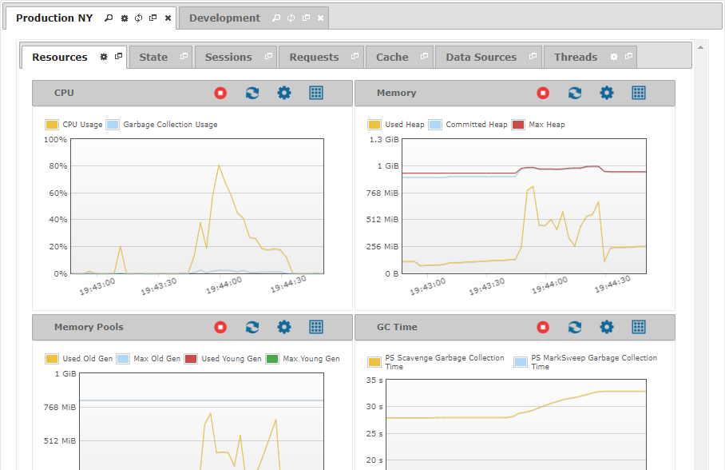

==================
Monitoring Servers
==================

.. toctree::
   :hidden:

   monitoring_resources.rst
   monitoring_state.rst
   monitoring_sessions.rst
   monitoring_requests.rst
   monitoring_cache.rst
   monitoring_data_sources.rst
   monitoring_threads.rst

To start monitoring a server, double-click its name in the tree area.
The Tool will open a new tab with real-time information of that server.

   Monitoring a server

This management information is displayed in the time zone of the
monitored server. Because of this, the Diagnostic & Monitoring Tool has
to read the :ref:`default i18n <Configuring the Default Internationalization>`
of the monitored server before start monitoring it.

There are a set of icons located at the tab of a monitored server:

-  |magnifying-glass|: Shows information about the Virtual DataPort server.
-  |tab-tool|: Displays a menu to start |play| and stop |stop| monitoring the Server.
-  |reload|: Reloads the whole tab restarting the monitoring of the server. The existing monitoring data will be lost.
-  |detach|: Opens the tab in a new window.
-  |close|: Closes the tab and stops monitoring the server.
-  |warning|: Warns that the Diagnostic & Monitoring tool cannot connect to that server. It will disappear as soon as it can reestablish the connection. Meanwhile, its graphs and tables are disabled, so the polling of new data stops.

The tabs with management information about the whole server (resources,
requests, threads…) are fixed and cannot be closed. However, you can
open new tabs that display parameterized information, like the active
requests of a particular session for instance. Notice that these tabs
count with the following icons:

-  |magnifying-glass|: Shows information about the parameter of the tab.

-  |edit|: Allows you to change the name of the tab.

.. |magnifying-glass| image:: ../../common_images/magnifying_glass.png

.. |reload| image:: ../../common_images/reload.png
.. |detach| image:: ../../common_images/new_window.png
.. |close| image:: ../../common_images/close.png

.. |edit| image:: ../../common_images/pen.png
