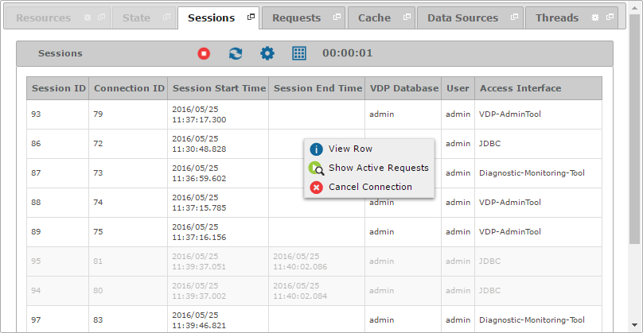

=====================
Monitoring - Sessions
=====================

The “Sessions” tab displays the last opened connections and sessions to the Virtual
DataPort server. The blurred rows are sessions that the user closed or were
closed by an administrator.

   Sessions tab of a monitored server

Right-click on a row to:

-  |image0| **Show Active Requests**: Opens a new tab that lists the active requests of that session.
-  |image1| **Cancel Connection**: Closes the connection, its sessions and the requests started from these sessions.

The fields that are available in the “Sessions” table are:

-  **Session ID**: Unique identifier of the session.
-  **Connection ID**: Identifier of the connection that the session
   belongs to.
-  **Connection Start Time**: Moment at which the connection was opened.
-  **Connection End Time**: Instant when the connection ended.
-  **Session Start Time**: Moment at which the session started.
-  **Session End Time**: Instant when the session ended.
-  **VDP Database**: Name of the Virtual DataPort database that the user
   is connected to.
-  **User**: User name of the client.
-  **Access Interface**: Type of client connected to the Server. The
   possible values of this attribute are: ``Diagnostic-Monitoring-Tool``,
   ``ITP``, ``JDBC``, ``JMS``, ``JMX``, ``ODATA``, ``ODBC``, ``PORTLET``,
   ``SCHED``, ``Solution-Manager``, ``VDP``, ``VDP-AdminTool``, ``WS-REST``, 
   ``WS-REST-Generic`` and ``WS-SOAP``.
-  **User Agent**: Name of the application that opens the connection
   that this session belongs to.
-  **Client IP**: IP address of the client. In case of web services,
   this is the IP address of the final client, i.e. the one that sends
   the HTTP request.
-  **Intermediate Client IP**: IP address where the service is running
   (only for SOAP, REST and the global RESTful Web service).
-  **JMS Queue**: Name of the JMS queue where the query is being sent
   from (only for JMS connections).
-  **Web Service**: Name of the web service, following the pattern
   "<database name>"."<web service name>" (only for SOAP or REST Web services).

