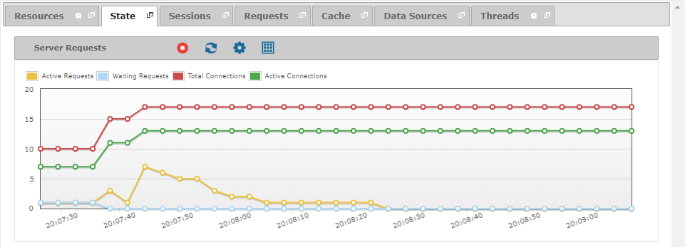

==================
Monitoring - State
==================

The “State” tab displays the
connections and requests managed by the Virtual DataPort server.

   State tab of a monitored server

The measures displayed in the “State” tab are:

-  **Active Requests**: Number of requests that the server is currently
   executing.
-  **Waiting Requests**: Number of requests that are waiting to be
   executed.
-  **Total Connections**: Number of connections established with the
   server, since it was started.
-  **Active Connections**: Number of currently opened connections with
   the server.

