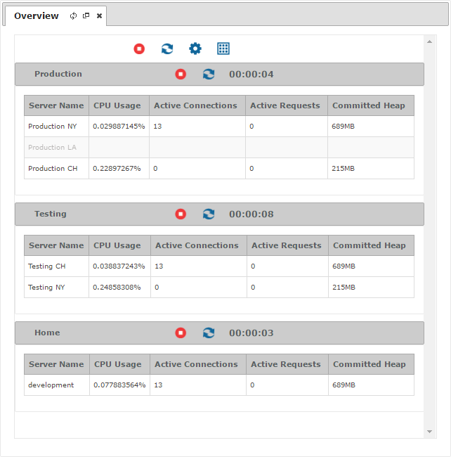

========
Overview
========

You can see an overview of all the monitored servers and environments in
the *Overview* tab. To open it, double-click on |image0| or click
**Options** > **Overview**.

   Overview of all the monitored servers and environments

The “Overview” tab displays a table for each defined environment in the
tree area where the rows are each one of its servers. An extra table
includes all the servers that do not belong to any environment. As the
rest of tables, you can select which measures to monitor in each table
and they will automatically refresh its content.

The servers that are unreachable are displayed as blurred rows.

You can find a detailed explanation of the fields in the tables on
the sections :ref:`Monitoring - Resources` and :ref:`Monitoring - State`.

.. |image0| image:: ../../common_images/home.png

