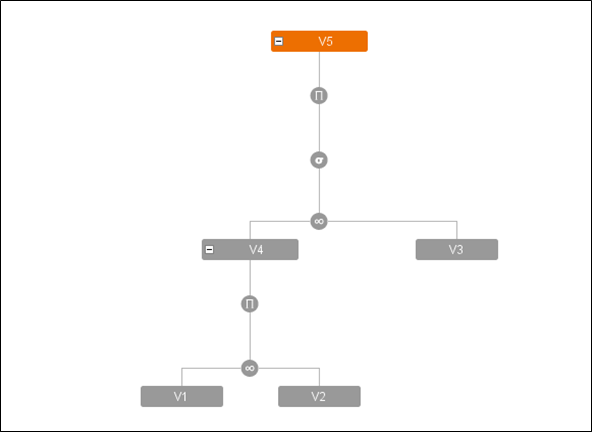

===============================
Dynamic Choice of Join Strategy
===============================

When a query that uses derived views in its ``FROM`` clause, is executed
and the definition of these views involves join operations, it is
possible to dynamically specify an execution strategy for each operation
(which changes the strategy specified when the view was created, only
for this specific query).

To dynamically choose the join strategy, the ``CONTEXT`` clause with the
option ``QUERYPLAN`` must be used (requires ``WRITE`` privileges over
the view). It is also possible to use the ``ALTER VIEW`` sentence (see
section :ref:`Modifying a Derived View`) to modify the execution strategy of
the joins taking part in defining a specific view. The formal syntax of
the ``QUERYPLAN`` option can be seen in the figure :ref:`below <QUERYPLAN syntax>`.

.. code-block:: bnf
   :caption: QUERYPLAN syntax
   :name: QUERYPLAN syntax

   QUERYPLAN = <query_plan>

   <query plan> ::=
       { }
     | [ <view name:identifier> : <view plans> ]+

   <view plans> ::= 
       <view plan>
     | [ ( [<view plan>] ) ]+

   <view plan> ::= 
       <any method type> <any order type>
     | NESTED PARALLEL [ <nested_parallel_number:integer> ] <any order type>

   <any method type> ::= 
       <method type>
     | ANY

   <any order type> ::=
       <order type>
     | ANY

   <method type> ::=
       HASH 
     | NESTED
     | MERGE

   <order type> ::= 
       ORDERED
     | REVERSEORDER

Observe the following example. Suppose there are three base views:
``V1``, ``V2`` and ``V3``. ``V1`` is made up of attributes ``A`` and
``B``, ``V2`` by attributes ``B`` and ``C`` and ``V3`` by attributes
``C``, ``D`` and ``E``. Now suppose that the following VQL sentences are
executed:

.. code-block:: sql

   CREATE VIEW V4 AS
         SELECT A, B, C
         FROM V1 MERGE JOIN V2 USING (B)

and

.. code-block:: sql

   CREATE VIEW V5 AS
         SELECT A, B, C, D, E
         FROM V4 NESTED ORDERED JOIN V3 USING (C)
                WHERE A > a 

`Definition tree for view V5`_ shows the definition tree for view ``V5``
(this tree can be easily obtained with the Virtual DataPort
Administration Tool). As you can see, there are two join operations that
form part of the tree: that used on creating the intermediate view
``V4`` (where the ``MERGE`` execution method is forced) and that used to
create ``V5`` (where the ``NESTED`` execution method is forced with
``V4`` as first relation).

   Definition tree for view V5

Now suppose that the following VQL query is to be executed:

.. code-block:: sql

   SELECT * 
   FROM V5 
   WHERE D = d

In this case, a different execution strategy may be desirable for the
join operations comprising the ``V5`` tree. For example, there may be
very few tuples in ``V3`` that verify the new condition
``D = d``. Therefore, less tuples would be expected to enter the ``V5``
creation join from ``V3`` than from ``V4``. Under these conditions and
only for this query, it would be wise to change the order of input
relations so that ``V3`` is considered the first relation and ``V4`` the
second.

This may be done using the ``QUERYPLAN`` option of the ``CONTEXT``
clause. The name of the intermediate view used, and the preference for
the execution method and order of input relations can be specified for
each join operation in the tree of this query. ``ANY`` is used to
indicate that the choice is to be made by Virtual DataPort.

Hence, in this example, the ``V5`` creation join can be forced to be run
in the desired order:

.. code-block:: sql

   SELECT * 
   FROM V5 
   WHERE D = d
   CONTEXT (QUERYPLAN = V5:NESTED REVERSEORDER)

It is also possible to set the desired execution strategy of the join
used to create ``V4``. For example, if you wish to set this strategy to
use the ``HASH`` method, allowing Virtual DataPort to choose the order of the
input relations, write:

.. code-block:: sql

   SELECT * 
   FROM V5 
   WHERE D = d
   CONTEXT (QUERYPLAN = V5:NESTED REVERSEORDER V4:HASH ANY)

As indicated above, the ``QUERYPLAN`` option is also available in the
``ALTER VIEW`` sentence to modify the execution strategies of the joins
involved in defining a specific view. For example, if you want to modify
the execution strategies of the joins in view ``V5``, write:

.. code-block:: vql

   ALTER VIEW V5 
   QUERYPLAN = (V5:NESTED REVERSEORDER V4:HASH ANY)

