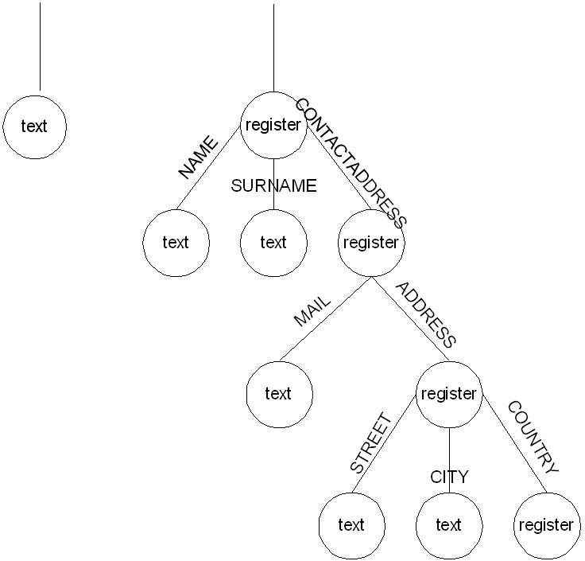
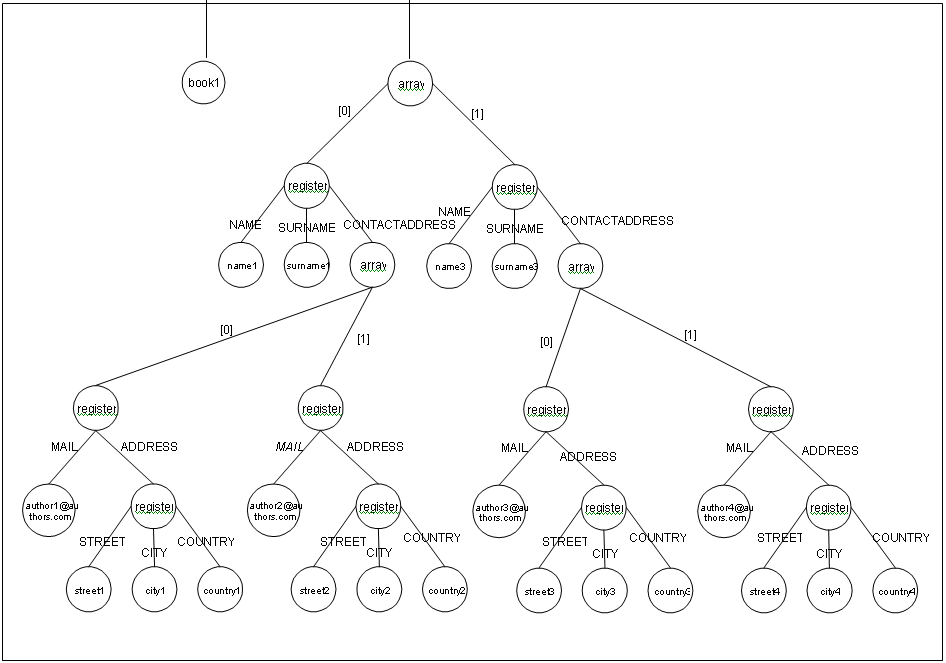

=====================================
Processing of Compound Types: Example
=====================================

Imagine that you want to define a relation that models books with title
and various authors. We could have the attributes:

-  ``TITLE``: simple type (``text``)
-  ``AUTHOR``: compound type. More specifically, we can have various
   authors and, for each author, we want to represent his/her name,
   surname and a list of contact addresses. As explained earlier, an
   array type models a subrelation, whereby it is necessary to indicate
   using a register type the schema of this relation. The subrelation
   ``AUTHOR`` thus has an associated register type with subattributes of
   the simple type ``NAME``, ``SURNAME`` and other compound attributes
   of the array type to contain the list of contact addresses
   (``CONTACT``). ``CONTACT`` represents another subrelation, with a
   schema comprised of the subattributes ``MAIL`` and ``ADDRESS``;
   ``MAIL`` has a simple type and ``ADDRESS`` is a register comprised of
   the subattributes: ``STREET``, ``PLACE`` and ``COUNTRY``.

The tree of the type ``AUTHOR`` is shown in `Trees of compound
elements`_. The data type to represent elements of the type
``AUTHOR`` can be created with the following statements:

.. code-block:: vql

   CREATE TYPE address AS REGISTER OF (
       STREET:text,
       CITY:text,
       COUNTRY:text
   );

   CREATE TYPE contactAddress AS REGISTER OF (
       MAIL:text,
       ADDRESS:address
   );

   CREATE TYPE contactAddressArray AS ARRAY OF contactAddress;

   CREATE TYPE author AS REGISTER OF (
       NAME:text,
       SURNAME:text,
       CONTACTADDRESS:contactAddressArray
   );

   CREATE TYPE authorArray AS ARRAY OF author;

   Trees of compound elements

`Tuple with compound elements`_ shows an example of a tuple of this view
and its internal representation:

.. table:: Tuple with compound elements
   :name: Tuple with compound elements

   +-------+------------------------------------------------------------------------+
   | TITLE | AUTHOR                                                                 |
   +=======+========+===========+===================================================+
   | Book  | NAME   | SURNAME   | CONTACTADRESS                                     |
   |       +--------+-----------+----------------------+----------------------------+
   |       | Name 1 | Surname1  | MAIL                 | ADRESS                     |
   |       |        |           +----------------------+---------+-------+----------+
   |       |        |           | Author1\@authors.com | STREET  | CITY  | COUNTRY  |
   |       |        |           |                      +---------+-------+----------+
   |       |        |           |                      | Street1 | City1 | Country1 |
   |       |        |           +----------------------+---------+-------+----------+
   |       |        |           | MAIL                 | ADRESS                     |
   |       |        |           +----------------------+---------+-------+----------+
   |       |        |           | Author2\@authors.com | STREET  | CITY  | COUNTRY  |
   |       |        |           |                      +---------+-------+----------+
   |       |        |           |                      | Street2 | City2 | Country2 |
   +       +--------+-----------+----------------------+---------+-------+----------+
   |       | NAME   | SURNAME   | CONTACTADRESS                                     |
   |       +--------+-----------+----------------------+----------------------------+
   |       | Name 3 | Surname3  | MAIL                 | ADRESS                     |
   |       |        |           +----------------------+---------+-------+----------+
   |       |        |           | Author3\@authors.com | STREET  | CITY  | COUNTRY  |
   |       |        |           |                      +---------+-------+----------+
   |       |        |           |                      | Street3 | City3 | Country3 |
   |       |        |           +----------------------+---------+-------+----------+
   |       |        |           | MAIL                 | ADRESS                     |
   |       |        |           +----------------------+---------+-------+----------+
   |       |        |           | Author4\@authors.com | STREET  | CITY  | COUNTRY  |
   |       |        |           +                      +---------+-------+----------+
   |       |        |           |                      | Street4 | City4 | Country4 |
   +-------+--------+-----------+----------------------+---------+-------+----------+
   | TITLE | AUTHOR                                                                 |
   +-------+--------+-----------+---------------------------------------------------+
   | Book  | NAME   | SURNAME   | CONTACTADRESS                                     |
   |       +--------+-----------+----------------------+----------------------------+
   |       | Name 1 | Surname1  | MAIL                 | ADRESS                     |
   |       |        |           +----------------------+---------+-------+----------+
   |       |        |           | Author1\@authors.com | STREET  | CITY  | COUNTRY  |
   |       |        |           |                      +---------+-------+----------+
   |       |        |           |                      | Street1 | City1 | Country1 |
   |       |        |           +----------------------+---------+-------+----------+
   |       |        |           | MAIL                 | ADRESS                     |
   |       |        |           +----------------------+---------+-------+----------+
   |       |        |           | Author2\@authors.com | STREET  | CITY  | COUNTRY  |
   |       |        |           |                      +---------+-------+----------+
   |       |        |           |                      | Street2 | City2 | Country2 |
   +       +--------+-----------+----------------------+---------+-------+----------+
   |       | NAME   | SURNAME   | CONTACTADRESS                                     |
   |       +--------+-----------+----------------------+----------------------------+
   |       | Name 3 | Surname3  | MAIL                 | ADRESS                     |
   |       |        |           +----------------------+---------+-------+----------+
   |       |        |           | Author3\@authors.com | STREET  | CITY  | COUNTRY  |
   |       |        |           |                      +---------+-------+----------+
   |       |        |           |                      | Street3 | City3 | Country3 |
   |       |        |           +----------------------+---------+-------+----------+
   |       |        |           | MAIL                 | ADRESS                     |
   |       |        |           +----------------------+---------+-------+----------+
   |       |        |           | Author4\@authors.com | STREET  | CITY  | COUNTRY  |
   |       |        |           +                      +---------+-------+----------+
   |       |        |           |                      | Street4 | City4 | Country4 |
   +-------+--------+-----------+----------------------+---------+-------+----------+
   
           
The structure of the value tree is shown in `Tree of Compound-type
values`_.

   Tree of Compound-type values

Now a base relation that models this relation can be created:

.. code-block:: vql
   :caption: Creating a base relation with compound types
   :name: Creating a base relation with compound types

   CREATE TABLE BOOK I18N es_euro (
       TITLE:text (SEARCH),
       AUTHOR:authorArray
   );

It will also be necessary to create a *wrapper* for the relation. Note
that, as always, the schema of the data returned by the *wrapper* should
be compatible with the schema of the relation, which in this case means
that the *wrapper* requires that the data be returned in the form of
compound values.

.. note:: We strongly recommend you to use the Administration Tool to
   import data sources and create base views to avoid creating the compound
   types, wrappers and base views manually.

For example, the following figure shows part of a VQL sentence to create
an ITPilot wrapper to obtain the required data. Note how the output
schema defined is compatible with that of the relation:

.. code-block:: vql
   :caption: Creating a wrapper with compound types
   :name: Creating a wrapper with compound types

   CREATE WRAPPER ITP BOOK_sm1
       OUTPUTSCHEMA (
           TITLE,
           AUTHOR : ARRAY OF
               AUTHOR : REGISTER OF (
                   NAME,
                   SURNAME,
                   CONTACTADDRESS : ARRAY OF
                       CONTACTADDRESS : REGISTER OF (
                           MAIL,
                           ADDRESS : ARRAY OF
                               ADDRESS : REGISTER OF (
                                   STREET,
                                   CITY,
                                   COUNTRY
                               )
                          )
                      )
                  )
     ... Wrapper definition ...;

Once the *wrapper* has been created, a search method can be defined for
the ``BOOK`` relation (see section :ref:`Modifying a Base View`). In most
cases, query restrictions will only be defined for URIs that indicate
simple data types (this is consistent with the fact that compound-type
attributes are considered as though they were subrelations). However, it
is also possible to add restrictions for URIs indicating compound types
(in this case, remember that the operands on the right of the conditions
will be built using the constructors ``ROW`` and ``{ }``
and that only operators ``=`` and ``<>`` may be used). The following
sentence adds a possible search method (note that a restriction has been
included for the compound URI ``AUTHOR.CONTACTADDRESS``):

.. code-block:: vql
   :caption: Adding a search method with compound types
   :name: Adding a search method with compound types

   ALTER TABLE BOOK
      ADD SEARCHMETHOD BOOK_SM1 (
        CONSTRAINTS (
           ADD TITLE                                    NOS ZERO ()
           ADD AUTHOR.NAME                              NOS ZERO ()
           ADD AUTHOR.SURNAME                           NOS ZERO ()
           ADD AUTHOR.CONTACTADDRESS                    NOS ZERO ()
           ADD AUTHOR.CONTACTADDRESS.MAIL               NOS ZERO ()
           ADD AUTHOR.CONTACTADDRESS.ADDRESS.STREET     NOS ZERO ()
           ADD AUTHOR.CONTACTADDRESS.ADDRESS.CITY       NOS ZERO ()
           ADD AUTHOR.CONTACTADDRESS.ADDRESS.COUNTRY    NOS ZERO ()
       )
       OUTPUTLIST (TITLE, AUTHOR)
       WRAPPER (itp book)
   );

.. note:: In the specification of URIs of compound attributes in
   condition queries, and in order to avoid ambiguities between the name of
   the table and the attribute name, the attribute names will be specified
   between parentheses.

Finally, some examples of queries that could be made on the relation are
shown:

#. Obtain the title and the authors’ names of all the books that contain
   in their title the word "java".
   
   .. code-block:: sql
   
      SELECT TITLE, LIST((AUTHOR).NAME) AS AUTHORLIST  
      FROM BOOK   
      WHERE TITLE like '%java%'  
      GROUP BY TITLE;
     

#. Find the tile and the list of contact addresses for each of the
   authors of the books that contain in their title the word "java".
   
   .. code-block:: sql
   
      SELECT TITLE, LIST((AUTHOR).CONTACTADDRESS) AS AUTHORLIST   
      FROM BOOK   
      WHERE TITLE like '%java%'  
      GROUP BY TITLE

#. Find the title and the first e-mail address of each of the authors of
   all the books that contain in their title the word "java".

   .. code-block:: sql
   
      SELECT TITLE,LIST((AUTHOR).CONTACTADDRESS[0].MAIL) AS AUTHORLIST
      FROM BOOK   
      WHERE TITLE like '%java%'  
      GROUP BY TITLE

#. Find the title and the name of each of the authors of all the books
   that contain the word "java" in their title and that have at least
   one author with an e-mail address that contains the word
   ``.es``.
   
   .. code-block:: sql

      SELECT TITLE, LIST((AUTHOR).NAME) AS AUTHORLIST 
      FROM BOOK   
      WHERE (TITLE like '%java%')   
            AND ((AUTHOR).CONTACTADDRESS.MAIL like '%.es%' )   
      GROUP BY TITLE

   
   
#. Find the title and the name of each of the authors of all the books
   that contain the word ``java`` in their title and that have at least
   one author with an address in the street ``Real``.
   
   .. code-block:: sql
   
      SELECT TITLE, LIST((AUTHOR).NAME) AS AUTHORLIST 
      FROM BOOK   
      WHERE (TITLE like '%java%')   
            AND ((AUTHOR).CONTACTADDRESS.ADDRESS.STREET like '%Real%')
      GROUP BY TITLE

   
   
#. Find the books written by an author with a single contact address,
   the e-mail ``john@mail.com`` and who lives in ``Real`` street in the
   city of ``Madrid (Spain)``.

   .. code-block:: vql
   
      SELECT TITLE, AUTHOR 
      FROM BOOK   
      WHERE (AUTHOR).CONTACTADDRESS =  
       { ROW('john@mail.com',{ROW('Real', 'Madrid', 'Spain')}) }
