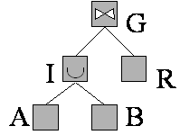

=======================
Defining a Derived View
=======================

.. toctree::
   :hidden:

   modifying_a_derived_view/modifying_a_derived_view.rst
   defining_an_interface_view/defining_an_interface_view.rst

The administrator can use the base views of the system to define new
relations. These new relations are called derived views.

Derived views are created through the statement ``CREATE VIEW``.

.. code-block:: bnf
   :caption: Syntax of the CREATE VIEW statement
   :name: Syntax of the CREATE VIEW statement

   CREATE [ OR REPLACE ] VIEW <name:identifier> 
       [ FOLDER = <literal> ]
       [ DESCRIPTION  = <literal> ]
       [ <primary key> ]
       [ ( <field properties> [, <field properties> ]* ) ]
       AS <select>
       [ USING PARAMETERS ( <parameter> [, <parameter> ]* ) ]
       [ ORDER BY <field name> [ ASC | DESC ] [, <field name> [ ASC | DESC ] ]* ]
       [ WITH [ CASCADED | LOCAL ] CHECK OPTION ] 
       [ CONTEXT ( <context information> [, <context information>]* ) ] 
   
   <field properties> ::= 
     <name:identifier> ( <property list> )

   <parameter> ::=
     <fieldname:identifier> : <fieldtype:identifier> [<default:literal>]

.. 

   <primary key> ::= (see :ref:`Syntax of the statement CREATE TABLE`)

   <property list> ::= (see :ref:`Syntax of the statement CREATE TABLE`)

   <select> ::= (see :ref:`Syntax of the SELECT statement`)

   <context information> ::= (see :ref:`Syntax of the SELECT statement`)

As you can see, a name and the query that defines it are specified, when
creating a view. The query is specified using the syntax of the
``SELECT`` statement, which has been explained in detail in the
section :ref:`Queries: SELECT Statement`.

Therefore, the administrator can create new derived views by combining
other existing views using operators such as unions, joins, cartesian
products, selections, projections, group-by operations, intersections,
the minus operation and the flatten operation.

Furthermore, existing derived views can be also used to create new
derived views, allowing view trees with as many levels as
required.

For example, considering the views A, B and R as base relations (those
that directly access the sources to obtain their data) the administrator
can define a view G as the *join* of the result of applying the union
(A, B) with R, as can be seen in the figure :ref:`below <Example of how a view is defined in
accordance with others>`.

   Example of how a view is defined in accordance with others

The optional ``ORDER BY`` clause indicates that when querying the view,
the results will be ordered by those field(s). ``ASC`` sorts in
ascending order and ``DESC``, in descending order. If ``ASC`` or
``DESC`` are omitted, Virtual DataPort will sort in ascending order.

The creation of a view also accepts the SQL standard clause
``WITH CHECK OPTION``, which is related to the updating of view contents
using ``INSERT`` / ``UPDATE`` / ``DELETE`` statements. The function of
this modifier is described in detail in the section :ref:`Use of WITH CHECK
OPTION`.

The use of the ``OR REPLACE`` modifier specifies that, if there is a
view with the name indicated, this must be replaced by the new view.
Where, due to the change in view definition, the query capabilities of some derived views have been altered (e.g. due to the
addition of another field or a query restriction that did not previously
exist), Virtual DataPort will update the schema and query capabilities of the
upper level derived views wherever possible.

The ``PRIMARY KEY`` clause sets the definition of the primary key of the
view. See more information about primary keys in the section :ref:`Primary
Keys of Views` of the Administration Guide.

The clause ``USING PARAMETERS`` defines the parameters of the derived
view. See more about this in the section :ref:`Parameters of Derived Views`
of the Administration Guide.

