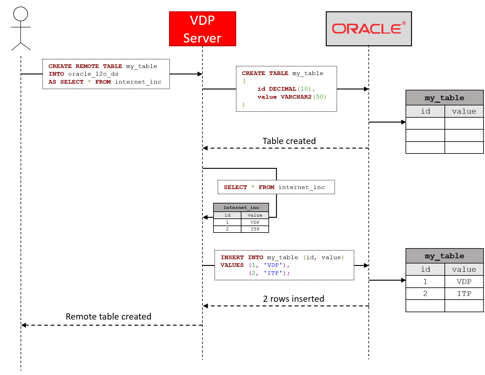
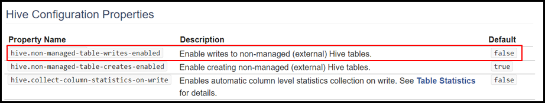

===========================
Remote Tables
===========================

With Virtual DataPort, a user can store the result of a query on a table of an external database. This feature is called *remote tables*. In this process, Denodo creates the table with the appropriate schema and inserts the result of the query in this table. With this feature, the user does not need another tool to execute a query in Denodo and store the result in a database.

The main components of this feature are:

-  The command ``CREATE REMOTE TABLE`` (see :ref:`below <CREATE REMOTE TABLE Command>`). This command does this:

   1. Creates a table in the underlying database of a JDBC data source.
   #. Executes a query in the Virtual DataPort Server.
   #. Inserts the result of this query into the table of the database.

   This command does not return any row. If you execute it from the administration tool, it does return the trace.

-  The stored procedure :ref:`CREATE_REMOTE_TABLE`, in addition to the previous three steps, it creates a base view that queries the table created in the database.

-  The stored procedure :ref:`DROP_REMOTE_TABLE`. It deletes a base view and the remote table accessed by the base view of a JDBC data source.

CREATE REMOTE TABLE Command
============================

The syntax of the command ``CREATE REMOTE TABLE`` is the following:

.. rubric:: Syntax

.. code-block:: bnf
   :name: Syntax of the CREATE REMOTE TABLE statement
   :caption: Syntax of the CREATE REMOTE TABLE statement

   CREATE [ OR REPLACE ] REMOTE TABLE <remote_table_name:identifier>
        INTO <data_source_name:identifier>
        [ CATALOG = <data_source_catalog:literal> ]
        [ SCHEMA = <data_source_schema:literal> ]
        AS <query>
..

   <query> ::= (see :ref:`Syntax of the SELECT statement`)

-  ``OR REPLACE``: if present and the table ``remote_table_name`` already exists in the database, Virtual DataPort drops the table and creates it again. If this clause is not present and the table exists, the command fails.
-  ``query``: query executed by Virtual DataPort as any other query.
-  ``data_source_name``: JDBC data source. The new table will be created in the database of this data source.
-  ``data_source_catalog`` (optional): name of the catalog of the underlying database in which you want to create the table.
-  ``data_source_schema`` (optional): name of the schema of the underlying database in which you want to create the table.

If you do not indicate the catalog nor the schema, the table will be created in the default catalog/schema.

.. important:: When you execute ``CREATE REMOTE TABLE`` from the VQL Shell, select the check box *Retrieve all rows*.
   Otherwise, the execution engine will only insert the number of rows set by the box *Display rows* of the VQL Shell.

.. rubric:: Remarks

If the database is based on HDFS (Hadoop, Impala, Presto, etc.), you have to enable bulk data load on the data source before executing this command.

This procedure only works for JDBC data sources.

A table created with this command has to be deleted from another application. However, if the table is created with the *procedure* :ref:`CREATE_REMOTE_TABLE`, it can be deleted from Denodo using the *procedure* :ref:`DROP_REMOTE_TABLE`.

If one of the field names is a reserved word in the data source, VDP will rename the field name to 'field_0'. If this happens with more fields, they will be renamed to 'field_1', 'field_2', etc.

The ``CREATE REMOTE TABLE`` command can be executed in Presto only if it uses the `Hive connector <https://prestodb.io/docs/current/connector/hive.html>`_.

The ``CREATE REMOTE TABLE`` creates ``INTERNAL TABLES`` in Hive and Impala and it creates ``EXTERNAL TABLES`` in Presto and Spark.

If you want to execute IDU queries in a table created with the ``CREATE REMOTE TABLE`` command in Presto, you have to enable the property ``hive.non-managed-table-writes-enabled=true`` in the Presto server configuration.

Follow these steps to enable the property in the Presto server:

1. Edit the file ``/opt/presto-server-<version>/etc/catalog/hive.properties``
#. Add the following line: ``hive.non-managed-table-writes-enabled=true``
#. Restart the Presto server.

.. rubric:: Privileges required

To execute this command, the user needs these privileges:

-  ``Connect`` over the database of the JDBC data source.
-  ``Execute`` over the JDBC data source in which the remote table will be created.
-  ``Execute`` over the views used in the query.

The user account of the JDBC data source has to be able to create tables in the underlying database.

.. rubric:: Example

.. code-block:: sql

   CREATE REMOTE TABLE reporting_customer360_state_ca
   INTO common_sources.ds_jdbc_oracle
   SCHEMA = 'REPORTING'
   AS
   SELECT * FROM customer360.customer WHERE state = 'CA';

This command will perform these steps:

1. Create a table called ``reporting_customer360_state_ca`` in the underlying database of the JDBC data source ``ds_jdbc_oracle``.
2. Execute the following query in the VDP Server.

   .. code-block:: sql

      SELECT *
      FROM customer360.customer
      WHERE state = 'CA';

3. Insert the result of the previous query into the table ``reporting_customer360_state_ca``.
