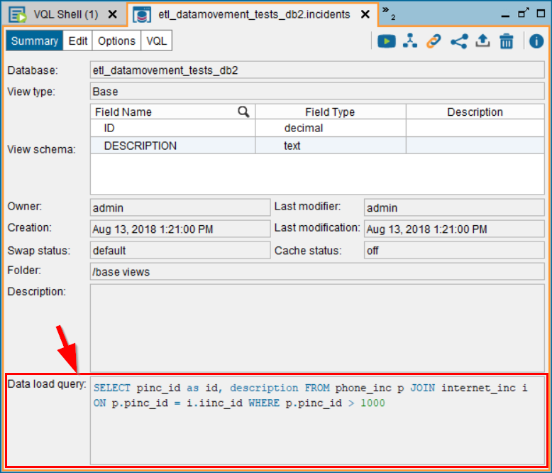
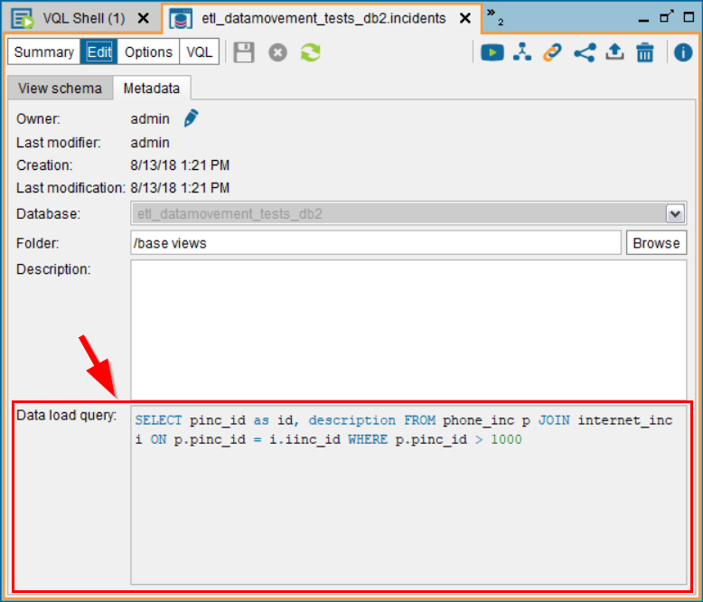

=====================
CREATE_REMOTE_TABLE
=====================

.. rubric:: Description

The stored procedure ``CREATE_REMOTE_TABLE`` is one of the components of the feature *remote tables*. The section 
:doc:`/vdp/administration/remote_tables/remote_tables` of the Administration Guide explains in detail what remote tables are. 

 This procedure does the following:

1. Creates a table in the underlying database of a JDBC data source.
#. Executes a query in the Virtual DataPort server.
#. Inserts the result of this query into the table of the database created in step #1.
#. It creates a base view over the table created in step #1.

To perform steps 1 to 3, this procedure invokes the command ``CREATE REMOTE TABLE`` and then, it creates the base view (step #4).

The procedure :ref:`DROP_REMOTE_TABLE` drops the base views created by this procedure, and the table created by it in the underlying databases.

.. rubric:: Syntax

.. code-block:: bnf

   CREATE_REMOTE_TABLE(
         remote_table_name : text
       , replace_remote_table_if_exist : boolean
       , query : text
       , datasource_database_name : text
       , datasource_name : text
       , datasource_catalog : text
       , datasource_schema : text
       , base_view_database_name : text
       , base_view_name : text
       , base_view_folder : text
       , replace_base_view_if_exist: boolean
   )

-  ``remote_table_name``: name of the new table in the underlying database of the JDBC data source. It has to be a valid identifier in the target database.
-  ``replace_remote_table_if_exist`` (optional): if ``true`` and a table with the same name already exists in the database (in the same schema/catalog), the procedure will drop the table and create it again. The default value is ``false`` so if the table already exists, the procedure will fail.
-  ``query``: query executed in the Virtual DataPort server to obtain the data that will be inserted in the new table of the database.
-  ``datasource_database_name`` (optional): database of the JDBC data source in which the new table will be created. If ``null``, it looks for ``datasource_name`` on the current database.
-  ``datasource_name``: JDBC data source that points to the database in which the table will be created.
-  ``datasource_catalog`` (optional): catalog of the database where the table will be created. If the database does not support catalogs, set this to ``null``.
-  ``datasource_schema`` (optional): schema of the database where the table will be created. If the database does not support schemas, set this to ``null``.
-  ``base_view_database_name`` (optional): Virtual DataPort database where the base view will be created. If ``null``, the base view is created in the current database.
-  ``base_view_name`` (optional): name of the new base view. If ``null``, the name will be the value of ``remote_table_name``.
-  ``base_view_folder`` (optional): folder in which the base view will be created. If the folder does not exist, the procedure will create it. If ``null``, the base view will be created in the root folder.
-  ``replace_base_view_if_exist`` (optional): if ``true`` and a view with the same name already exists in the Virtual DataPort database, the procedure will drop the view and create it again. The default value is ``false`` so if the view already exists, the procedure will fail.

.. rubric:: Stored Procedure Result

The procedure returns three rows with the status of each step. For example:

+----------------------------------------------------------------------------------------------------------+
|Step 1 of 3: Created remote table '\<remote table name\>' successfully.                                   |
+----------------------------------------------------------------------------------------------------------+
|Step 2 of 3: Inserted 2 rows into remote table '\<remote table name\>'.                                   |
+----------------------------------------------------------------------------------------------------------+
|Step 3 of 3: Created base view '\<base view name\>' successfully in the '\<vdp database name\>' database. |
+----------------------------------------------------------------------------------------------------------+

.. rubric:: Remarks

If the target database is based on HDFS (Hadoop, Impala, Hive), you have to enable bulk data load on the data source before executing this procedure.

This procedure only works for JDBC data sources.

This procedure fails if the base view already exists, regardless of the value of the input parameter ``replace_remote_table_if_exist``. This parameter only checks if the table exists in the underlying database.

.. rubric:: Privileges Required
    
The user needs these privileges:

-  ``Connect`` over the database of the JDBC data source.
-  ``Execute`` over the JDBC data source.
-  ``Connect`` and ``Create view`` over the Virtual DataPort database in which the base view will be created.
-  ``Create folder`` over the database where the base view will be created, if the procedure has to create the base view on a folder and the folder does not exist.
-  ``Execute`` over the views referenced in the query.

The user account of the JDBC data source has to be able to create tables in the underlying database.

.. rubric:: Example

.. code-block:: sql

   SELECT *
   FROM CREATE_REMOTE_TABLE()
   WHERE datasource_database_name = 'common_sources'
     AND datasource_name = 'ds_jdbc_oracle'
     AND datasource_catalog = ''
     AND datasource_schema = 'REPORTING'
     AND remote_table_name = 'reporting_customer360_state_ca'
     AND replace_remote_table_if_exist = true
     AND query = 'SELECT * FROM customer WHERE state = ''CA'''
     AND base_view_database_name = 'customer360'
     AND base_view_name = 'customer360_state_ca'
     AND base_view_folder = '/reporting_customer'
     AND replace_base_view_if_exist = false;

Note that because ``query`` is a literal, the single quotes have to be escaped.

This example does the following:

1. It checks if in the schema "REPORTING", the database of the data source "ds_jdbc_oracle" has the table "reporting_customer360_state_ca". If it does, it deletes this table.
2. In the same schema, it creates the table "reporting_customer360_state_ca" to store the results of "query".
3. Executes the query and inserts the result on this table.
4. Creates the folder "/reporting_customer".
5. It creates the JDBC base view "customer360_state_ca" in this folder that queries the table "reporting_customer360_state_ca" of the database of the data source "ds_jdbc_oracle".

.. rubric:: Virtual DataPort Administration Tool

When you open a base view that was created with this procedure, you will see the source query in the box **Data load query**, at the bottom of the dialog.

Also, in the tab **Metadata** of the **Edit** dialog of a view.

