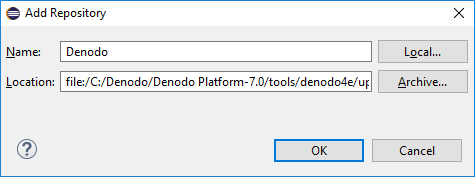

===================
Installing Denodo4E
===================

To install the Denodo4E plug-in for Eclipse, follow these steps:

#. Install the Denodo Platform on your local machine (this plugin depends on libraries *not included* in the client installation). To obtain a complete installation, you can either install `Denodo Express <https://www.denodo.com/en/denodo-platform/denodo-express>`_, or request an installer and a license to the Denodo administrator of your organization.

.. note:: With Denodo Express you will be able to develop and debug any type of custom component except VDP custom wrappers. With Denodo Express you can develop VDP custom wrappers but not debug them.

2. Open Eclipse and click the menu **Help** > **Install New Software**.

#. Click the button **Add**.
#. Click **Local…**. In this dialog, select **the folder** - not a file - 
   :file:`{<DENODO_HOME>}/tools/denodo4e/updateSite` and click **Ok**.
   Then, enter a name for the new update site (e.g. "Denodo")
   and click **OK**.

   Configuring the local repository for Denodo 4E

4. Select **Denodo4E** (located under the Denodo Technologies category)
#. Select the check box **Contact all update sites during install to
   find required software**.
#. Click **Next**. Once Eclipse finishes calculating dependencies, click
   **Finish** to begin the installation process.
#. Once all the required features are installed, restart Eclipse.

|

This plug-in has been tested with these versions of Eclipse:

-  Eclipse Neon (4.6)
-  Eclipse Oxygen (4.7)