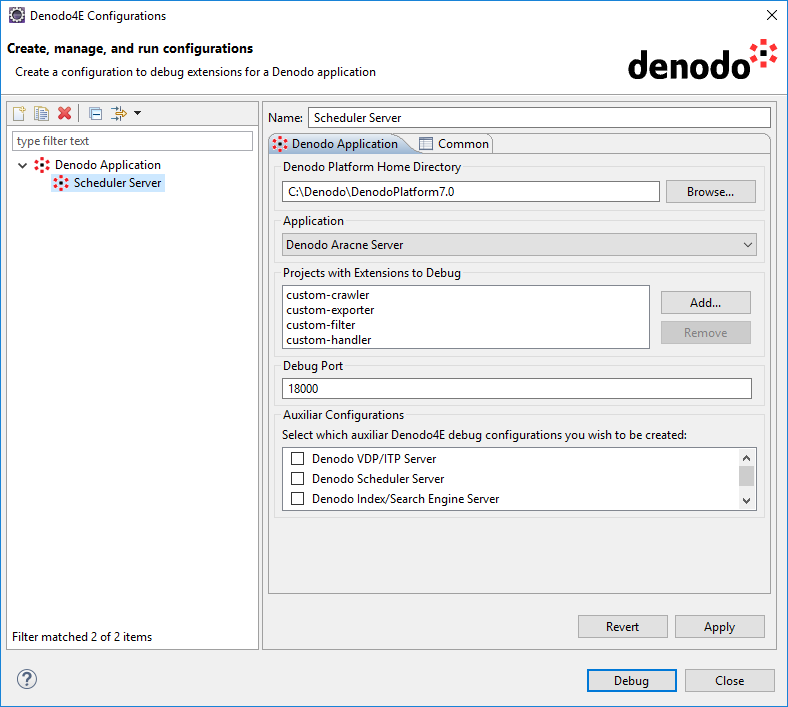

====================================================
Denodo Application Debug Configuration
====================================================

Denodo4E adds a new type of debug configuration to Eclipse called Denodo Application which allows debugging extensions 
for Denodo servers and applications (see `Running and Debugging <https://help.eclipse.org/mars/index.jsp?topic=%2Forg.eclipse.jdt.doc.user%2Ftasks%2Ftask-running_and_debugging.htm>`_ for more details on launch/debug configurations).

There are several variants of the Denodo Application debug configuration type depending on what Denodo application is going to be debugged:

    1.  **VDP/ITP** server.
    
    #.  **Aracne** server.
    
    #.  **Scheduler** server.

    #.  **Wrapper Generation Tool**.
    
    #.  **VDP Administration Tool** and the **Browser Pool**, **Verification** and **Index/Search Engine** servers.

You can access the Denodo4E Configurations dialog by clicking **Run** > **Denodo4E Debug Configurations** > **Denodo4E Configurations...** or using the **Denodo4E Configurations...** option in the Denodo4E pull-down button in the debug toolbar.

|

   Denodo Run menu

   Denodo4E dialog   

Wrapper Generation Tool and the VDP/ITP, Aracne and Scheduler Servers
=======================================================================
 
The following options are available in the Denodo Application tab when the selected application is the VDP/ITP, Aracne or Scheduler server or the Wrapper Generation Tool:

    -  **Denodo Platform Home Directory**: here it must be specified the Denodo Platform's installation directory. The **Browse...** button can be used for convenience, but the directory can also be typed manually.
    -  **Application**: use this combo box to select which Denodo application is going to be launched and debugged.
    -  **Projects with Extensions to Debug**: this is a list of the Eclipse projects which are going to be linked to the selected Denodo application when it is launched. Click **Add...** to add one or more Denodo Extension projects from the Eclipse project's list and click **Remove** to remove the selected projects from the list.
    -  **Debug Port**: the port used to receive debugging information from the Java Virtual Machine after the Denodo application is launched. Any free port number can be used.
 
.. note::
    The "Common" tab you can see in the screenshot is common for all of the Eclipse launch/debug configuration types, please see `Creating a Java application launch
    configuration <https://help.eclipse.org/luna/index.jsp?topic=%2Forg.eclipse.jdt.doc.user%2Ftasks%2Ftasks-java-local-configuration.htm>`_ for more information.
    

  Auxiliary Debug Configurations  
  
If the selected application is the VDP/ITP, Aracne or Scheduler server, it is possible to create auxiliary debug configurations. This is useful if you need to run several Denodo applications to debug a particular extension. For example, you may need to run both the VDP/ITP Server and the Scheduler Server in order to test and debug a custom Exporter.
  
The following auxiliary debug configurations can be created depending on the selected application:

-  **VDP/ITP Server**

   -  VDP Administration Tool
   -  Browser Pool Server
   -  Verification Server

-  **Aracne Server**

   -  VDP/ITP Server
   -  Scheduler Server
   -  Index/Search Engine Server
   -  Browser Pool Server

-  **Scheduler Server**

   -  VDP/ITP Server
   -  Aracne Server
   -  Index/Search Engine Server
   -  Browser Pool Server
    

   
   Auxiliary Debug Configurations  

  Auxiliary Debug Configurations
   
   

   Auxiliary Debug Configurations
  
The required auxiliary configurations will be created after pressing **Apply** or **Debug**. 
The new configurations will inherit any relevant parameter from the main configuration and will be automatically given a name. 
Both the name and any other configuration parameter can be edited if necessary.

VDP Administration Tool and the Browser Pool, Verification and Index/Search Engine Servers
===========================================================================================

   Debug Configurations
  
In this case, only the Denodo Platform Home Directory and the Application parameters are available. 
Neither the **VDP Administration Tool** nor the **Browser Pool**, **Verification** and **Index/Search Engine** servers are extensible, 
so no other options are necessary in their case. They have been included here for convenience. For example: whenever a VDP/ITP Server instance 
is launched using Denodo4E, instead of opening the **Denodo Platform Control Center** and launching the **VDP Administration Tool**, 
it may be easier to have a debug configuration for the **VDP Administration Tool** and just launch it from Eclipse.

Other Considerations
==================== 

-  It is possible to add new classes to a Denodo Extension project while it is being debugged, as long as they belong to packages that already existed when 
   the Denodo Application debug configuration was launched.
-  When debugging an extension which has already been deployed (see :ref:`The Deploy wizard` for more details), the results obtained when executing such extension 
   will always correspond to the Eclipse workspace version of the extension.
-  When debugging an ITPilot Custom Function, a VDP Custom Function or a VDP Custom Policy 
   (see :ref:`Supported extension types` for more details) Eclipse may show you a warning like the one in the screenshot if you are using hot code replacement. This is due to a limitation of the JVM. If this happens you can click Continue and the changes will be active in the next execution of the updated methods.

   
   Obsolete Methods Warning

.. _additional-resources3:

Additional Resources
=====================  
  
:ref:`Supported Denodo applications`

:ref:`Supported extension types`

:ref:`Support for dependencies`
  
