========================
VDP/ITP Server Tutorial
========================

In this tutorial you will learn how to use Denodo4E to create, debug and deploy a custom stored procedure for Virtual DataPort.

Creating an Extension Project with a Custom Stored Procedure
==================================================================

We are going to create a Denodo Extension project with a VDP Stored Procedure.

.. rubric:: Step #1

Launch Eclipse and click the menu **File** > **New** > **Project....**. Select **Denodo Extension Project** (category **Denodo4E**) and click **Next**.

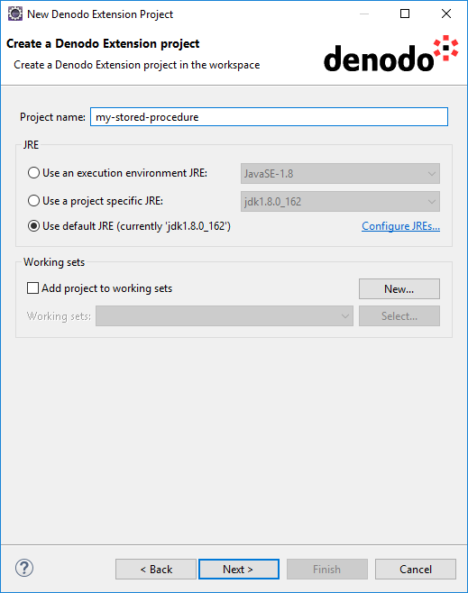

   New Denodo Extension Project Wizard

Provide these values:

-  **Project name**: my-stored-procedure
-  **JRE**: select a JRE version 8. This is the version of the JRE with which Denodo runs.

Click **Next**.

.. rubric:: Step #2

Enter these values:

-  **Denodo Platform Home Directory**: directory of the *local installation* of Denodo (e.g. ``C:\Denodo\DenodoPlatform7.0``).
-  **Denodo application**: select **Denodo VDP/ITP Server**.
-  **Extension configuration**:

   -  **Extension**:  select **Denodo VDP Stored Procedure**.
   -  **Package**: enter ``com.denodo.test.extension``
   -  **Name**: enter ``CustomStoredProcedure``. 
       
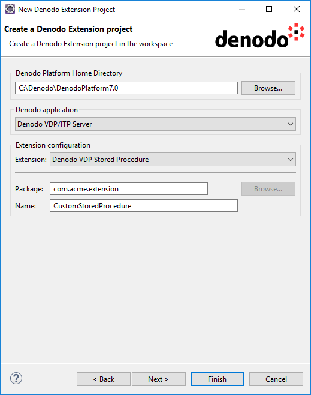
  
   New Denodo Extension Project Wizard
              
Click **Finish**. You now have a new project called *my-stored-procedure*.
 
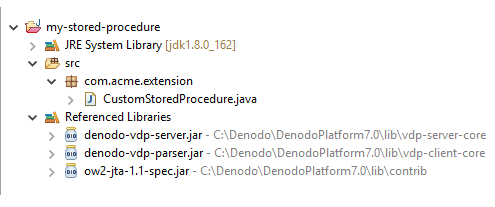
              
The new project contains the class ``CustomStoredProcedure`` in the package ``com.denodo.test.extension``. The classpath of the project includes the libraries necessary to develop a custom stored procedure.

A project can contain several Denodo extensions. To add more, you can use the *Denodo Extension wizard*.

Creating Debug Configurations for the VDP/ITP Server and the VDP Administration Tool
====================================================================================

The first time you debug an extension you have to set up a "Denodo4E configuration". To do this, click the menu **Run** > **Denodo4E Debug Configurations** > **Denodo4E Debug Configurations**.

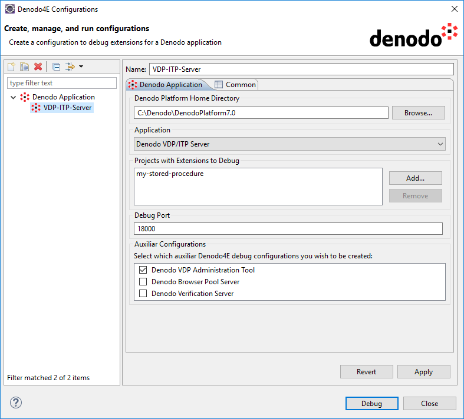
  
   Denodo4E Configurations

After clicking **Apply**, a configuration for launching the VDP Administration Tool will also be created:

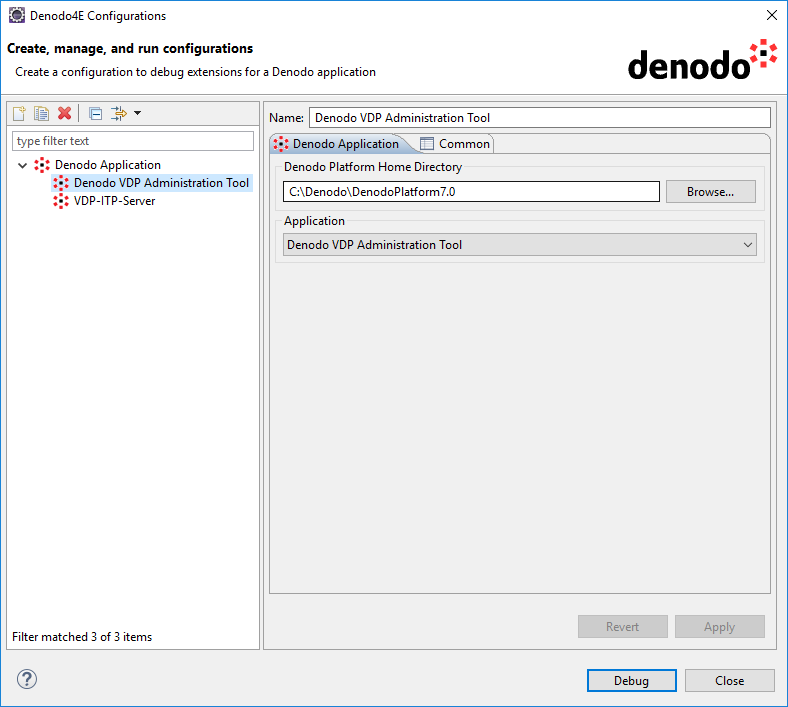
   
   Denodo4E Configurations
  
Starting the VDP/ITP Server in Debug Mode
=========================================

Go back to the VDP-ITP Server configuration and click **Debug** to launch the VDP server in debug mode, linked to the *my-stored-procedure* 
project (this project can depend on other Eclipse projects or external jar files; see :ref:`Support for dependencies` for more details).

If you open the Debug perspective (menu **Window** > **Open Perspective** > **Debug**) you will see something like this:

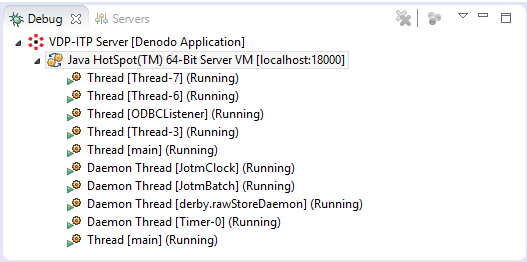
  
   Debug Perspective

Click **Terminate** (|icon1|) to close the debug session and stop the Virtual DataPort server.

Click **Disconnect** (|icon2|) to close the debug session but leave the Virtual DataPort server running.

Debugging the Stored Procedure
================================

First of all, go again to the Denodo4E Configurations dialog, select *Denodo VDP Administration Tool* and click Debug to launch the VDP Administration Tool. 

Once the tool has started, log in and go to **File** > **New...** > **Stored procedure**. 

Enter a value in the field **Name** and enter ``com.acme.extension.CustomStoredProcedure`` in the field **Class name** parameter.

If we were developing a custom wrapper the process would be similar, but we would have to go to the menu **File** > **New...** > **Data source** > **Custom**. On the other hand, custom functions do not need to be imported to be available. 

Click **Ok** to create the Stored Procedure.

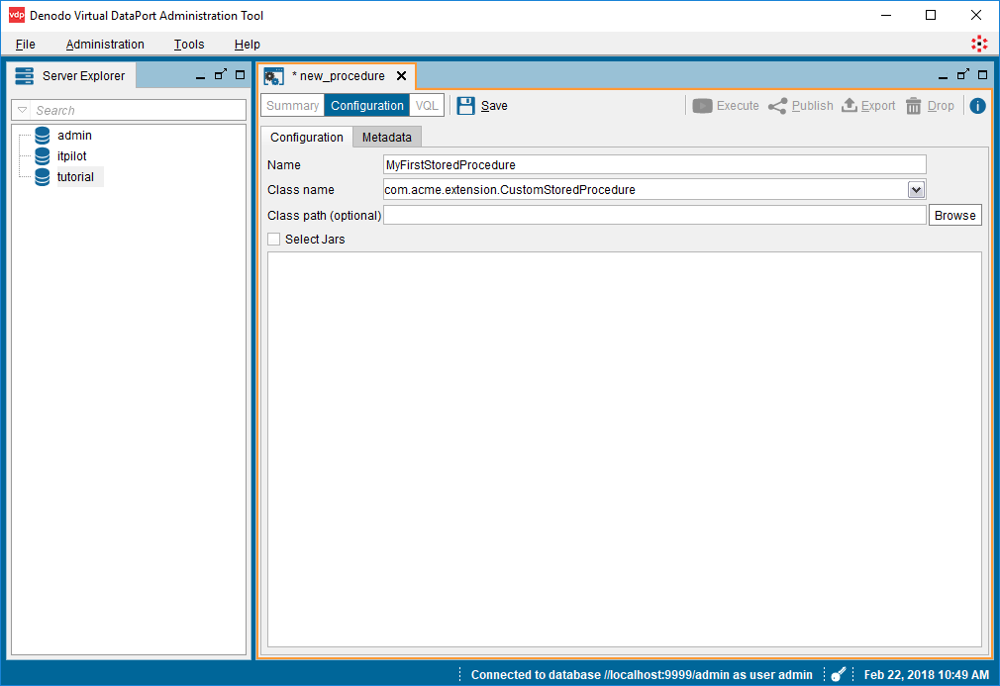
  
   VDP Admin Tool - New Stored Procedure Wizard

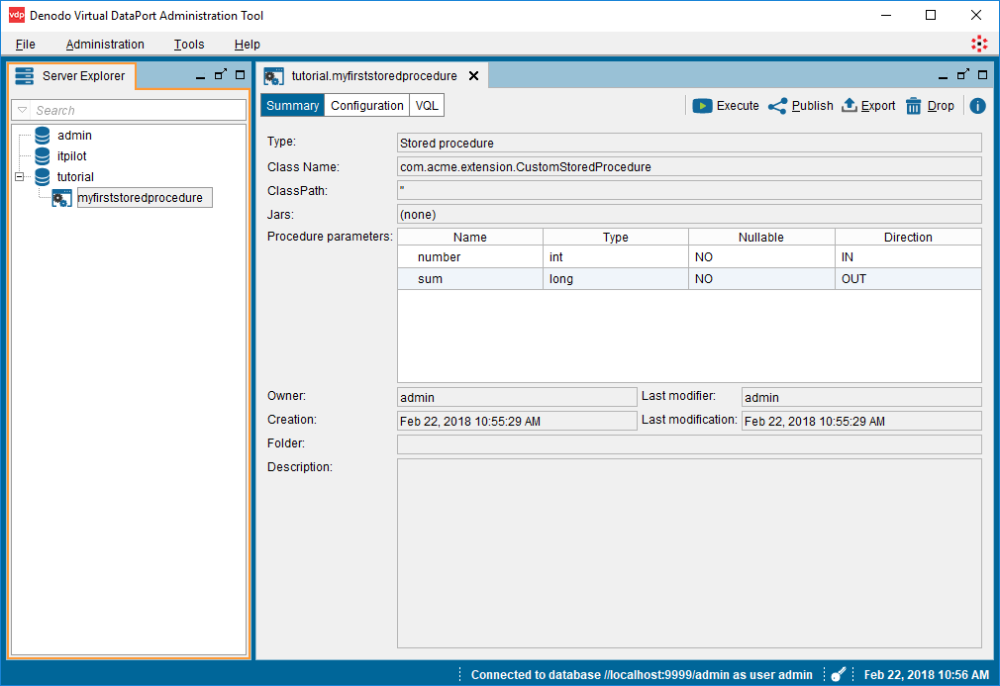
  
   VDP Admin Tool - New Stored Procedure Wizard
  
Go back to Eclipse and set a breakpoint in the ``doCall`` method of the ``CustomStoredProcedure`` class. 

In the Administration Tool, click **Execute**, set any integer value for the number parameter (this is an input value defined in the template Stored Procedure) 
and then click **Ok**. The execution will be interrupted and Eclipse will display the debug information:
  
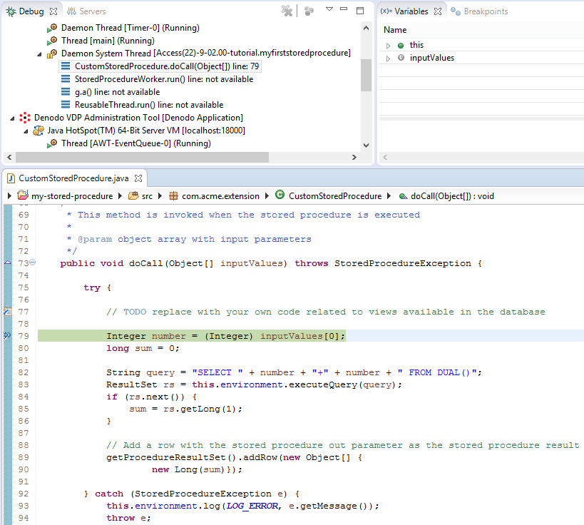
  
   Debug Perspective

You can use now any features available in the Eclipse debugger, including Hot code replacement, to debug the Stored Procedure. 
For example, replace lines 89 and 90 of the doCall method with the following code and then save the changes:

.. code-block:: java

   getProcedureResultSet().addRow(new Object[] {
       new Long(1234) 
   });
  
Now resume the execution. In the VDP Administration Tool, you will see something like this:
    
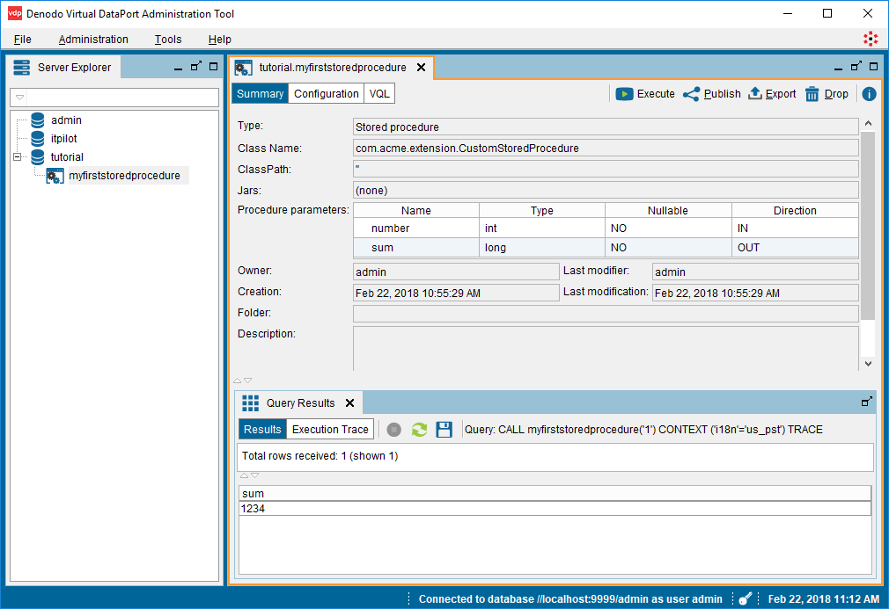
  
   VDP Admin Tool - Stored Procedure tab
    
Deploying the Stored Procedure
==============================
  
Now that we have a functional stored procedure, we are going to deploy it to the server.

First, stop the VDP/ITP Server and the VDP Administration Tool that were launched from Eclipse. Then open the Denodo Platform Control Center and 
launch again the server and the administration tool (these steps are not necessary for the deploy, but we will use them for testing this scenario).

Back in Eclipse, open the contextual menu over the *my-stored-procedure* project and click **Deploy Extensions...** to open the Deploy wizard (see :ref:`The Deploy wizard` for more details). 
Configure the wizard as you can see in the screenshot and click **Finish** (you may need to change some of the values to adapt them to your configuration).
  
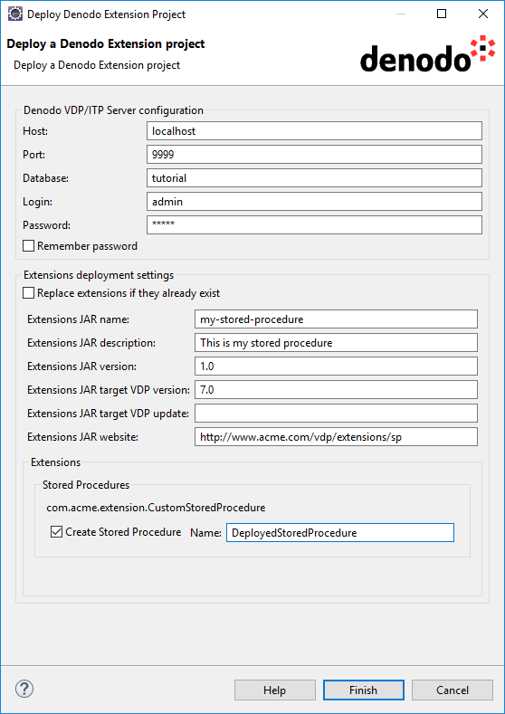
  
   Deploy Denodo Extension

After the deployment process is over, go to the VDP Administration Tool and click the menu **File** > **Refresh**. You will see a new stored procedure in the left tree: ``deployedstoredprocedure``. Double-click it to see its configuration details and to execute it.

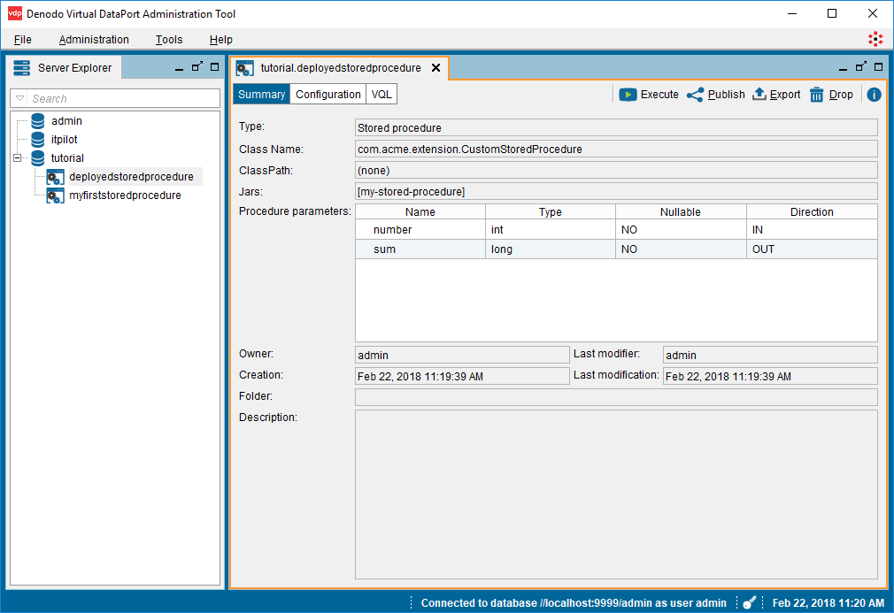
  
   VDP Admin Tool - Stored Procedure tab
  
Note that the Stored Procedure created during the debugging process (*myfirststoredprocedure*) is still there, but you will not be able to see its configuration details or 
to execute it unless you start the server from Eclipse using the Denodo4E Configuration we created in this tutorial. So, now that the development of our new 
Stored Procedure is over, you may want to drop *myfirststoredprocedure*.

