==================================
Wrapper Generation Tool Tutorial
==================================

In this tutorial you will learn how to create, deploy and debug ITPilot Custom Functions using Denodo4E and the Wrapper Generation Tool. 

Creating an Extension Project with an ITPilot Custom Function
===================================================================

We will create a Denodo Extension project containing a new ITPilot Custom Function using the wizard included with Denodo4E.

Follow these steps:

1. Click the menu **File** > **New** > **Project**. Look for the category **Denodo4E**, select **Denodo Extension Project** and click **Next**.

2. In this wizard, provide this:

   -  **Project name**: my-itp-custom-function
   -  **JRE**: select a JRE version 8. This is the version used by the Wrapper Generation Tool.

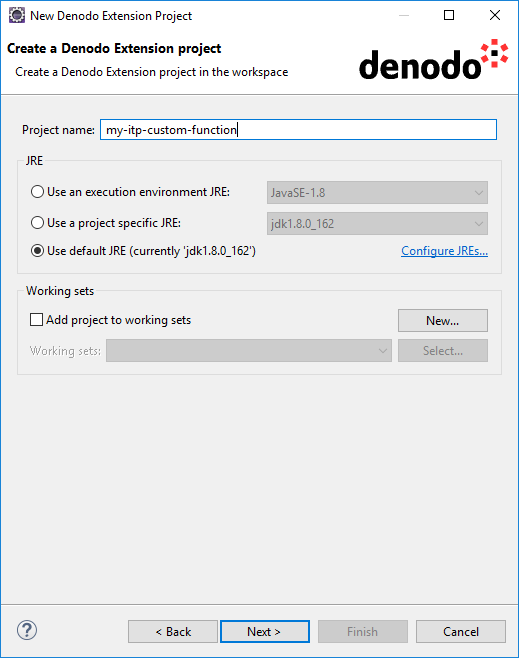

   New Denodo Extension Project Wizard
  
3. Click **Next** to proceed to the wizard's second page. Configure the second page with the following values:

  -  **Denodo Platform Home Directory**: directory of the *local installation* of Denodo Platform (e.g. ``C:\Denodo\DenodoPlatform7.0``).
  -  **Denodo application**: select **Denodo Wrapper Generation Tool**.
  -  **Extension configuration**:

     -  **Extension**: select **Denodo ITPilot Custom Functions**.
     -  **Package**: enter ``com.acme.extension``.
     -  **Name**: enter ``CustomItpFunction``.

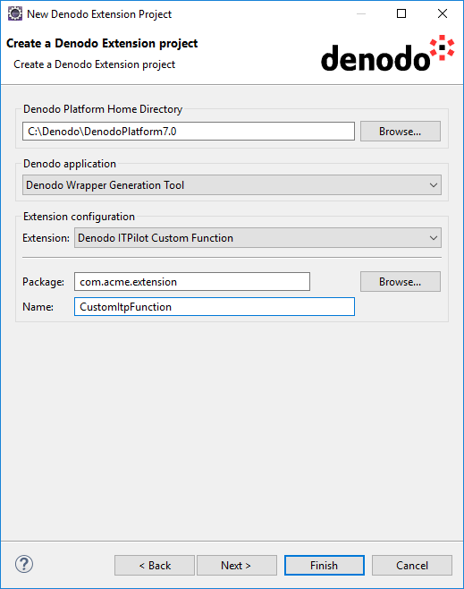

   New Denodo extension project wizard

4. Click **Finish**. You now have a new project called *my-stored-procedure*.

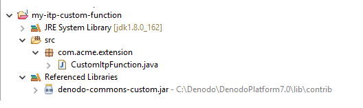

The new project contains the class ``CustomItpFunction`` in the package ``com.acme.extension`` (as it was configured). The classpath of the project includes the libraries necessary to develop an ITPilot custom function.

A project can contain several Denodo extensions. To add more, you can use the *Denodo Extension wizard*.

Creating a Debug Configuration for the Wrapper Generation Tool
==============================================================

The first time you debug an extension for ITPilot, you have to set up a "Denodo4E configuration" for this. To do this, follow these steps:

1. Click the menu **Run** > **Denodo4E Debug Configurations** > **Denodo4E Debug Configurations**.

#. Click the button **New launch configuration** and fill in the dialog as in the screenshot below.

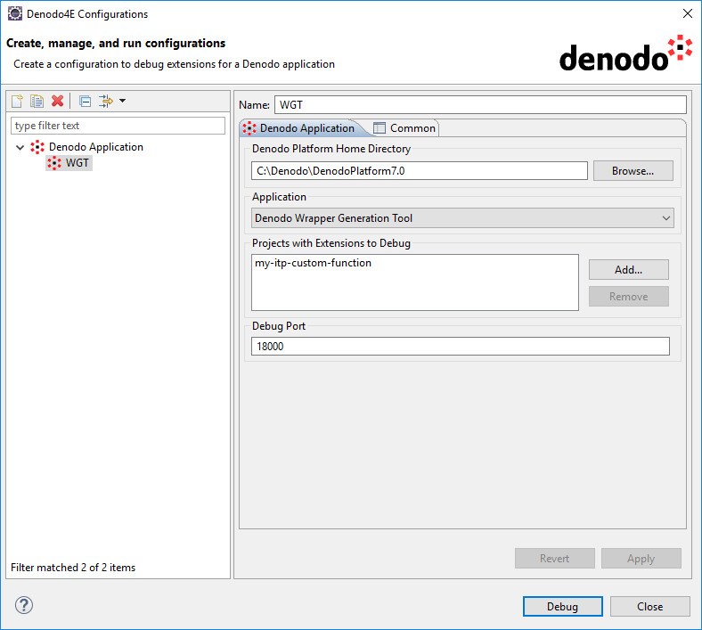

   Denodo4E configuration to debug ITPilot custom functions

Starting the Wrapper Generation Tool
====================================

Click **Debug** to launch the Wrapper Generation Tool in debug mode, linked to the *my-itp-custom-function* project (this project can depend on other Eclipse projects or external jar files; see :ref:`Support for dependencies` for more details).

If you open the Debug perspective (menu **Window** > **Open Perspective** > **Debug**) you will see something like this:
  
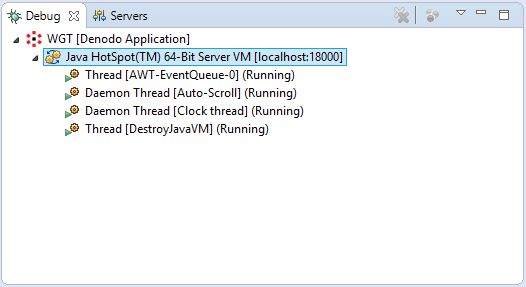

   Debug perspective

Click **Terminate** (|icon1|) to close the debug session and stop the Wrapper Generation Tool.

Click **Disconnect** (|icon2|) to close the debug session but leave the Wrapper Generation Tool running.

Debugging the Custom Function
=============================
  
Now create a new process in the Wrapper Generation Tool. Create an *Expression* component, open its editor and write any expression involving the ITPilot Custom function 
included in *my-itp-custom-function*. You can see an example in the following screenshot:

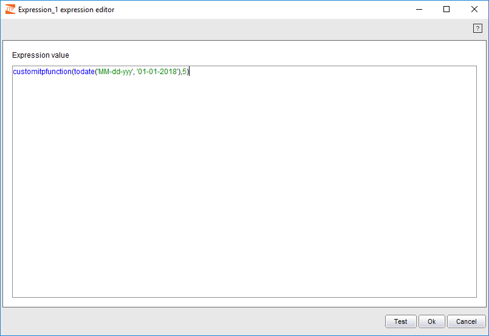

   Expression editor
  
Now go back to Eclipse, open the source file of the ``CustomItpFunction`` class and set a breakpoint in the execute method. 
Go to the expression editor in the Wrapper Generation Tool and click Test. The execution will be interrupted and Eclipse will display the debug information:

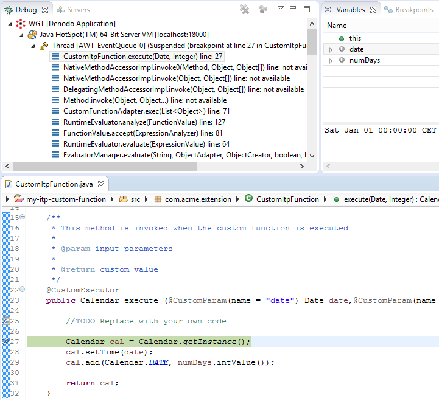

   Debug perspective
  
You can use now any features available in the Eclipse debugger, including Hot code replacement, to debug the custom function. 
For example, replace the ``execute`` method code with the following and then save the changes:
  
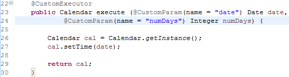

Now resume the execution. In the Wrapper Generation Tool you will see something like this:

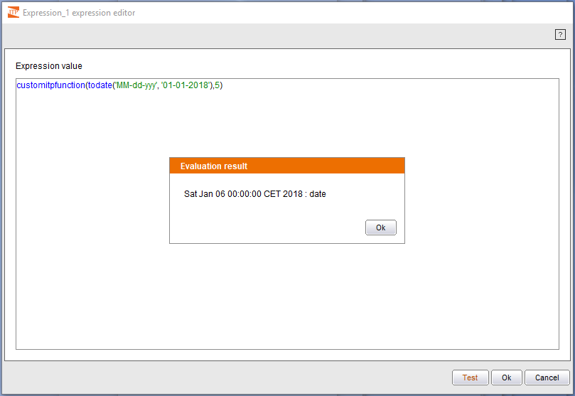

   Expression editor

Deploying the Custom Function
=============================

Now that we have a working ITPilot Custom Function we are going to deploy it into the Wrapper Generation Tool.

First you will need to stop the Wrapper Generation Tool (new extensions will not be detected until the tool is restarted, if it was running before deploying the JAR 
containing them).

Back in Eclipse, right-click the project *my-itp-custom-function* project > **Deploy Extensions...** to open the Deploy wizard. Configure the wizard as in the screenshot below and click **Finish**.

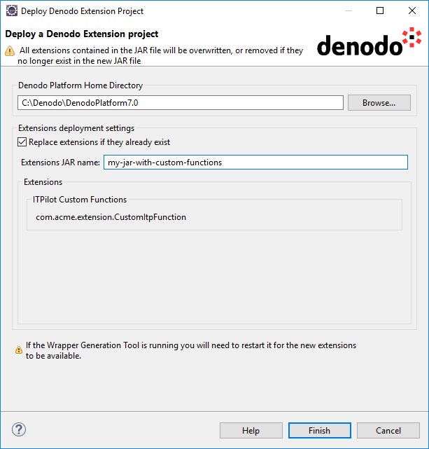
  
   Deploy Denodo extension

Open the Denodo Platform Control Center and launch the Wrapper Generation Tool. Go to **Tools** > **Extensions...** and you will see the new JAR containing our Custom Function.

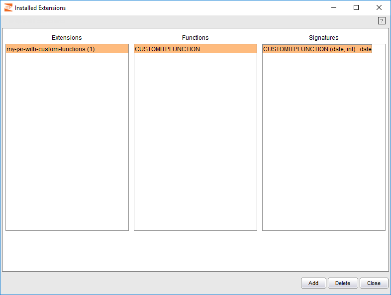

   Installed extensions

.. |icon1| image:: button_stop.png
.. |icon2| image:: button_disconnect.png  
