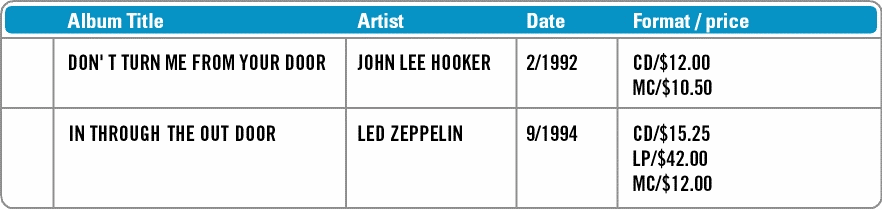

====================
An Overview of DEXTL
====================

A DEXTL program is composed of elements that are structured in a
hierarchical manner; these elements reflect the data items to be
extracted from a document or group of documents. For example, when
obtaining a structured view of a list of messages in a WebMail source,
DEXTL elements exist for data items such as messages, subjects, senders,
recipients, etc.

To understand this process it is important to first note that a Web
document contains two types of data that merge together:

-  Data for the user: visible texts in which most of the data to be
   extracted are actually found.
-  Data for the browser’s rendering engine: HTML tags with format data
   that instruct the browser how to graphically represent the texts seen
   by the user.

The data items that can be extracted using DEXTL match a hierarchical
data schema in which each item is composed of a series of attributes
that can be atomic or non-atomic. An atomic attribute can have a string
as a value, while a non-atomic attribute is composed of a series of
sub-attributes, atomic or otherwise. For a better understanding, think
of an application for an electronic music shop (e.g. selling CDs, DVDs,
etc.) from which we want to extract the following data on each album:
TITLE of the album, name of the ARTIST, DATE recorded and data on the
EDITION, which is a non-atomic attribute composed of the FORMAT and the
PRICE of the album.

Normally, a DEXTL program has a *non-atomic element* for each non-atomic
attribute in the schema of the extractable data. The different elements
of a DEXTL program are hierarchically listed in the same manner as the
attributes in the schema of the data to be extracted.

Each non-atomic element of a DEXTL program is usually composed of one or
more *DEXTL patterns*. A detailed definition of a DEXTL pattern will be
provided in the following sections, but for the moment it is enough to
know that a pattern defines a sequence of data and separators between
these data which reflect the way the data corresponding to the
non-atomic attribute are arranged on the Web pages.

The basic structure of a DEXTL element is described below:

-  Name of the element.
-  FROM clause: identifies the start of the search area for the specific
   element. If this clause does not appear in the program, the FROM is
   taken from the parent element (i.e. from the preceding level). If
   this does not have a FROM or this subelement does not exist, the
   beginning of the document is taken into consideration.
-  TO clause: identifies the end of the search area for the specific
   element. If this clause does not appear in the program, the end of
   the document is deemed to demarcate the search area.
-  Between both demarcation clauses is the DEXTL EXTRACTION pattern,
   which describes the subelements and how they are grouped in the
   search area, thus, enabling them to be identified and extracted.

All the clauses mentioned are composed of DEXTL patterns. A DEXTL
pattern is composed of a list of *elements of text to be extracted*
(what we call *text tokens*) that are consecutively arranged on a Web
page and which are separated from each other by *separators*.

Text tokens represent text in the page displayed by the browser. They
have an associated name (prefixed with the character ‘:’), which usually
matches the name of an atomic attribute of the data element to which the
pattern is associated. The reserved name IRRELEVANT is used to represent
text tokens present in the pattern that are not to be extracted.

The separators between tokens can be of two types:

-  Separators of the string type. They represent texts that are visible
   on the page that behave like separators between text tokens.
-  Separators of the format-tag type. They represent a regular
   expression that matches an HTML tag. For example, a ``BR`` separator
   could be defined as follows: ``BR = "<BR"[^\>]*">"``.

ITPilot provides by default a set of *format tags* that cover all the
HTML tags, for correct extraction of information from HTML documents.
Each DEXTL pattern has a series of associated separators of the
format-tag type that are indicated by means of the TAGSET construction.
Any HTML tag that does not match with one of the format-tag type
separators included in the set being used for the current pattern is
ignored.

**Example**: `Search results from an electronic music shop`_ shows two
search results from an electronic music shop.

   Search results from an electronic music shop

We want to extract the group of items corresponding to the element
ALBUM:{TITLE, ARTIST, DATE, EDITION:{FORMAT, PRICE}}. `HTML code associated with the figure above`_ shows the fragment of the HTML code from the previous
figure, omitting some tag attributes to improve legibility.

.. code-block:: html
   :name: HTML code associated with the figure above
   :caption: HTML code associated with the figure above

   <TR>
      <TD>
         
      </TD>
      <TD>Album title </TD>
      <TD>Artist </TD>
      <TD>Date </TD>
      <TD>Format/price </TD>
   </TR>
   <TR>
      <TD>
         
      </TD>
      <TD>
         <A>DON’T TURN ME FROM YOUR DOOR</A>
      </TD>
      <TD>
         <A>JOHN LEE HOOKER</A>
      </TD>
      <TD>2/1992 </TD>
      <TD>CD / £9.07 MC / £7.93 
      </TD>
   </TR>
   <TR>
      <TD>
         
      </TD>
   </TR>
   <TR>
      <TD>
         
      </TD>
      <TD>
         <A>IN THROUGH THE OUT DOOR</A>
      </TD>
      <TD>
         <A>LED ZEPPELIN</A>
      </TD>
      <TD>8/1994</TD>
      <TD>CD / £11.85 LP / £29.28 MC / £9.59 
      </TD>
   </TR>
   <TR>
      <TD>
         
      </TD>
   </TR>

The figure `DEXTL program for extracting music shop data`_ shows the DEXTL program
code that is capable of extracting the occurrences of an element ALBUM.
Later in this manual a detailed description of each of the components of
the program will be provided (for simplicity reasons, this example does
not take into account the tagsets; a full DEXTL program should provide
information about them. See section :ref:`Tagsets` for information and
examples about tagsets.

.. code-block:: none
   :name: DEXTL program for extracting music shop data
   :caption: DEXTL program for extracting music shop data
   
   { NAME="ALBUM"
     FROM 
      TAGSET="ALL4_6"     
       "Album title" ENDTD TD "Artist" ENDTD TD "Date" ENDTD TD "Format/Price"    
     END_FROM 
   
     TAGSET="ALL4_6"
     ANCHOR :TITLE ENDANCHOR ENDTD TD ANCHOR :ARTIST ENDANCHOR ENDTD TD :DATE 
   
     { NAME="EDITION"
       LISTNAME="EDITION_LIST"
       TAGSET="ALL4_6"
       :FORMAT "/ £" :PRICE 
       <ENDTD ENDTR>
     }
   
   }
