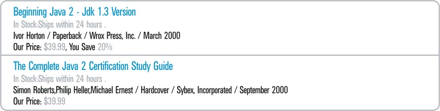

=====================================
Fundamentals of Pattern Specification
=====================================

To begin with, we should indicate that in a DEXTL program a DEXTL
pattern is usually used in the EXTRACTION clause for a specific
*element*.

As it will be seen in more detail later, an element within a DEXTL
program corresponds to a relation or a non-atomic attribute of a
relation (which can, thus, be seen as a sub-relation) the tuples of
which are to be extracted through said element of the DEXTL program
(thus, throughout the document this concept will be called "element" or
"relation" without exception). R will refer to the relation or
sub-relation from which we wish to extract tuples through a DEXTL
program element.

Regarding the syntax of an element within a DEXTL program, for now it is
enough to bear in mind that:

-  The specification of an element within a DEXTL program is demarcated
   using the opening character ``{`` and the closing character ``}`` (or
   ``{*`` and ``*}`` in for "flattened" elements: see section :ref:`Hierarchy
   of elements`).
   
-  Each element can have an associated name, which should match that of
   the relation or the non-atomic attribute of same from which the rows
   are being extracted and which is indicated with the notation
   ``NAME="NAME\_ELEMENT"``, where NAME\_ELEMENT is the name assigned to
   the element. This name should be indicated immediately after the
   element opening tag. If it is not indicated and the element is
   "flattened" (see section :ref:`Hierarchy of elements`), the system
   will assign a random name to the element.
-  Comments can be included in a DEXTL program, prefixed with the
   symbols ``//``.
   
-  Each element contains at least one pattern in its extraction clause
   that represents the way in which the tuples to be extracted, or a
   subelement, are arranged in the document (there may be elements that
   are simply used to group subelements, but in which no data is
   extracted).

A DEXTL pattern is composed fundamentally of the following types of
components:

-  Separators: these enable the system to distinguish where a specific
   attribute begins or ends within a pattern and where a specific tuple
   begins or ends. There are two basic types of separators in a pattern:

   -  Strings: these match portions of the document representing *data for
      the user*. They are represented in inverted commas in the pattern.
   -  Format tags: these are used to represent separators composed of a
      regular expression matching HTML tags. For example
      ``ENDANCHOR:="</A"[\n\r\t ][^\>]*">"|"</A>"``.

      *Format tags* are defined using regular expressions to which a name is assigned.
      The tags are defined to provide a simple and legible form of representing 
      complex regular expressions that frequently appear in the *data for the 
      visualizing tool*. It is important to highlight that the system ignores any portion 
      of the document representing format data that does not match any of the format tags.

-  Names of atomic attributes: these are found in the pattern position in
   which the value of the attribute appears in the graphic representation
   of the tuples of relation R. The name of the attribute is prefixed with
   the character ‘:’. They match the portions of the document that
   represent *data for the user* and that are found between two separators.
   It is also possible to have auxiliary attributes that do not belong to
   R, but the value of which may be saved for an operation or calculation.
   The auxiliary attributes are prefixed with ``::``.

-  ‘IRRELEVANT’ tag: operates in a manner similar to attribute names in R,
   but represents a portion of the pattern that is not to be assigned to
   any attribute in R.

-  Optional pattern tags [#f1]_: these are "/?" and "?/" and they demarcate
   areas of the pattern that may or may not appear. It is also possible to
   use the following format: "¿ <OPTIONAL> ?".

-  Tags to identify alternative portions of the pattern: an expression such
   as ‘(subpattern1 \| subpattern2)’ may appear in a pattern, indicating
   that something may appear in this zone of the pattern that matches
   ‘subpattern1’ or with ‘subpattern2’. In case of having more than two
   alternatives, the different sub patterns are specified by nesting the
   different alternatives, in this way: ( ( ( ( subpattern1 \| subpattern2
   ) \| subpattern3 ) \| subpattern4 ) \| subpattern5 ).

There are also tags for identifying alternative elements or
specifications: for instance in some electronic shops, when a product
search returns just one result, it automatically jumps to the product
detail page format instead of to the usual ‘search result’ page.
However, it is not possible to know whether the search will return one
or several products before executing a search, whereby it is not
possible to determine a priori which pattern should be used to extract
the tuples from the relation. DEXTL incorporates a function to deal with
this type of case, which consists in defining patterns to extract tuples
from all the possible document formats and separate them with the symbol
‘\|\|’. The DEXTL program tries the first pattern first. If it does not
find tuples that match, it moves on to the second and so forth. Given
that the program checks the pattern in the top location first, it is a
good idea to put the most frequent pattern in that position for
efficiency reasons.

**Example**: In the case of a Web source with information on books,
modeled using a relation R={TITLE, AUTHOR}, the following HTML fragment
represents the data which the source offers on a specific book:

.. code-block:: html
   :name: HTML Fragment with Data on a Book
   :caption: HTML Fragment with Data on a Book

    Michael <b> Crichton </b> 
   <a href="/cgibook.jsp?id=1256790">Title: Jurassic Park </a>
    

Imagine that just one separator of the format-tag type is used: BR. The
BR tag is associated with a regular expression which matches the *data
for the visualizing tool* contained in the document each time the tag
’ ’ appears. The tag BR is the only tag defined in this example; all
the HTML tags that do not match the definition of BR will be ignored by
the scanner.

.. code-block:: none
   :name: Definition of BR
   :caption: Definition of BR
   
   BR:="<BR"[^\>]*">" 

Under these conditions, the DEXTL program analyzes the tokens in the
following manner:

#. Token of the type BR. Corresponding to the first ‘ ’.
#. Token of the type TEXT containing the value ‘Michael Crichton’. Note
   that the tags ‘<b>’ and ‘</b>’ are ignored as they constitute *data
   for the visualization tool* which does not match any of the defined
   format tags (in our example, the only format tag is BR, and ‘<b>’
   does not match the regular expression defined for the tag BR; the
   same applies to ‘</b>’).
#. Token of the type BR. Corresponding to the second ‘ ’.
#. Token of the type TEXT containing the value ‘Title: Jurassic Park’.
   Note that the tags ‘<a href=…>’ and ‘</a>’ are ignored, as they do
   not match the only format tag that was defined (BR).
#. Token of the type BR. Corresponding to the third ‘<br’>.

In summary,

.. code-block:: none
   :name: Format tags of the example
   :caption: Format tags of the example
   
   BR "Michael Crichton" BR "Title: Jurassic Park" BR

To understand it better now imagine that the following pattern has been
defined:

.. code-block:: none
   :name: Definition of a Simple Pattern
   :caption: Definition of a Simple Pattern
   
   { NAME="R"
     :AUTHOR BR "Title:" :TITLE BR
   }

Given this pattern, the DEXTL program detects an occurrence of the
pattern, when it receives the following sequence of tokens: TEXT, BR,
TEXT, BR. In addition, the second TEXT has to comply with an additional
restriction: it should match the regular expression implicit in the
portion of the pattern ["Title:" TITLE], which in this case determines
that the value associated with the token should start with the string
"Title:".

As it can be seen, in the case of the preceding HTML code fragment, the
last four tokens constitute a sequence that matches the pattern. Once
the token sequence has been detected, the actions carried out are as
follows:

-  Create a new relation tuple.
-  Assign the value of the first token TEXT to the field AUTHOR of the
   new tuple. In this specific example, the value that the field AUTHOR
   will take is ‘Michael Crichton’.
-  Assign to the field TITLE the result of applying the regular
   expression constructed implicitly using separators of the type string
   to the value of the second token TEXT, which consists in deleting the
   substring ‘Title:’. Thus, for our example tuple the value for the
   field TITLE is ‘Jurassic Park’.

**Example**: consider the example in `Results Returned in an Online
Bookshop`_, which shows what the HTML page returned in an online
bookshop search looks like on an Internet browser. The code associated
with the representation of the first book is shown.

   Results returned in an online bookshop

Looking closely at these two results, you can see that the structure
differs. The first contains additional discount data.

The HTML code of the first search result is as follows:

.. code-block:: html
   :name: HTML code of search result for electronic bookshop
   :caption: HTML code of search result for electronic bookshop
   
   
      <A href="/booksearch/isbnInquiry.asp?userid=2N3SK9Y2P7&mscssid=JF86DUA3QD498J283583M4SBG9PQ0UL7&isbn=1861003668">
         <b>Beginning Java 2 - Jdk 1.3 Version</b>
      </a>
   
    
   
   In Stock:Ships within 24 hours.
   
    Ivor Horton / Paperback / Wrox Press, Inc. / 
   March&nbsp;2000 
      Our Price: $39.99, You Save 20%
    
   
   </TD>
   
In this case, the schema of the data to be extracted can be modeled
using just one non-atomic element called BOOK. This element is composed
of the atomic subelements TITLE, AUTHOR, FORMAT, PRICE and DISCOUNT. The
DEXTL program that obtains the data items associated with the element
BOOK is shown below. Imagine that just one separator of the format-tag
type is used: BR.

.. code-block:: none
   :name: DEXTL pattern for obtaining elements from the electronic bookshop
   :caption: DEXTL pattern for obtaining elements from the electronic bookshop
   
   {NAME="BOOK"
    :TITLE BR
    IRRELEVANT BR
    :AUTHOR "/" :FORMAT "/" IRRELEVANT BR
    "Our Price:" :PRICE /? ",You Save" :DISCOUNT ?/ BR
   }

Once the pattern of the tuples of the element BOOK has been defined, the
system searches for occurrences of this pattern in the page.

Data on the page are associated with the items that are to be captured
through the following series of actions:

#. Token of the type TEXT with the associated value ‘Beginning Java 2 -
   Jdk 1.3 Version’. Subsequently this token is associated with the
   attribute TITLE.
#. Token of the type BR corresponding to the first ‘ ’.
#. Token of the type TEXT with the associated value ‘In Stock:Ships
   within 24 hours.’ This token is associated with the identifier
   IRRELEVANT, which is a reserved identifier used by DEXTL to reject
   data.
#. Token of the type BR corresponding to the second ‘ ’.
#. Token of the type TEXT with the associated value ‘Ivor Horton /
   Paperback / Wrox Press, Inc. / March&nbsp;2000’. DEXTL divides this
   value using the pattern *’:AUTHOR "/" :FORMAT "/" IRRELEVANT’*,
   obtaining the items *AUTHOR=Ivor Horton, FORMAT=Paperback* and
   rejecting *Wrox Press, Inc. / March&nbsp;2000*.
#. Token of the type BR corresponding to the third ‘ ’.
#. Token of the type TEXT with the associated value ‘Our Price: $39.99,
   You Save 20%’. DEXTL associates this value with the pattern ‘ *"Our
   Price:" :PRICE /?",You Save" :DISCOUNT ?/* ’ to obtain the items
   *PRICE=$39.99* and *DISCOUNT=20%*. It is important to remember that
   obtaining the item *DISCOUNT* is optional. The second result of the
   example is equally valid, although it does not provide any discount.
#. Token of the type BR corresponding to the last ‘ ’.

--------------

.. rubric:: Footnotes

.. [#f1] The "¿" symbol has the ASCII code 168, and can be obtained by pressing ALT-168.
