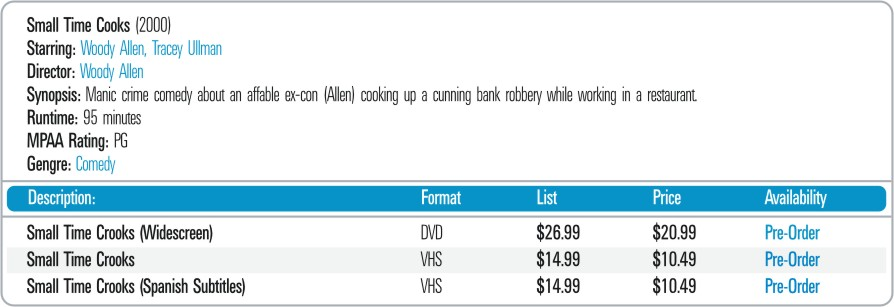

==========================
Relations and Subrelations
==========================

As mentioned in the section :ref:`Fundamentals of pattern specification`, an
attribute of a specific relation (i.e. of a specific element) can be a
relation with its own attributes. DEXTL provides support to process
these cases through the hierarchical arrangement of different DEXTL
elements within the same program.

When this occurs, it is said that the subrelation associated with the
attribute is a "child" of the relation that contains the attribute.

For the system to be able to extract tuples from a subrelation a new
element must be defined for them, as a subelement of the element that
extracts tuples from the parent relation. This is specified by including
it between the symbols ‘{‘ and ‘}’. The name of the new subelement must
be specified at the start of the subelement, with the notation
‘NAME="NAMEELEMENT"’, where NAMEELEMENT is the name assigned to the
element. After the name of the subelement, a FROM clause can be declared
as usual, followed by the pattern of the subelement.

In addition, a pattern that demarcates the end of the subrelation must
be indicated in order for the system to recognize when it should stop
the search for tuples of the subrelation and return to the search for
tuples from the relation or superior element. For this a pattern has to
be provided inside a TO clause; it constitutes the *end tag of the
subrelation*. As a regular TO pattern, it must be inserted between the
symbols ‘<’ and ‘>’ immediately before the end tag of the subelement
‘‘}’. If this TO pattern is not included, it is implicitly assumed that
the subrelation has to be searched until the end of the current
document. An important detail is that the text that causes the *TO
pattern* to be matched is not discarded: once the subelement has been
abandoned the text is returned to the input and will be considered again
in the next search of the parent element.

Different *format tags* can be used for the pattern of each relation or
subrelation. In fact, each pattern contained in a block between ‘{‘ and
‘‘}’ can specify its own format tagset by putting the expression
‘TAGSET="NAME"’ before the pattern definition, where NAME represents the
name of the format tagset to be used. It is important to highlight that
the pattern specified by the TO pattern of a subrelation uses
the tagset defined for the pattern that is being analyzed at each moment
in time (this is due to the fact that each pattern of the element can
have a different tagset).

**Example**: Consider an electronic video shop represented by the
relation R={TITLE, ACTORS, DIRECTOR, GENRE, SUMMARY,
EDITION{DESCRIPTION, FORMAT, PRICE}}.

This figure shows an example of a fragment
of a Web page in which a tuple of R is represented graphically.

To construct this specification a tagset will be defined containing only
three *format tags*: the BR, ENDTD and ENDTABLE.

ENDTABLE represents the end of a table in HTML. Thus,
ENDTABLE="</TABLE"[^\\>]\*">".

The DEXTL program that would be able to extract tuples with this format
is shown below:

.. code-block:: none
   :caption: Pattern

   { NAME="R"
   :TITLE "(" IRRELEVANT ")" BR
    "Starring:" :ACTORS BR
    "Director:" :DIRECTOR BR
    "Synopsis:" :SUMMARY BR
    IRRELEVANT BR
    IRRELEVANT BR
    "Genre:" :GENRE BR
    PATTERN EDITION
    {
      FROM "Description:" ENDTD "Format:" ENDTD "List:" ENDTD "Price:" ENDTD "Availability:"
                 ENDTD 
      END_FROM
      :DESCRIPTION ENDTD :FORMAT ENDTD IRRELEVANT ENDTD :PRICE ENDTD
     <ENDTABLE>
    }
   }

`HTML of "Output from an Electronic Video Shop" without the irrelevant tags`_ shows the HTML code associated with
`Output from an Electronic Video Shop`_ after deleting all those HTML tags ignored by the DEXTL program, 
as they did not match any of the *format* tag definitions. These constitute most of the document.

.. code-block:: html
   :name: HTML of "Output from an Electronic Video Shop" without the irrelevant tags
   :caption: HTML of "Output from an Electronic Video Shop" without the irrelevant tags

   Small Time Crooks (2000) 
   Starring: Woody Allen, Tracey Ullman 
   Director: Woody Allen 
   Synopsis: Manic crime comedy about an affable ex-con (Allen) cooking up a cunning bank robbery while working in a restaurant. 
   Runtime: 95 minutes 
   MPAA Rating: PG 
   Genre: Comedy 
   
   </TD> Description:</TD>Format:</TD>List:</TD>Price:</TD>Availability:</TD>
   Small Time Crooks (Widescreen)</TD>DVD</TD>$26.99</TD>$20.99</TD>Pre-Order</TD>
   </TR>
   Small Time Crooks</TD>VHS</TD>$14.99</TD>$10.49</TD>Pre-Order</TD>
   </TR>
   Small Time Crooks (Spanish Subtitles)</TD>VHS</TD>$14.99</TD>$10.49</TD>Pre-Order</TD>
   </TR>

The document analysis will now operate in the following manner:

-  Until the beginning of the subrelation is reached it operates in the
   same manner as that seen before.

-  When it is time for a specific tuple extraction process to search for
   tuples in the subrelation (because it matches the pattern defined in the
   FROM clause of the subrelation):

   - It executes the change of tagset, if it is different to that of the
     parent element (in this case this is not so).

   - It begins to simultaneously search for the tuple pattern in the
     subrelation main patterns (to look for data to extract) and the
     *subrelation end tag* pattern (to check if the end of the subrelation
     search area has been reached).

      -  The search for tuples in the subrelation is developed in the same
         manner as the search for tuples in a parent element.
      -  When the *subrelation end tag* is found, the group of tuples
         extracted from the subrelation becomes the value of the attribute
         corresponding to the tuple of the parent element. In addition, the
         text that triggered the detection of the end tag is returned to the
         beginning.

   -  When processing of the subelement is complete, the search for the
      attributes that are missing from the tuple of the parent element
      proceeds.

There is one restriction to the use of subrelations, which is as
follows: when an element of a DEXTL program has a subrelation as a first
attribute (i.e. a non-atomic attribute), the system has to match at
least one occurrence of a subrelation before being able to match the
pattern TO. Therefore, the number of occurrences of subelements that
constitute the first component of an element will be between 1 and n
instead of between 0 and n.

