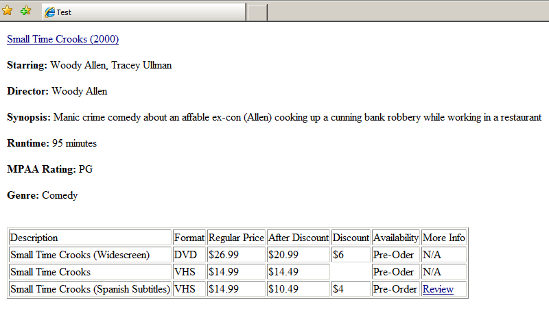
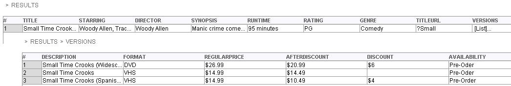

====================
Putting All Together
====================

In the following section a complete example is presented, as a summary
of all the concepts explained in this document. The example starts with
a web page that contains movie information to be extracted, and then
shows different additional views: the HTML code of the page, the format
tags that are scanned from the HTML, the DEXTL program that is used to
extract the data and the extraction results.

Browser View
============

   

HTML Code View
==============

.. code-block:: html

   <A href="Small Time Crooks.html"> Small Time Crooks (2000) </A>   
   <b>Starring: </b> Woody Allen, Tracey Ullman   
   <b>Director:</b> Woody Allen   
   
   <b>Synopsis:</b> Manic crime comedy about an affable ex-con (Allen) cooking up a cunning bank robbery while working in a restaurant   
   
   <b>Runtime:</b> 95 minutes   
   
   <b>MPAA Rating:</b> PG   
   
   <b>Genre:</b> Comedy     
   
   <TABLE border="1">
   <TR>
      <TD>Description</TD><TD>Format</TD><TD>Regular Price</TD><TD>After 
      Discount</TD><TD>Discount</TD><TD>Availability</TD><TD>More Info</TD> 
   </TR>
   <TR>
      <TD>Small Time Crooks (Widescreen)</TD> <TD>DVD</TD> 
      <TD>$26.99</TD><TD>$20.99</TD><TD>$6</TD><TD>Pre-Oder</TD><TD>N/A</TD>
   </TR>
   <TR>
       <TD>Small Time Crooks</TD> <TD>VHS</TD> <TD>$14.99</TD> <TD>$14.49</TD> 
       <TD></TD> <TD>Pre-Oder</TD><TD>N/A</TD>
   </TR>
   <TR>
       <TD>Small Time Crooks (Spanish  Subtitles)</TD> <TD>VHS</TD><TD>$14.99</TD> 
       <TD>$10.49</TD><TD>$4</TD><TD>Pre-Order</TD><TD><A href="more.html">Review</A>    
       </TD>
   </TR>
   </TABLE>

FORMAT TAGS VIEW
================

Scanner: StandardFullLexer4\_6, Tagset: all4\_6

**ANCHOR** "Small Time Crooks (2000)" **ENDANCHOR BR BR**

**B** "Starring:" **ENDB** "Woody Allen, Tracey Ullman" **BR BR**

**B** "Director:" **ENDB** "Woody Allen" **BR BR**

**B** "Synopsis:" **ENDB** "Manic crime comedy about an affable ex-con
(Allen) cooking up a cunning bank robbery while working in a restaurant"
**BR BR**

**B** "Runtime:" **ENDB** "95 minutes" **BR BR**

**B** "MPAA Rating:" **ENDB** "PG" **BR BR**

**B** "Genre:" **ENDB** "Comedy" **BR BR BR**

**TABLE TBODY TR TD**

"Description" **ENDTD TD** "Format" **ENDTD TD** "Regular Price" **ENDTD
TD** "After Discount" **ENDTD TD** "Discount" **ENDTD TD**
"Availability" **ENDTD TD** "More Info" **ENDTD ENDTR TR TD**

"Small Time Crooks (Widescreen)" **ENDTD TD** "DVD" **ENDTD TD**
"$26.99" **ENDTD TD** "$20.99" **ENDTD TD** "$6" **ENDTD TD** "Pre-Oder"
**ENDTD TD** "N/A" **ENDTD ENDTR TR TD**

"Small Time Crooks" **ENDTD TD** "VHS" **ENDTD TD** "$14.99" **ENDTD
TD** "$14.49" **ENDTD TD ENDTD TD** "Pre-Oder" **ENDTD TD** "N/A"
**ENDTD ENDTR TR TD**

"Small Time Crooks (Spanish Subtitles)" **ENDTD TD** "VHS" **ENDTD TD**
"$14.99" **ENDTD ENDTR ENDTBODY ENDTABLE**

DEXTL VIEW
==========

.. code-block:: none

   #include "scanners/StandardFullLexer4_6"
   
   {   NAME="Extractor_1_ITEM"
        LISTNAME="Extractor_1_ITEM"
        TAGSET="ALL4_6"
        ANCHOR(:TitleUrl=href) :Title ENDANCHOR() BR() BR() B() IRRELEVANT ENDB() :Starring BR() BR() B() IRRELEVANT ENDB()
        :Director BR() BR() B() IRRELEVANT ENDB() :Synopsis BR() BR() B() IRRELEVANT ENDB() :Runtime BR() BR() B() IRRELEVANT
        ENDB() :Rating BR() BR() B() IRRELEVANT ENDB() :Genre BR() BR() BR() TABLE() TBODY() TR() TD() IRRELEVANT ENDTD() TD()
        IRRELEVANT ENDTD() TD() IRRELEVANT ENDTD() TD() IRRELEVANT ENDTD() TD() IRRELEVANT ENDTD() TD()
        IRRELEVANT ENDTD() TD() IRRELEVANT ENDTD() ENDTR() TR() TD()
        {    NAME="Version"
              LISTNAME="Versions"
              TAGSET="ALL4_6"
              :Description ENDTD() TD() :Format ENDTD() TD() :RegularPrice ENDTD() TD() :AfterDiscount ENDTD() TD () /? :Discount ?/ 
              ENDTD() TD() :Availability
              <
                      ENDTD() TD() ANCHOR()
              >
          }
   }
   

RESULTS VIEW
============

