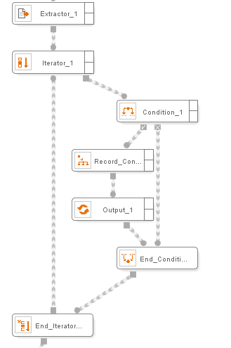
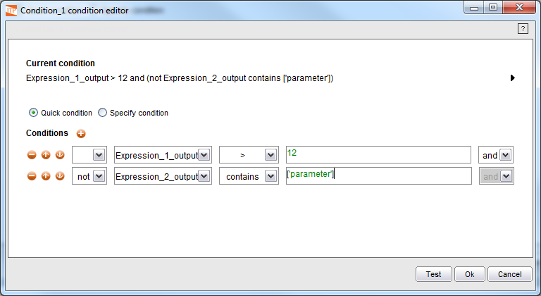
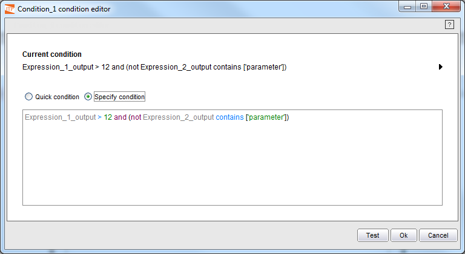

=========
Condition
=========

.. rubric:: Description

Allows defining a condition. Two output connections determine the
process flow, depending on whether the condition is met or not.

.. rubric:: Input Parameters

Zero or more values, zero or more pages, zero or more records and zero
or more record lists.

.. rubric:: Output Values

This component returns no element.

.. rubric:: Example

Consider the case presented in `Use of the Condition component`_.
Following the extraction of information from a Web resource by an
Extractor component, the process iterates on each of the obtained
results. Suppose that only the results matching with certain input
parameter provided by the user (using the Init component) should be
returned. To do so, a Condition component is used. Depending on the
result of evaluating the described condition expression (“true” or
“false”), the process will access the Record Constructor component to
generate the final output record or will simply go to the end of the
iteration to continue iterating. A condition expression can be created
using the component creation wizard.

   Use of the Condition component

===========================
Using the Conditions Editor
===========================

The conditions editor allows creating selection conditions. The editor
allows to define a list of simple conditions over input values
(`Condition editor, using simple conditions`_), or to manually type any
condition, no matter how complex (`Condition editor, typing the
condition manually`_). Examples of conditions that cannot be graphically
created using simple conditions include those having functions on the
left operand or conditions with several levels of parenthesis.

The box for manually writing conditions provides some features to assist
the user when the condition is being typed: syntax highlighting and text
completing.

-  Syntax highlighting: the errors in the condition are highlighted in
   red, and by hovering the mouse over the erroneous elements a
   description of the error will be provided as a tooltip. Also,
   different colors are used to highlight constants, functions and
   variables.
-  Text completing: a popup menu for text completing can be invoked by
   typing Ctrl+Space; it also appears after the condition is changed.
   This menu shows a list of elements that can be inserted in the
   current position, as input variables or functions (both built-in and
   custom). The items can be selected by clicking with the mouse or
   navigating the list with the up and down arrows and pressing Enter.
   
   The list of elements will only show the items that match the current
   prefix. For example, after writing a “c” character and opening the text
   completing menu, only the functions whose names start with “c” will be suggested. 
   
   Also, the expected types are taken into account, depending on the place where
   the menu is open. If the menu is open inside a function, the list will only show
   the items with a type compatible with the type of the function parameter where
   the cursor is placed. For example, when completing parameters of the function
   concat, only variables of type string will appear, and only functions whose return type is string. 
   
   The functions that are in the text completing list include the core functions and
   the custom functions that are installed in the environment (see :doc:`/itpilot/developer/index` for additional details about the custom functions).

   Condition editor, using simple conditions

   Condition editor, typing the condition manually

