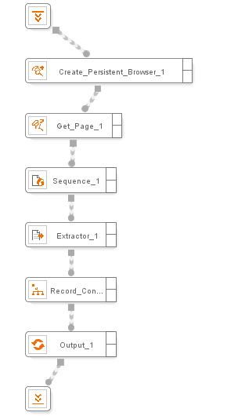
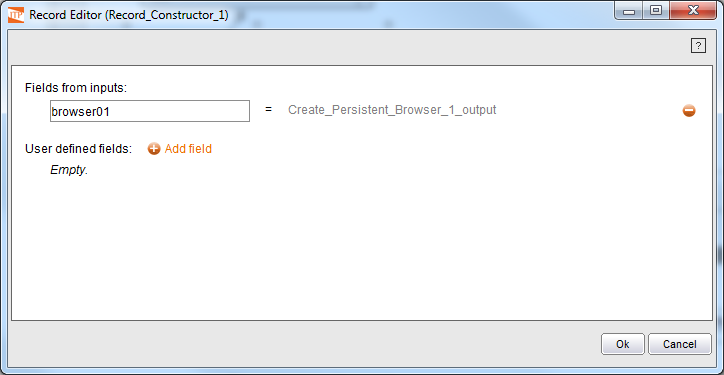

=========================
Create Persistent Browser
=========================

.. rubric:: Description

This component lets the user create a persistent browser, that is, a
browser that is kept active after the wrapper that created it finishes
its execution. This way, another wrapper executed later can reuse the
browser state.

This is useful for instance when, in the middle of a web automation
process, we need to dynamically receive information from the user. In
these situations, we can split the process in two wrappers: the first
one will execute the process until the information from the user is
required and will return the identifier of the persistent browser used.
The second wrapper will receive as input this identifier and will
continue the browsing from the same point and using the same browser.

.. rubric:: Input Parameters

This component does not require any input parameter.

.. rubric:: Output Values

The component returns a browser identifier of the created persistent
browser. This identifier can be use later by a GetPage component in
other wrapper to obtain the page that ITPilot internally recognizes as
belonging to the persistent browser.

.. rubric:: Using the Component Create Persistent Browser

There are occasions in which it is necessary to “stop” the execution of
a process, but in a way that it is possible to keep its state. For
instance, a web automation process may require at a specific moment some
information manually typed by a user (e.g. a password) in order to
continue the process. In those cases, the components Create Persistent
Browser (section :ref:`Create Persistent Browser`), Get Page (section :ref:`Get
Page`) and Release Persistent Browser (section :ref:`Release Persistent
Browser`) allow that management to take place.

In general, a process will be the responsible for creating a persistent
browser by using the Create Persistent Browser component. This component
returns a ``browser``-type object that can be internally stored in the
process for its latter use, and/or returned as result of the process
execution. `Using Create Persistent browser`_ shows a simple example. It
can be seen how a Create Persistent Browser component has been created
that returns a ``browser`` value. This value can be immediately used by
a Get Page component to obtain a ``Page`` object that can be used in
other components such as Sequence, Extractor Sequence, and so on.

   Using Create Persistent browser

This process returns a ``browser`` value as a result, so that it can be
reused by another wrapper at a later stage. `Using Record Constructor to
return a persistent browser`_ shows how the Record Constructor component
contains the ``browser`` value created by the Create Persistent Browser
component as a result.

   Using Record Constructor to return a persistent browser

Another process can recover the state of that browser if its identifier
is passed as an input argument. Obviously, the state of the browser
depends on characteristics such as its cookies’ expiration time, or the
session expiration time. Any process desiring to use these components
must take into account the inherent behavior of the web applications to
be accessed.

Finally, the Release Browser component is used to free that browser.

The CreatePersistentBrowser component wizard can be configured for the
type of browser to be used. The options are:

#. Default: default browser.
#. MSIE Browser: Microsoft Internet Explorer.
#. Denodo Browser: http client able to manage JavaScript.