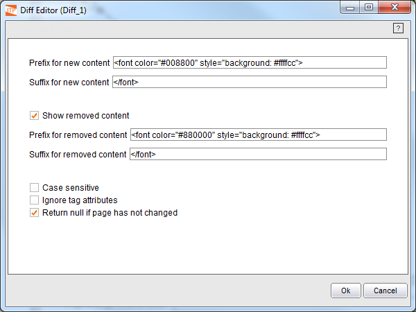

====
Diff
====

.. rubric:: Description

The Diff component allows comparing two web pages, returning the
differences between them in terms of the HTML code obtained.

.. rubric:: Input Parameters

This component has the following input parameters. On one hand, a
character string, “Original page source code”, which will contain the
source code of the homepage. The page with which it is compared can be
entered in two different ways: either as a character string that
contains the page code (“Current page source code”) or as a page-type
object (“Current Page”) such as that returned by the Sequence component.
If this last option is used, its base URL will be used as the base URL
of the output HTML code.

.. rubric:: Output Values

The component returns a character string that contains the HTML code of
a page that displays the differences between the pages entered as
component input parameters.

.. rubric:: Using the Component

In some cases, the decisions to take in the Web automation process must
be based not on the records obtained but rather on changes to the pages
through which the process browses. To do so, the Diff component allows
finding the differences between two HTML pages (generally, the same page
at two different times). Therefore, based on the input information, the
component can be configured with the following parameters, as shown in
`Diff Editor`_.

   Diff Editor

-  *Prefix for new content*: This text box indicates the prefix to use
   on generating the results page for the new contents (green HTML tag
   by default).
-  *Suffix for new content*: This text box indicates the suffix to use
   on generating the results page for the new contents (green HTML tag
   by default).
-  *Show removed content*: This check box indicates whether the prefix
   and suffix configuration for the deleted contents is required. This
   means that if this option is not marked, the deleted parts will not
   be displayed. Depending on this option, the following two options may
   or may not be enabled.
-  *Prefix for removed content*: This text box indicates the prefix to
   use on generating the results page for the deleted contents (red HTML
   tag by default).
-  *Suffix for removed content*: This text box indicates the suffix to
   use on generating the results page for the new contents (red HTML tag
   by default).
-  *Case sensitive*: This indicates whether the marking of changes is
   case sensitive. This is not selected by default.
-  *Ignore tag attributes*: This check box configures whether the HTML
   tag attributes are to be ignored when the pages are compared. This
   means that two HTML tags with different values for their attributes
   will be considered as equal. This does not affect the results HTML
   page generation process. This option is not selected by default.
-  *Return null if page has not changed*: This check box (marked by
   default) indicates that, if the results page is equal to any of the
   two input pages, the component returns “null” instead of the page
   itself.

