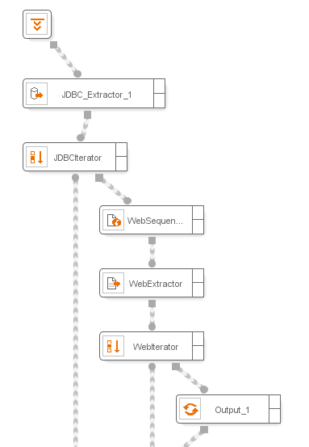
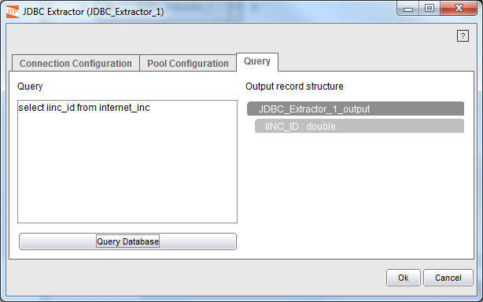

==============
JDBC Extractor
==============

.. rubric:: Description

This component sends a query to any data source available through the
JDBC protocol and returns a list of records containing the retrieved
results.

.. rubric:: Input Parameters

The JDBCExtractor component accepts zero or more records and zero or
more values as input arguments. These elements are used to assign
variables to the component configuration parameters.

.. rubric:: Output Values

A record list, where the record structure is defined by the query
performed on the database.

.. rubric:: Example

In many cases, the web applications from which we are retrieving data
require input parameters that are stored in other repositories. For
example, the employee identifications of a financial institution, which
are going to be used by the institution itself to access to their
intranet and perform a service quality control of its internal
applications. With ITPilot, performing this action is simplified by
using the JDBCExtractor component. `Access to Information from a
Relational Database`_ shows part of the example process. First, the
component executes a query to a relational database, from which an
employee list is obtained. Then, an Iterator is used so that the
internal web application is accessed, one employee id at a time, to
extract the data which allow the required validation process to work.

   Access to Information from a Relational Database

In the component wizard, we will find three configuration tabs:

-  The first one is used to configure the connection to the JDBC
   repository:

   -  Database Adapter: Used to select from a list of predefined database
      adapters. When a database adapter is selected, the driver class and
      the database URI are automatically filled.
   -  Driver Class: The driver class to use for connecting to the data
      source (it can use variables that are obtained from the input values
      and records).
   -  Driver Properties: these are important to access databases with
      specific characteristics; adding driver properties is optional, and
      the available properties are dependent on the specific driver that is
      used (consult the documentation of your specific driver for more
      details). If not specified, the default configuration is used.
   -  Database URI: The database connection URL (it may use variables that
      are obtained from the inputs of the component).
   -  Login: User name (it may use variables that are obtained from the
      component inputs).
   -  Password: The user keyword (it may use variables that are obtained
      from the component input values and records). The password’s value
      will be stored encrypted in the wrapper’s xml file.

-  The second tab of the component is used to configure the connection pool
   that manages the access to the repository:

   -  Use Pool: in this check box it can be decided whether a connection
      pool will be used or not.
   -  Initial Size: Number of connections for pool initialization. These
      connections are established in “idle” state, ready to be used. By
      default, its value is 4.
   -  Maximum Size: Maximum number of connections that the pool may manage
      at the same time.
   -  Ping Query: SQL query used by the pool to verify the status of the
      connections to be cached. It is required that the query is simple and
      that the table already exists. The default value is ”SELECT COUNT(\*)
      FROM SYS.DUAL”.
   
   -  The third tab is used to execute a SQL query that allows ITPilot to
      determine the output record structure (the query may use variables from
      the input records and values of the component). `Obtaining an output
      record structure in the JDBCExtractor component`_ shows how the
      “internet\_inc” table is accessed in the example to obtain the
      “iinc\_id” field as an incident’s unique identifier. Thus, the
      JDBCExtractor will return a list of records containing a unique field
      “IINC\_ID”.

   Obtaining an output record structure in the JDBCExtractor component

When the SQL statement to execute is of type INSERT or UPDATE, the JDBC
Extractor component returns a record with a single simple integer field
which contains the number of rows that have been inserted or updated. In
the case of CREATE, DROP, ALTER and TRUNCATE statements it returns a
record with a single integer field which contains the number of elements
affected.

.. note:: The JDBC Extractor component does not support the insertion of
   binary data.

.. note:: The first time you use a JDBC extractor to connect to a database, you need to copy the jar file of the JDBC driver of the database to :file:`{<DENODO_HOME>}/extensions/thirdparty/lib`. Then, restart the tool.