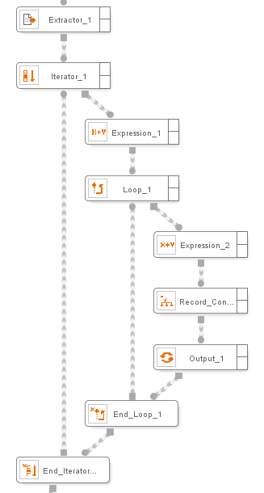

====
Loop
====

.. rubric:: Description

This component allows inserting loops in the flow. The loop will be
repeated, as long as the given condition is met (therefore, it is a loop
of type WHILE… DO).

.. rubric:: Input Parameters

Loop accepts zero or more values, zero or more records, zero or more
lists and zero or more pages. These elements are used to assign
variables to the loop output condition expression. The information about
available functions can be found in Appendix A.

.. rubric:: Output Values

None.

.. rubric:: Example

After an Extractor component has received information about several
people, being one of the attributes the birth date, an example wrapper
obtains information about each of the years in which this person has
been alive. This is done by accessing another resource that accepts as
an input the specific year to obtain information about and returns the
most relevant events from that year.

Using ITPilot it is possible to construct a loop, where each iteration
accesses each of the specific years. The components used in this part of
the process are shown in `Example of Loop component operation`_.

For each record obtained by the Extractor component an Expression
component (Expression\_1) is created that obtains the age of this
person, applying the expression:

``SUBTRACT(2012,GETYEAR(TODATE('MM/dd/yyyy',Record_Constructor_1_output.DATE)))``

, where the date of birth is subtracted from the current date to check
the age of this person (to simplify the example, only the date of birth
is taken into account). The output condition of the loop can be defined
like this:

``AGE = 0``

, where ``AGE`` is the value resulting from the previous subtraction.

Finally, another expression component (Expression\_2) needs to be
created within the loop to subtract 1 from the AGE expression in each
iteration so the previously defined output condition can be met:
``SUBTRACT(AGE, 1)``

   Example of Loop component operation

