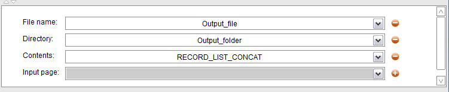
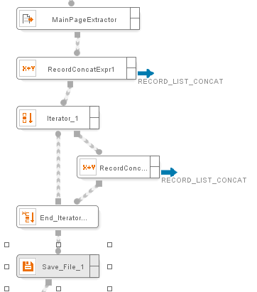
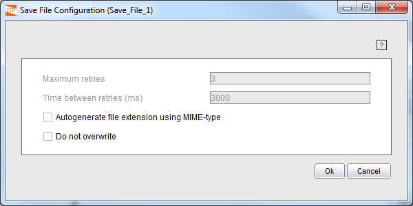
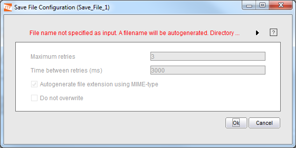

========
SaveFile
========

This component saves in a file the value of the input parameter.

.. rubric:: Input Parameters

Save File accepts the following input parameters:

-  “File name”: string-type value with the name of the file where the
   content is going to be stored. This parameter is optional; if not
   provided, the file will be given a random name.
-  “Directory”: string-type value with the name of the folder where the
   content is going to be stored. This parameter is optional; if not
   provided, the file will be saved in the default download folder. The
   default download folder is the folder configured as the ‘Temp
   directory’, which can be configured from the preferences dialog of
   the Wrapper Generation Tool (see :ref:`Generation Tool Global
   Preferences`) or the Web Administration Tool, for the
   generation and execution environments respectively.
-  “Contents”: string- or binary-type content to be stored.
-  “Input Page”: a page-type value, whose HTML source code will be
   stored. If this page contains frames, they will also be stored.

The “Contents” and “Input page” inputs are mutually exclusive: only one
of them can be used at the same time.

.. rubric:: Output Values

The full path name of the file where the component’s input has been
saved.

.. rubric:: Example

This example uses the Save File component to store in a text file a
group of records obtained by an Extractor.

`Input parameters of the Save File component`_ shows the input
parameters of the Save File Component and `Example of Save File
component operation`_ shows the basic structure of the example wrapper:

#. Configure an Extractor component and use an Iterator to go through
   all the obtained records.
#. Create an Expression named RECORD\_CONCAT\_EXPR\_1 with output name
   RECORD\_LIST\_CONCAT and an empty string as its value.
#. For each iteration, an expression, whose output name is
   RECORD\_LIST\_CONCAT, concatenates all the fields of the current
   record with the content of the RECORD\_LIST\_CONCAT variable.
#. After iterating through all the record, the Save File component is
   used to save the content of the RECORD\_LIST\_CONCAT variable that
   will contain the fields’ value of all the records obtained by the
   Extractor (see :ref:`Extractor`)

   Input parameters of the Save File component

   Example of Save File component operation

`Save File component Wizard with folder and file name specified`_ and
`Save File component Wizard with no folder and no file name specified`_
show the wizard of the component. The top controls allow configuring the
maximum number of retries in case of error, and the number of
milliseconds between retries; the availability of the other controls of
the wizard depends on what inputs are selected in the component: if a
file name is specified, both the “Autogenerate file extension using
MIME-type” and “Do not overwrite” options will be enabled. Both options
will be disabled if no file name is provided, as it will be generated
automatically.

   Save File component Wizard with folder and file name specified

   Save File component Wizard with no folder and no file name specified

If the option “Do not overwrite” is not selected, the output file will
be overwritten if already exists when the component is executed. If the
option is selected and the file exists, the appropriate error handler
will be executed, as configured in the Save File Details Tab for the
error “File name exists”.

When the component’s input is of page type (“Input page”) and this page
has frames, the content of these frames will be stored in a directory
created in the same path as the file of the main page, each frame will
be stored in a separate file and its name will be randomly generated.

If the component is configured to retry in case of error, the number of
retries and time between retries can be also specified in the wizard.