===========================================================
Description of the Navigation Sequences Generator Interface
===========================================================

.. toctree::
   :hidden:

   toolbar_state_info_dialog.rst

The figure below shows what the Navigation
Sequences Generator toolbar looks like when the browser is started from
the Wrapper Generation Tool and the toolbar is enabled.

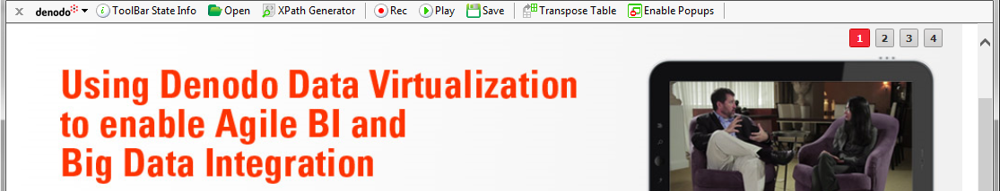

   Navigation Sequences Generator toolbar

A brief description of the interface elements is given below:

-  *Properties* |image1|. By clicking on the Denodo logo on the left of the bar it is possible to configure various aspects of the Navigation Sequences Generator functions (see section :ref:`Properties of the Navigation Bar`).
-  *ToolBar State Info* |image2|. This shows information about sequences that have been recorded, navigation elements that have been selected, and extractor sequences that have been generated (see section :ref:`Toolbar State Info dialog`)
-  *Open* |image3|.  Allows a navigation sequence saved on a disk file to be opened and executed.
-  *Assign Examples*. This button is used to mark examples for the data extraction
   process (see section :ref:`Defining the structure of the data and assigning examples`). It is not related with the navigation sequence recording process and, therefore, it will not be discussed further in this section.
-  *Review Examples*\ |image4|. This button is used to review the examples marked for 
   the data extraction process (see section :ref:`Reviewing the Data`). It is not 
   related with the navigation sequence recording process and, therefore, it will not be discussed further in this section.
-  *XPath Generator* |image5|. This button opens a tool that allows 
   generating the XPath expressions for the elements contained in a HTML page. 
   The generated expressions can be used with the functions *XPATH* and *XPATHLIST* 
   (see section :ref:`Functions for Page Handling`) or with the NSEQL command 
   *FindElementByXPath*, in the case of manually typing the sequence. 
   The section :ref:`XPath Generator Utility` gives a detailed description of this tool.
-  *Rec* |image6|. Starts the process of generating a sequence, requesting 
   the initial URL from the user and changing the Generator to record mode, whereby 
   the events generated by the user are recorded by the system and translated to 
   NSEQL commands. The figure below shows how, when adding a URL, the user can also 
   decide what to do with that URL selecting an option in the “Action” combo box. 
   The allowed actions go from a simple navigation to the resource, if no action 
   is selected, to saving the resource to the local file system or performing 
   Word/Excel/PDF to HTML conversions, if the resource is in Microsoft Word, 
   Microsoft Excel or Adobe PDF format. In these cases, ITPilot will convert 
   these formats into HTML (using format converters included in the distribution 
   or dependent on third-party tools, as described in section the section
   :ref:`Wrapper Advanced Options: Specific Browser Pool and Locale`).  
   The Browse button shows a file chooser that allows users to select a local 
   file or a network-shared file as the initial URL.

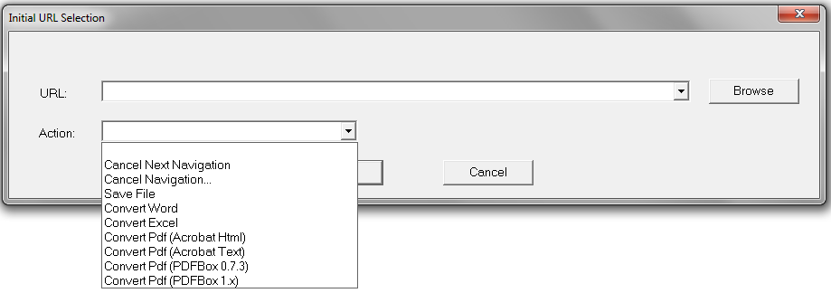

   URL Initial Selection, showing all the options of document converters

-  *Transpose Table* |image15|. This allows transposing a HTML table, transforming 
   its row vectors into column vectors, which is extremely useful to extract results 
   when the desired records are laid out in columns instead of rows. See section
   :ref:`The Transpose Table Button and Action`. 
-  *Enable PopUps* |image8|. The sequence generator supports the creation of 
   navigation sequences that involve actions on pop-up windows. In order to 
   do this, the *Enable pop-ups* button should be activated on the bar 
   (the button should display the text “Disable pop-ups”). If it is not 
   activated, no pop-up window will be allowed to appear during the 
   sequence recording.

ITPilot’s Navigation Sequences Generator toolbar has three modes: one
for recording navigation sequences, another for recording extractor
sequences, and a third one for assigning examples. The two latter ones
have been explained in sections :ref:`Recording a navigation sequence` and
:ref:`Defining the structure of the data and assigning examples`. In this
section we will focus on the first one.

The figure below shows what the
Navigation Sequences Generator toolbar looks like when the process of
recording navigation sequences is activated (record mode).

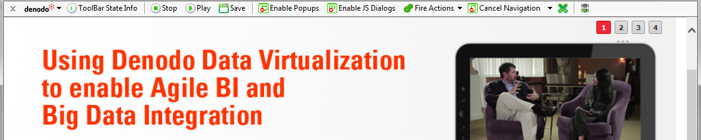

   Navigation Sequences Generator toolbar in Record Mode

1. Place the mouse over the element of the page where you want to execute
   the action. For instance, if you want to perform a click on an anchor,
   place the mouse over the desired anchor. If you want to fill in a form
   text field, position the mouse over the field.

2. Right-click on the mouse. Choose the desired browsing action in the
   drop-down menu. For instance, if you want to perform a mouse left-click,
   select “Click”. If you want to fill in a form text field, select
   “SetText”. The full list of available browsing actions is as follows:

   -  *Click*: this action will emulate left-clicking on the element.

   -  *DblClick*: this action emulates double left-clicking on the element.

   -  *RightClick*: right-clicking.

   -  *MouseOver*: hovering over a specific area on the page with the cursor.

   -  *MouseOut*: removing the cursor from a specific area on the page.

   -  *SelectFrame*: whilst frame-handling is normally transparent to the
      user, when the system is used for data extraction tasks, it is sometimes
      necessary to explicitly specify the frame in the page that the extractor
      component should process. See section :ref:`The SelectFrame action` for more
      information.

   -  *SelectOption*: selecting an option in a drop-down list. When choosing
      this action, a pop-up dialog will appear where the user will be able to
      select the desired option. We can also use the “Variable name” field in
      the dialog to specify that at execution time, the value of the input
      parameter of the sequence with the specified name should be used instead
      of the typed example value.

   -  *SetText*: typing text in an editable field on a Web site. When choosing
      this action, a pop-up dialog will appear where the user will be able to
      specify the desired text. We can also use the “Variable name” field in
      the dialog to specify that at execution time the value of the input
      parameter of the sequence with the specified name should be used instead
      of the typed example value.

   -  *TransposeTable*: this allows transposing a HTML table, transforming its
      row vectors into column vectors, which is extremely useful to extract
      results when records are disposed in columns instead of rows. See
      section :ref:`The Transpose Table button and action`.

   -  *Drag*: Used in drag & drop operations. Drags an element on the
      page.

   -  *Drop*: Used in drag & drop operations. Drops a previously dragged
      element.

   -  *Click and...*: emulates a left click on the element and performs some
      action over the resulting document. The same operations can be done
      combining an action in the Cancel Next Navigation menu with a Click
      action (see section :ref:`The Cancel Navigation Button`). The following
      actions are available:

      -  *Save File*: if the click performs a navigation, it is cancelled and
         the document is saved in the local file system. A dialog will prompt
         for a file name and a destination folder.
      -  *Convert Word*: if the click performs a navigation to a Microsoft
         Word document, the document is converted into a HTML document. The
         browser will navigate to the resulting HTML document.
      -  *Convert Excel*: if the click performs a navigation to a Microsoft
         Excel document, the document is converted into a HTML document. The
         browser will navigate to the resulting HTML document.
      -  *Convert Pdf* if the click performs a navigation to a PDF document,
         the document is converted into a HTML document. The browser will
         navigate to the resulting HTML document.
      -  *Cancel*: if the click produces a navigation, it is canceled.

   -  *Scroll*: scrolls on the active page. This action only take effect on
      scrollable elements. These means that it must be recorded on the
      scrollbars of the page (the HTML element) or the scrollbars of any DIV
      element that has the CSS property “overflow” set to “scroll” or “auto”.
      The following scroll actions are available:

      -  *Page Down*: moves the scrollable element to its bottom position.
      -  *Page Up*: moves the scrollable element to its top position.
      -  *Page Right*: moves the scrollable element to its rightmost position.
      -  *Page Left*: moves the scrollable element to its leftmost position.

A more detailed step-by step description of how to record navigation
sequences will be provided in section :ref:`Steps for generating a navigation
sequence` (an example was also provided in section :ref:`Component
Configuration`). Now, we provide a brief description of the function of
each of the interface elements:

-  *Stop* |image10|. This is enabled only in record mode. It allows stopping the sequence generation process, returning the browser to the normal mode and storing the recorded sequence (so it can be reviewed, saved to file or imported into a Sequence editor in the Wrapper Generation Tool).
-  *Play* |image11|. This is enabled only in record mode. It allows playing in a new browser window the sequence recorded up to the current moment.
-  *Save* |image12|. This is enabled only in record mode. This allows the current sequence to be stored in a text file on disk.
-  *Enable JS Dialogs* |image13|. This option allows enabling any JavaScript dialog box launched by the navigation client (they are blocked by default).
-  *Fire Actions* |image16|. This menu allows an alternative method for performing one browsing action. 
   This is useful when the website redefines the contextual menu that appears when right-clicking the mouse. 
   In those cases, it may not be possible to record browsing actions using the contextual menu, and this 
   alternative should be used. To specify an action using the “Fire action” button, perform the following 
   steps: 
   1. Click on the “Fire actions” button
   2. Select the desired action on the drop-down list
   3. The cursor arrow changes to |image18|. Move the cursor to the element in the page where you want to perform the action and left-click on it. The action will be executed and recorded.

-  *Cancel Navigation* |image17|. This button allows the user to indicate that the next link in the browsing 
   process does not lead to an HTML resource, but a PDF, Microsoft Excel or a Microsoft Word one (see section 
   :ref:`The Cancel Navigation Button` for detail). 
   The option “Only Cancel” lets the user ask ITPilot not to execute the following navigation command, but only process it 
   (e.g. allowing the processing of the javascript code needed to evaluate the target URL of a link, but without actually 
   performing the navigation). Read the section :ref:`CancelNextNavigation <CANCELNEXTNAVIGATION>` of the NSEQL Guide for more information.
-  *CloseWindow* |image14|. If, as part of the navigation sequence, a pop-up is to be closed, simply click on the CloseWindow button on the bar and drag it over the pop-up window to be closed. The event will be recorded by the generator and incorporated into the NSEQL program generated.
-  *Semaphore* |image19|. Only appears in the recording mode. This element is not a button, but an indicator for the user. Each time the browser changes between pages during the sequence generation process the red light lights up until the system is ready again to continue recording events, at which time the green light lights up. Thus, after accessing a new page during sequence generation the user should wait for the green light to turn on before proceeding.

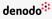

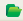
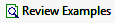
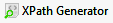

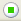

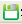
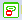

.. |image15| image:: transpose_table.png

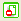

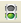
