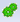

==========================================
Steps for Generating a Navigation Sequence
==========================================

.. toctree::
   :hidden:

   checking_navigation_sequences_in_systems_with_cookie-based_session_authentication_and_maintenance.rst

This section provides a step-by-step description of how a navigation
sequence is normally generated (section :ref:`Component Configuration`
provides an example).

1. Click on the *Rec* button to enter the record mode.

2. A dialog box appears requesting the initial URL of the sequence. This
   can either be written directly or pasted from the clipboard (*Paste*
   option in the contextual menu). For example, the Denodo example Webmail
   application can be used (see section :ref:`Presentation of the example`).

3. The browser automatically loads the initial page of the sequence. The
   red light lights up until loading is complete.

4. Once the traffic lights change to green, the navigation sequence can be
   generated. For this, the browser should be used to generate the required
   sequence, simply remembering the following two points:

   -  At each page change during sequence generation you have to wait for
      the green light to turn on before continuing.
   -  To specify browsing actions, use either of the two methods explained
      in section :ref:`Description of the Navigation Sequences Generator
      interface`: the contextual menu that appears right-clicking the
      mouse or the *Fire Actions* |image0| menu. *Events generated using the keyboard or directly on the
      page without using the events mentioned above, will not be registered by
      the Generator*.
   
   In our WebMail example, the system could be used to generate a sequence
   that automatically accesses the content of a user’s Inbox folder and
   sorts the messages by date. To do this, you should enter the user
   identification (e.g. ``demos``) and password (e.g. ``DeMo.04``), by
   using the “Set Text” event on each field. Changing the language
   selection, if required, is also possible (with the “Select Option”
   event). After pressing the form submission button (“Click” event), once
   the traffic lights icon turns green click the ‘Date’ link (“Click”
   event) to sort the messages by date.

5. At any point during the generation of the sequence, the *Play* button
   can be used to reproduce the portion of the sequence generated up to
   that moment. The system will launch a browser window in which the
   automatic execution of the generated sequence can be viewed. A dialog
   box will also display the execution trace of the NSEQL commands.
   

   .. note:: Some Web sites use cookie-based session authentication and
      maintenance techniques that can cause immediate reproduction of the
      sequence not to work, even though the sequence is being generated
      correctly. See section :ref:`Checking Navigation Sequences in Systems with
      Cookie-Based Session Authentication and Maintenance` for more
      information.

6. Once the desired sequence has been completed, the NSEQL command program
   generated can be saved to disk by pressing the *Save* button and
   selecting the folder and file name as required. Such file will contain
   the sequence of NSEQL commands corresponding to the generated navigation
   sequence in text format.

7. Once the sequence has ended, the *Stop* button should be pressed to exit
   the record mode and return to the start mode (this can be done before or
   after saving the sequence on disk).

8. The sequence can be executed at any time by clicking *Open* and
   selecting the file in which it was saved. It is important to take into
   account that if the navigation sequence contains any variable, the
   execution will not be satisfactory, since it will not perform the
   variable substitution.

 

