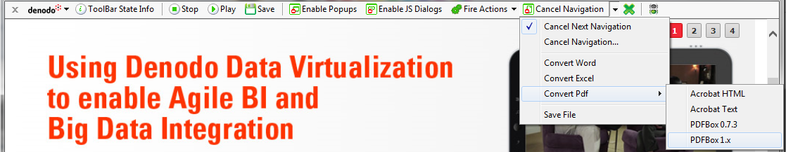

============================
The Cancel Navigation Button
============================

Denodo ITPilot allows extracting data not only from HTML pages but also
from resources in Microsoft Word, Microsoft Excel and Adobe PDF format.
To do so, as mentioned above, it can be indicated that the initial
browsing URL references a Microsoft Word, Microsoft Excel or PDF
resource.

If the resource is accessed via an action which performs a navigation,
the *Cancel Navigation* |image0| button must be used before performing
the action to navigate, to inform ITPilot what transformation will be
required. After pressing this button and selecting the appropriate
option (PDF, Microsoft Excel or Microsoft Word) as shown in `Selection
of the transformation type in the Cancel Navigation command`_, the user
should generate the action on the desired element (e.g. a click on a
link, a click on a button, etc.). ITPilot will convert the target
resource to HTML by using Word-to-HTML Excel-to-HTML or PDF-to-HTML
conversion tools, so that the results can be then processed by the
Wrapper Generation Tool. There also exists an option in this menu to
download the resource instead of converting it.

   Selection of the transformation type in the Cancel Navigation command

The selectable values of the *CancelNavigation* |image0| button are the
following:

1. ``Microsoft Word``: use of the Microsoft Word-to-HTML converter.
   Currently, ITPilot provides one conversion tool that uses the Open
   Office conversion capabilities.

#. ``Microsoft Excel``: use of the Microsoft Excel-to-HTML converter.
   Currently, ITPilot provides one conversion tool that uses the Open
   Office conversion capabilities.

#. ``PDF``: use of the PDF-to-HTML converter. Currently, ITPilot provides
   four converters:

   a. ``Acrobat HTML``: uses the HTML converter of the Adobe Acrobat
      Professional software (this product must be installed).
   b. ``Acrobat Text``: uses the plain text converter of the Adobe Acrobat
      Professional software, from which ITPilot generates an HTML file
      (this product must be installed).
   c. ``PDFBox 0.7.3`` and ``PDFBox 1.X``: uses the PDFBox library
      (`Apache PDFBox - A Java PDF Library <https://pdfbox.apache.org/>`_) to generate
      the HTML file. Version 1.X of PDFBox is available since ITPilot 4.7;
      version 0.7.3 was included in previous releases of ITPilot and is
      still available.

4. ``Save File``: downloads the resource to the local file system. A dialog
   will prompt for a file name and a destination folder.

If the action needed to access the resource is a click, then the “Click
as …” right-click drop down menu option can be used instead the *Cancel
Navigation* button (see section :ref:`Description of the Navigation Sequences
Generator interface`).

In order for the PDF-to-HTML conversion using Acrobat to work, the PDF
converter server of the generation environment must be running. This
server is launched by the Wrapper Generation Tool when it starts.

