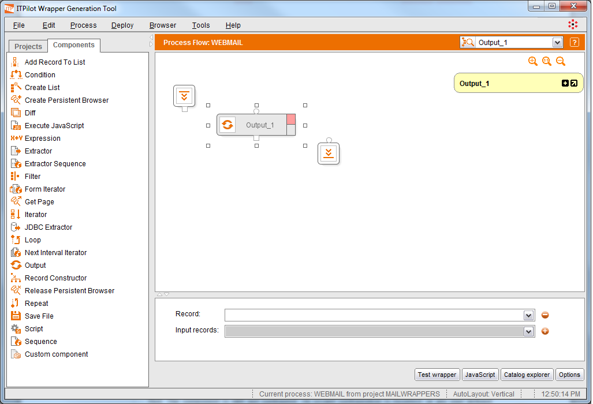

=====================
Components in ITPilot
=====================

.. toctree::
   :hidden:

   input_and_output_parameters.rst

Once the process has been created, you can start to add components to
it.

 

Double-click on the process to open it. In the browsing area you can see
how the **Components** tab has been automatically enabled and selected,
showing a list of general components that are distributed with ITPilot
by default and an initially empty “Custom component” list, where the
user-created components (see section :ref:`Saving a Flow as a Custom
Component`) will be listed. The generic components can be divided in
the following categories:

-  Flow Control Components: these components manage the process control
   flow. The components are :ref:`Condition`, :ref:`Iterator`, :ref:`Loop` and :doc:`../../appendix_c_catalog_of_components/repeat/repeat`.
-  Navigation Components: components that automatically execute
   navigation sequences on the web sources. They are :ref:`Form Iterator`, :ref:`Next Interval
   Iterator`, :ref:`Sequence` and :ref:`Extractor Sequence`.
-  Data Input Components: they retrieve information from data sources.
   They are :ref:`Extractor` and :ref:`JDBC
   Extractor`.
-  Data Output Components: they perform storage or output operations on
   data retrieved from the web sources. They are :ref:`Output` and
   :doc:`../../appendix_c_catalog_of_components/savefile/savefile`.
-  Data Management Components: these can be used to transform the data
   obtained by the data input components in order to format them before
   being returned. They are :ref:`Create List`, :ref:`Add Record To List`, :ref:`Diff`, 
   :ref:`Expression`, :ref:`Filter` and :ref:`Record
   Constructor`.
-  Persistent Browser Management: these components manage the life cycle
   of the so-called “Persistent browsers”. They are :ref:`Create Persistent Browser`, :ref:`Get Page` and
   :ref:`Release Persistent Browser`; see their
   respective sections for an example of use.
-  Other Components: :ref:`Script` and :ref:`Execute
   JavaScript` are other components accessible in ITPilot.

 

The more common general components will be explained through the
example. There is also a reference guide in section :ref:`Appendix C: Catalog
of Components` of this manual. Section :ref:`Saving a Flow as a Custom
Component` discusses when custom components can be useful and how they
can be created.

 

The workspace is divided into four parts, as indicated below:

#. *Title bar section*: This section shows the process name, a help
   button and a selector that will help user to easily locate and select
   components on the process flow.
#. *Process generation section*: This is the workspace itself, where
   users can drag components, connect them to each other and configure
   them. This section also shows zoom controls on the upper right
   corner.
#. *Component inputs section*: This contextual area allows configuring
   input data for selected component. This section is automatically
   hidden when no component is selected.
#. Button section: This area shows buttons to perform actions related to
   the current process. These actions are “Test wrapper” to execute the
   process, “JavaScript” to see the JavaScript code the wrapper will be
   transformed, “Catalog explorer” to open a window that shows
   information about all variables in the process, and “Options”, to
   open a wizard where some options can be configured for the current
   wrapper.

   Work area for Process Generation

 

The workspace already displays three components as part of the current
process. These components represent the start and the end of the
process, besides the output component (Output\_1) that returns the
results of the wrapper.

The components used in the flow can appear in the workspace in the
following colors:

-  Red. The component is still not configured, its wizard configuration
   is incorrect, or any user defined error record (see section :ref:`Error Processing on the Web Browsing Automation`) is incorrect. For instance, one component can be
   colored that way if other component providing its input is deleted,
   causing its own wizard configuration or user defined error records to
   be in an incorrect state.
-  Yellow. Due to changes in other components, the configuration of this
   component *may* be in an incorrect state. You should access the
   wizard component to check the configuration is still ok, and change
   it if it is incorrect.
-  White. The component is correctly configured.

In addition, each component has two boxes that determine the status of
the input (top box) and output (bottom box) parameters. This status is
reflected by the color of these boxes:

.. table:: Colors that represent the state of the output and inputs of a component
   :name: Colors that represent the state of the output and inputs of a component

   +--------------------+--------------------+--------------------+--------------------+
   |                    | **Red**            | **Yellow**         | **White**          |
   +====================+====================+====================+====================+
   | **Output**         | The output of the  | The output of the  | **OK**             |
   |                    | component is not   | component is       |                    |
   |                    | consistent.        | *uncertain*.       |                    |
   |                    |                    |                    |                    |
   |                    | It happens when    | | That is because  |                    |
   |                    | more than one      |   the component    |                    |
   |                    | component defines  |   has not been     |                    |
   |                    | the same variable, |   configured yet   |                    |
   |                    | but its            |   or because,      |                    |
   |                    | definitions are    |   after a change   |                    |
   |                    | not compatible.    |   in its input     |                    |
   |                    |                    |   parameters, the  |                    |
   |                    | | In that case,    |   component does   |                    |
   |                    |   all the          |   not know how to  |                    |
   |                    |   components that  |   calculate its    |                    |
   |                    |   define that      |   output.          |                    |
   |                    |   variable, have   |                    |                    |
   |                    |   their output     | i.e.: a            |                    |
   |                    |   marked in red.   | non-configured     |                    |
   |                    |                    | Expression or a    |                    |
   |                    | i.e.: two          | Record Constructor |                    |
   |                    | Expression         | that was           |                    |
   |                    | components which   | previously         |                    |
   |                    | have the same      | configured and the |                    |
   |                    | output name, but   | name of one of its |                    |
   |                    | one defines a      | input parameters   |                    |
   |                    | string, and the    | have changed.      |                    |
   |                    | other, an integer. |                    |                    |
   +--------------------+--------------------+--------------------+--------------------+
   | **Input**          | A mandatory input  | One or more        | **OK**             |
   |                    | is not selected or | component input    |                    |
   |                    | one of the         | parameters are     |                    |
   |                    | component inputs   | *uncertain*.       |                    |
   |                    | is not consistent. |                    |                    |
   +--------------------+--------------------+--------------------+--------------------+

The workspace has a contextual menu, which can be accessed by placing
the cursor on the flow area and right-clicking. Depending on whether the
contextual menu is opened over a component or not, the appropriate
following options will be available:

-  Rename component / component output: allows a specific name to be
   given to the selected component and its output variable (that may be
   collected as an input by other components). ITPilot identifiers must
   start with a letter (a-z or A-Z) followed by zero or more letters,
   numbers or underscores (the regular expression that defines the
   identifiers is [a-zA-Z][A-Za-z\_0-9]\* ). Please note that the names
   cannot be any of the ITPilot reserved words (see section :ref:`Appendix E:
   List of reserved words`).
-  Open wizard: opens the selected component’s wizard, where the
   component can be configured. The wizard can also be opened by
   double-clicking on the component.
-  Open error configuration: Opens a dialog to configure the selected
   component behavior in case of failure.
-  Collapse complex component: flow components that are expanded (the
   default status) – specifically, the :ref:`Condition` components, :ref:`Form Iterator`, :ref:`Iterator`, 
   :ref:`Loop`, :ref:`Next Interval
   Iterator` and :doc:`../../appendix_c_catalog_of_components/repeat/repeat` - can be collapsed graphically so
   the flow diagram can be seen more clear.
-  Expand complex component: this shows the components contained in the
   selected component again.
-  Insert before: allows choosing a new component and inserts it in the
   control flow before the selected one.
-  New component: allows choosing a new component and inserts it in the
   control flow at mouse position.
-  Insert after: allows choosing a new component and inserts it in the
   control flow after the selected one.
-  Copy: this option allows the selected components to be copied.
-  Paste: this option allows previously copied components to be pasted.
-  Paste and Rename Variables: this allows components to be pasted
   renaming its output variables.
-  Delete: deletes the components that have been selected. This can
   affect other related components.
-  Hide/show selected cell names: hides or shows the name of the
   selected components to leave only the icon visible.
-  Hide/show all cell names: same as the previous option, but affects
   all the components of the wrapper.
-  Hide/show comments: hides or shows component comments.
-  Hide/show input/output variables flow: hides or shows ongoing and
   ingoing arrows to help understanding which components consume the
   output of the selected component and which components produce the
   inputs of the selected component.
-  Layout graph vertically: this option organizes the flow of components
   from top to bottom.
-  Layout graph horizontally: this option organizes the flow of
   components from left to right.

The initialization component is described in the following section,
although it is first necessary to explain the types of input and output
parameters that can exist.

