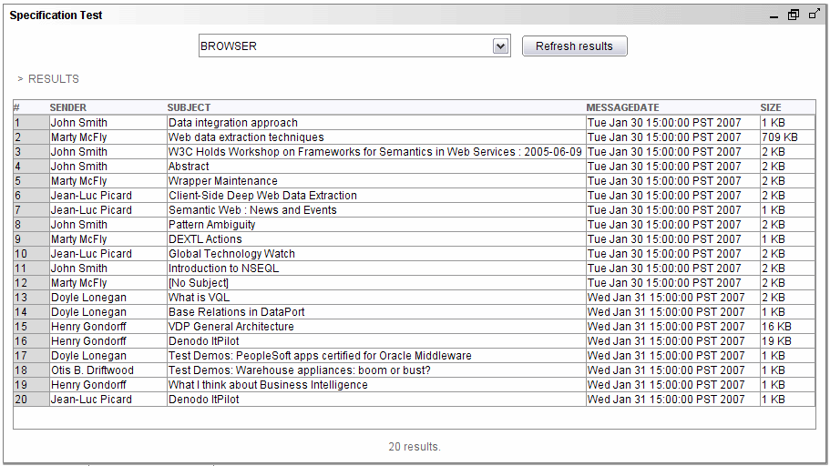

===================================
Testing the Generated Specification
===================================

When the specification is ready, it can be tested to check that it
really extracts the desired data from the web page. Click on the
“Specification Test” button of the Extractor wizard, to open the testing
pane. On this pane, and making sure that the browser is in the mails
page, click the “Refresh results” button. After the wait dialog closes,
the Specification Test pane will display a table with all the results
that were extracted from the web page using the generated DEXTL program
(`Data extracted from the page`_).

   Data extracted from the page

If the results are incorrect, go back to the browser and correct the
erroneous examples or add new ones, importing them again and testing
until all the results are extracted correctly. The following cases are
possible:

-  If fewer results than expected are obtained, new examples should be
   added. The examples should be chosen from the results that the system
   has not extracted.
-  If more results than expected are retrieved or some result is
   extracted incorrectly, the options “Disambiguate” and “Strict
   Patterns” may be used as explained in the description of the
   Generation pane. FROM and UNTIL options can also be used to further
   delimitate the area where the desired results are located in the
   page.
-  Alternatively, the generated DEXTL program can be modified manually
   (if doing this, we recommend users to carefully read :doc:`/itpilot/dextl/index`); this option
   is selected by clicking on the |image0| button. The automatically generated program can now be modified.

In `Data extracted from the page`_ all the twenty e-mail messages of the
inbox have been extracted correctly, so the Extractor component does not
need more configurations. Click “Ok” to accept the current values and
close the wizard.

