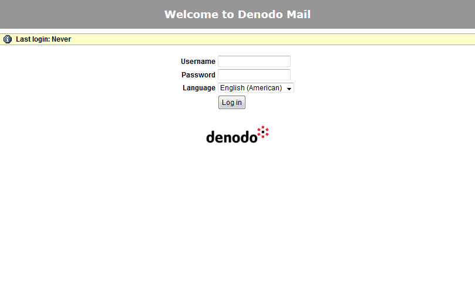
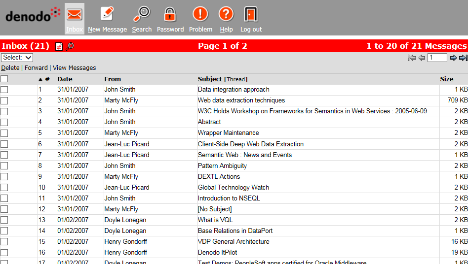
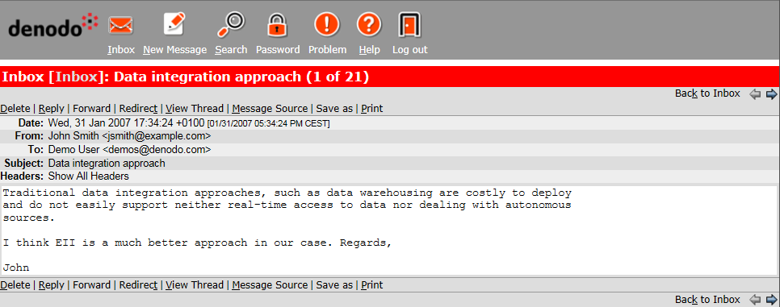
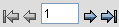

===========================
Presentation of the Example
===========================

`Denodo WebMail home page`_ shows the home page of a sample e-mail Web
site. This web application can be found in the Denodo Platform
distribution, and simulates the behavior of a simple Web mail system. To
access the example application, follow these steps:

-  Execute the ``webmailsample_startup.bat`` script in the
   :file:`{<DENODO_HOME>}/samples/itpilot/webmail` path. The script starts the
   application in the web container embedded in the Denodo Platform.
-  Access the application in the *samples/itpilot/webmail* path of the
   web container embedded in the Denodo Platform. If the container runs
   in the local host and the default port is used, then the URL will be
   *http://localhost:9090/samples/itpilot/webmail*.

In this example the Wrapper Generation Tool is used to create a wrapper
that obtains the list of incoming e-mails and their content in a
structured manner.

   Denodo WebMail home page

Enter the UserName “demos” and the Password “DeMo.04” to access the Web
e-mail application. The following window will appear (`First message
screen`_):

 
.. _my-reference-label_figure4:

   First message screen
   
The content of any e-mail can be accessed by clicking on the subject
(`Content of a message`_).

   Content of a message

The Web application displays the messages 20 at a time, whereby to
access the next messages you have to click on the right arrow
in |image3|.

