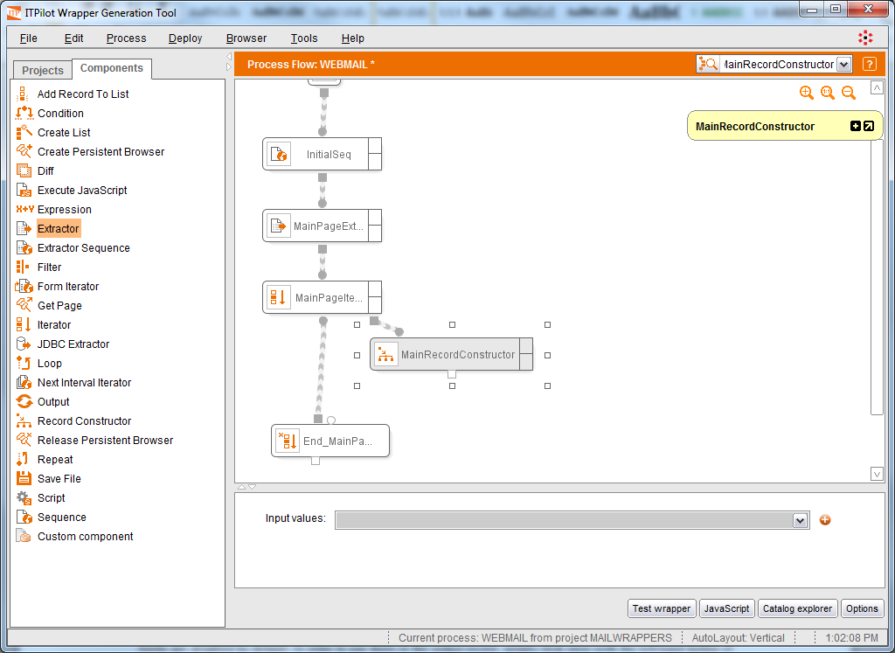
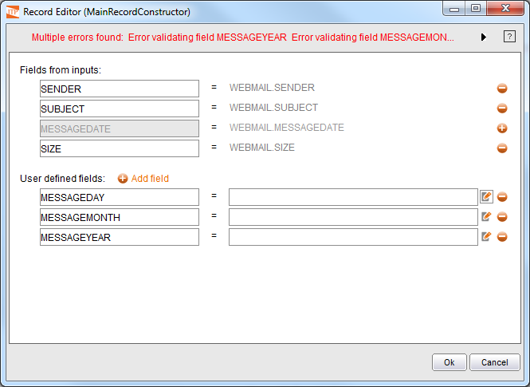
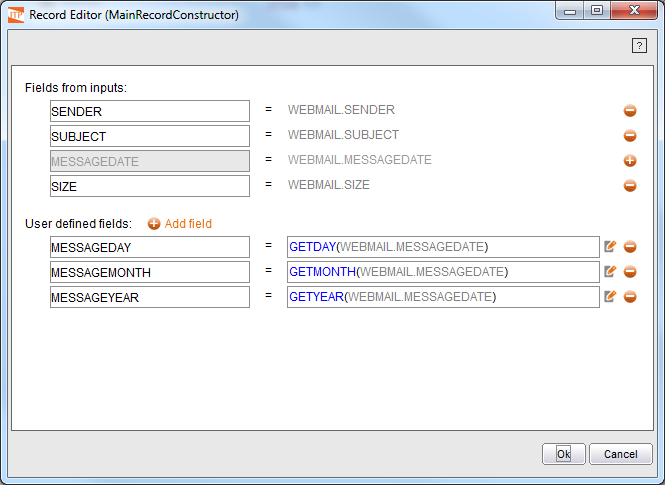

============================================================
Processing the Individual Records: Use of Record Constructor
============================================================

In this section, we show how to use the “Record Constructor” component.
This component allows applying data transformations on a record using
user-defined expressions. It also allows merging several simple values,
records or lists in one single record.

In our example, in the previous section we showed the Iterator component
returns a data record in each iteration. In this section, we will use
the “Record Constructor” component to perform a simple transformation in
the extracted records. More precisely, we will add three new data fields
to each record specifying the day of the month, the month and the year
when the message was received. The value of these data fields will be
obtained by applying simple expressions on the DATE field extracted from
the page.

Add the “Record Constructor” component (|image0| icon) to the workspace
and add it to the current process, as indicated in `Use of the Record
Constructor component`_, setting its name to “MainRecordConstructor” and
its output to “MAILMESSAGEOUT”. The output record that the iterator
returns on each iteration will be taken as input by the Record
Constructor component.

   Use of the Record Constructor component

The component is configured as follows: first, select the set of records
that can be combined in this component using the input configuration
area. In this case, only one will be used, the one called WEBMAIL. Click
on the |image1| icon to the right of “Input Values” to view a selection
list from where “WEBMAIL” is chosen.

Once this has been done, double-click on the component to access its
wizard. In this case, we want to return the WEBMAIL fields SENDER,
SUBJECT, and SIZE, along with three new fields, MESSAGEDAY (that will
return the day on which the message was delivered), MESSAGEMONTH (the
month), and MESSAGEYEAR (the year), created. The fields obtained from
the component input (WEBMAIL) are shown in the upper half of the window.
All fields are disabled by default. In order to use them in the output
record, simply click once with the left-hand button of the mouse on the
|image1| icon for each one. By clicking on the |image2| icon, the field
is disabled again.

The bottom half of the wizard allows adding new fields to the output
structure, which can be derived from the input fields. Click on the
|image3| button to the right of the “User defined fields” message to
create new derived attributes. Click it three times and name each one as
MESSAGEDAY, MESSAGEMONTH and MESSAGEYEAR, respectively.

`Record editor`_ shows the result of the operation after naming the
output record fields.

   Record editor

As can be seen, at the top of the window is an error indicating that
some attributes have not yet been defined.

Editing New Record Fields
=================================================================================

Next to each defined field a text box allows specifying the field value.
The section :ref:`Appendix A: ITPilot operators` describes each of the functions
that can be used in these expressions. In our example, the three new
fields will respectively be created by using the GETDAY, GETMONTH and
GETYEAR functions, which accept a DATE-type parameter as input and
respectively return an integer that indicates the day, the month and the
year of the received data.

The expression can be directly typed in the “Expression value” box (e.g.
GETDAY (WEBMAIL.MESSAGEDATE). Auto-complete features are available so
the user does not need to remember neither the name/parameters of the
available functions nor the name of the available fields. If the written
expression is wrong, it is highlighted in red and an explanatory message
of the error appears as a tooltip of the incorrect part. For very long
expressions user can click the |image4| button to open a bigger box in a
new window.

After the expressions for the three new fields have been created
(GETDAY(WEBMAIL.MESSAGEDATE), GETMONTH(WEBMAIL.MESSAGEDATE) and
GETYEAR(WEBMAIL.MESSAGEDATE)), the result will be similar to that shown
in `Final result of the Record Constructor component`_.

   Final result of the Record Constructor component

.. |image1| image:: DenodoITPilot.GenerationEnvironment-54.png

