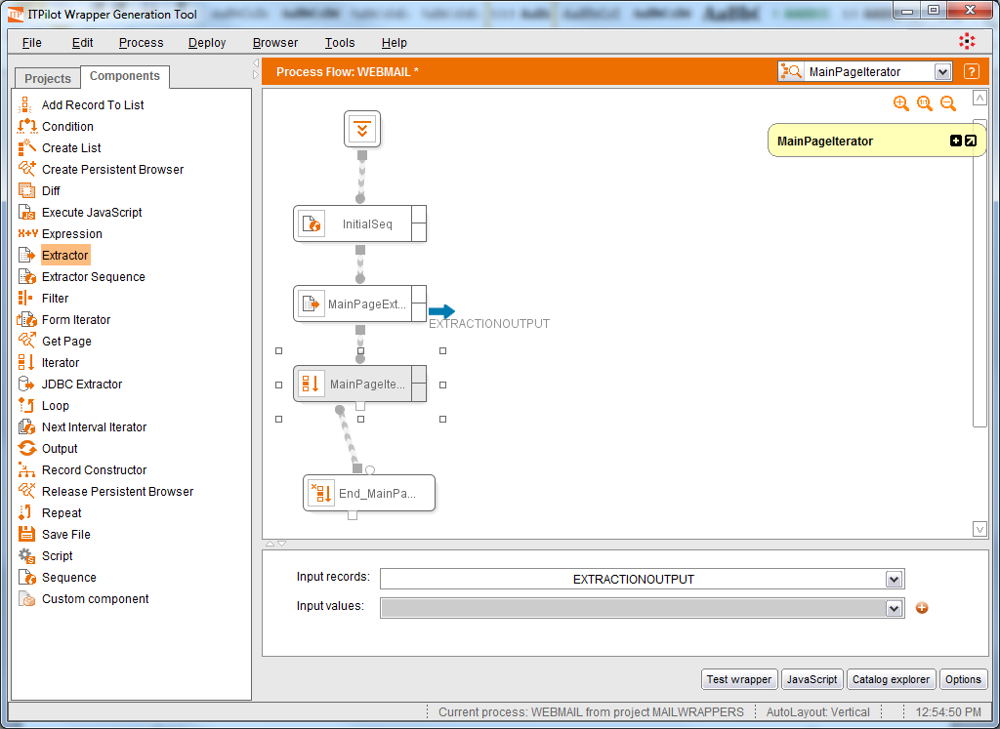

=============================
Use of the Iterator Component
=============================

The Extractor component returns a list of records, each one containing
one extracted data record. In our example, each record contains
information about one e-mail message with its sender, message, date and
size fields.

The Iterator component is used to iterate on each record from an input
list. In each iteration, the component will return a record from the
list.

As usual, the iteration component can be dragged from the browsing area
or from the workspace component bar. The component icon is |image0|.
Rename de component to “MainPageIterator” and its output to “WEBMAIL”.
The figure below shows the graphic appearance of the
component in the workspace. This component is represented using one
start box and one end box. The portion of the workflow between the start
and the end boxes will be executed in each iteration.

   Use of the Iterator Component

The configuration of this component is very simple. First, select the
input list to feed the iteration process. In this case, as can be seen
in the above figure, the list corresponds to the extraction component
output described in section :ref:`Configuration of the Extractor Component`,
EXTRACTIONOUTPUT.

The Iterator component wizard allows configuring whether iterations
should be processed in parallel or not. If parallel execution is
selected you can configure the maximum number of concurrent iterations.

Regarding the error configuration, in addition to the Runtime Error
explained in that section, the Iterator component adds the *Inner
Component error*. This error occurs in a compound component (Iterator,
Form Iterator, Loop, Repeat and Next Interval Iterator) when some of its
inner components fails. This error can be handled by *raising* it or
*continuing* processing the remaining iterations although an error
occurs in the current one. Besides, the actions *Trace Record* and
*Output Record* (see section :ref:`Error Processing on the Web Browsing Automation`) can be executed with
this type of error.

