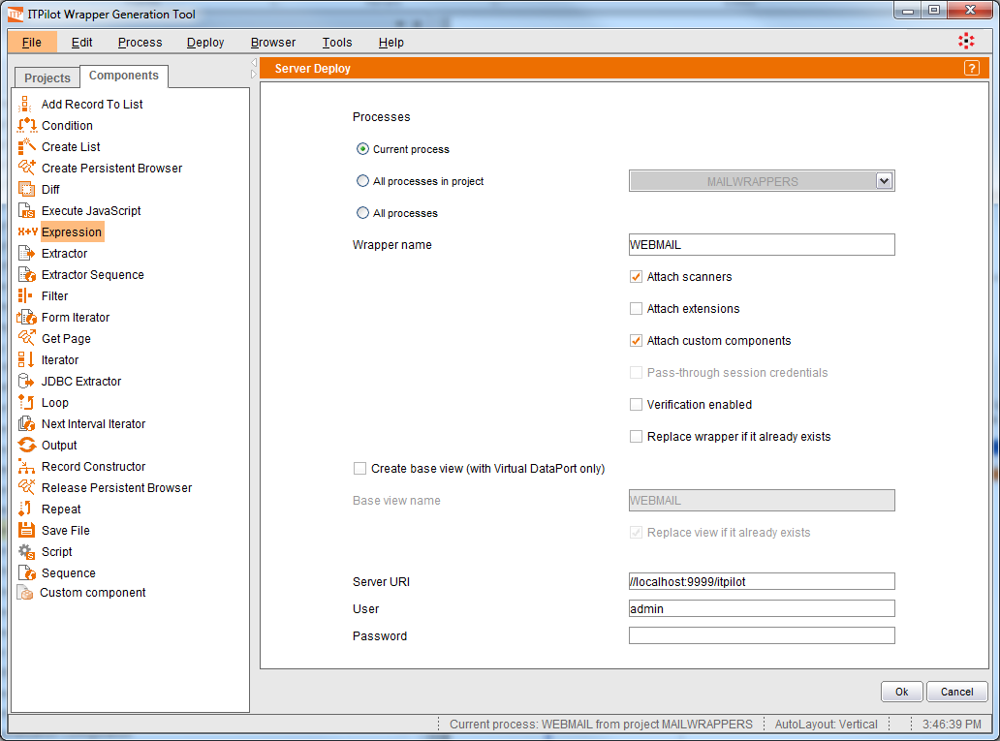
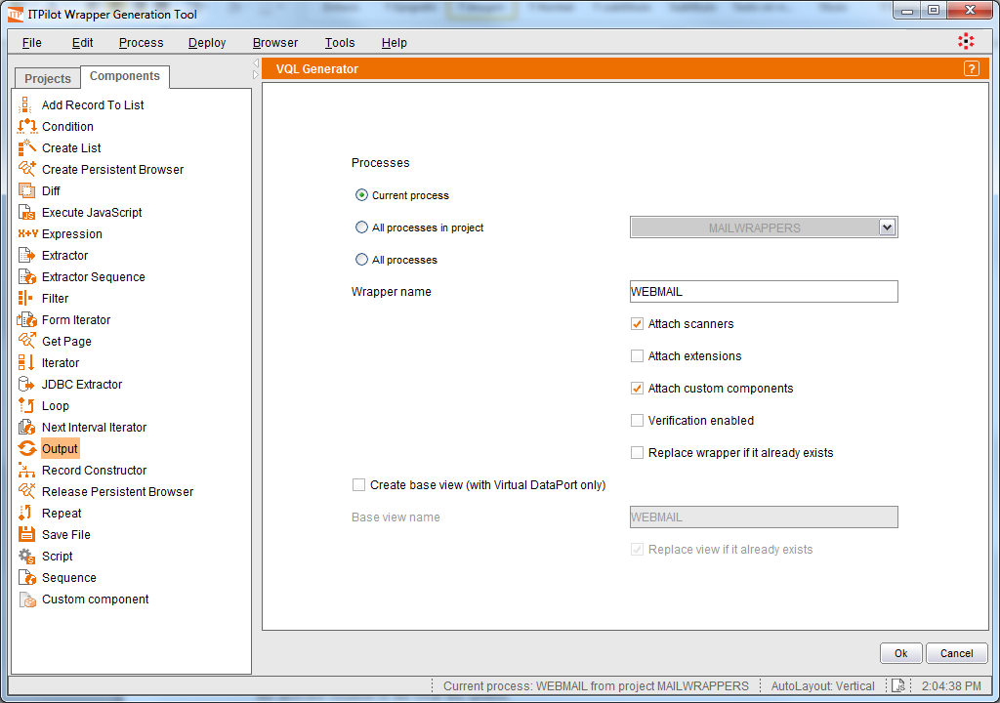

========================================
Deploying Wrappers to the Wrapper Server
========================================

If the Wrapper Server is started, it is possible to deploy the wrapper
from the Wrapper Generation Tool. Alternatively, the wrapper can be
exported as a VQL file (VQL is ITPilot’s execution format), so you can
load it in the server at some later moment.

Remember that it is not possible to export a wrapper to the execution
environment, or to a file, if it does not have neither input fields nor
Output components.

| 

To deploy a wrapper to the Wrapper Server, open the ITPilot Wrapper Generation Tool. From the main window, click on
the “Deploy” menu of the menu bar. This shows two submenu options: “VQL
Generator …” and “Server deploy …”. Click on the second option and the
screen shown in `Wrapper deployment in an ITPilot Wrapper Server`_ will
appear.

   Wrapper deployment in an ITPilot Wrapper Server

The deploy dialog allows deploying several sets of wrappers:

-  Only the wrapper being currently edited.
-  All the wrappers of a project.
-  All the wrappers in the Wrapper Generation Tool.

To deploy the wrapper, enter the server URL (//localhost:9999/itpilot by
default), login (‘admin’ by default) and password. It is also possible
to specify the following options:

-  *Attach scanners*. The scanners (see section :ref:`Tagsets and Scanners`)
   required by the wrapper to work properly will be also deployed in the
   server. This option is checked by default. You can uncheck this option
   if you know the scanners already exist in the server.

-  *Attach extensions*. If the wrapper uses elements (e.g. custom
   functions) defined in extensions (see section :ref:`Managing extensions`),
   they will be deployed in the server. If you know the extensions already
   exist in the server, this is unnecessary. When installing extensions,
   the following cases are possible:

  -  The extension already exists in the server: in this case it will be
     always overwritten.

  -  The extension does not exist in the server: in this case, if there is
     any name conflict between the functions that the extension installs
     and the functions already present in the server then the extension
     will not be installed. If there is no conflict then the installation
     of the extension will proceed normally.

-  *Attach custom components*. The custom components (see section :ref:`Saving a
   Flow as a Custom Component`) used by the wrapper will also be deployed
   in the server. This option is checked by default. You can uncheck this
   option if you know the custom components already exist in the server.

-  *Pass-through session credentials*. The wrapper will be deployed in the
   Wrapper Server configured to use pass-through session credentials. Note
   that this option will be available only if the fields for pass-through
   session credentials have been set in the Init component wizard. See
   section :ref:`Process initialization` to known more about pass-through
   session credentials and how to set the input fields to be used with it.

-  *Verification enabled*. The wrapper will be deployed in the server with
   the automatic verification option activated.

-  *Replace wrapper if it already exists*. If this option is checked and
   there exists a wrapper with the same name in the server, it will be
   overwritten by the new wrapper.

ITPilot wrappers can be directly deployed in a Denodo Virtual DataPort
server, so that the wrapper can be used as another source
in any data integration process. To do so, click *Create base
view (with Virtual DataPort only)* and complete the field
*Base view name* with the name of the base view that will
now reference the recently created wrapper in Virtual DataPort. You can
select the option *Replace view if it already exists* to overwrite
the view in case it already exists in the server.

Click OK and, assuming the Wrapper Server is started, the wrapper will
be deployed.

VQL Generation
=================================================================================

This option is useful when the Wrapper Server is not started or it is
not accessible from the network where the Wrapper Generation Tool is
being used.

From the main window of the ITPilot wrapper generation environment,
click on the “Deploy” menu of the menu bar. This shows two submenu
options: “VQL Generator …” and “Server deploy …”. Click on the first
option and the screen shown in `Wrapper storage in a local file system`_
will appear.

   Wrapper storage in a local file system

The available options are the same as the ones explained above. Pressing OK, ITPilot will store the
file at the selected location in the local file system.

Once the VQL file has been generated, it can be loaded into the ITPilot
Wrapper Server using the **Load VQL File** option in the ITPilot Web
administration tool. It can also be loaded in a
Virtual DataPort server by creating a new data source of type ITPilot in
the Virtual DataPort administration tool.
