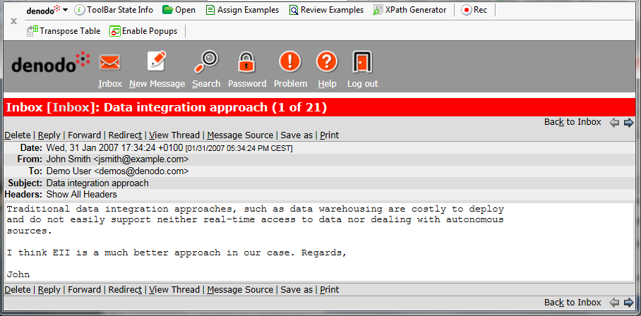

=======================================================
Generating the Access Specification to the Details Page
=======================================================

Once the new Extractor component has been created, assign the examples
for the data to be extracted from each message. To do that, highlight
the content of a message in its detail page, assign it to a new field of
a new example, and import it into the new Extractor wizard.

Sometimes, the generated specification can return more results than
expected since it might be too ambiguous. To solve this problem, we can
delimit the occurrence search zone the following manner, using the
message page as an example:

#. With the browser started from the Wrapper Generation Tool positioned
   in the detail page of any message, highlight the text “Headers” in
   the page, as shown in `Adding a FROM pattern`_.
#. Press the FROM button. The specification is modified automatically so
   that the matching search against the pattern is performed only from
   the zone of the highlighted page. That way, after testing again, the
   specification obtains the desired results.

   Adding a FROM pattern

The use of the FROM button is described in more detail in section :ref:`Generating FROM/TO Patterns`.

