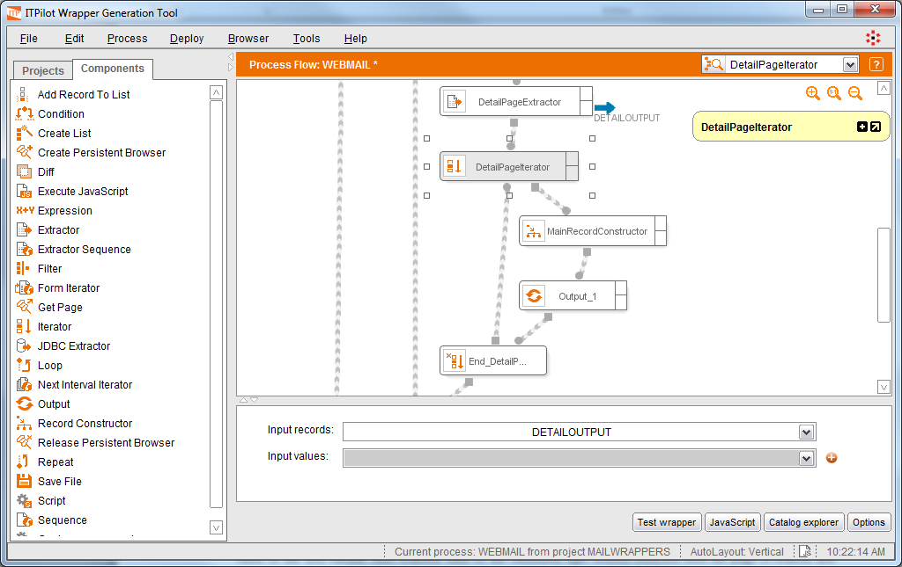
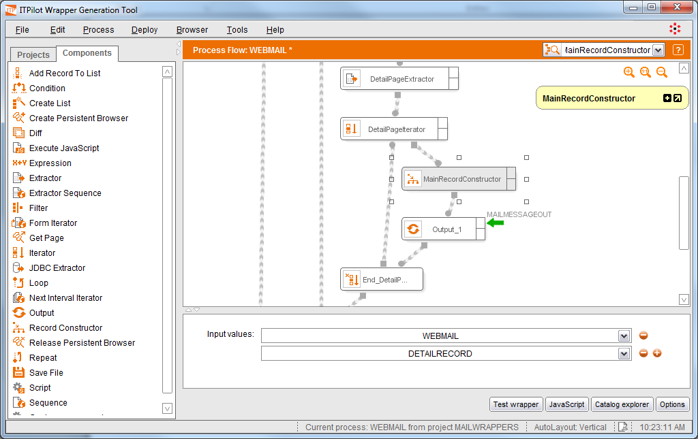
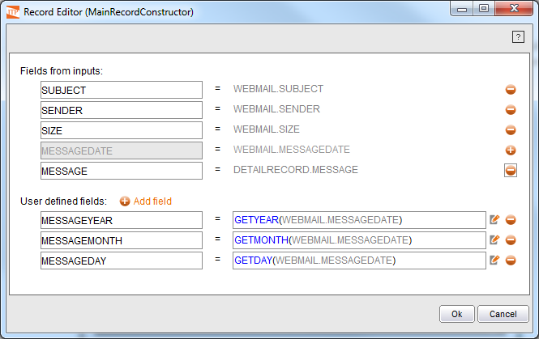

==========================================================================
Iteration on the Details Page Structures and Creation of the Output Record
==========================================================================

As indicated, the Extractor component returns a list of records.
Although in this case the list contains one element only. To access the
records in the list, an Iterator component is needed as it was shown in
section :ref:`Use of the Iterator component`. Once this action is complete,
the Record Constructor component of section :ref:`Processing the individual
records: use of Record Constructor` can be reused to generate an output
record containing the data obtained from the pages of results and the
details pages.

`Adding a data Iterator coming from the detail pages`_ shows the result
of adding these last components to the e-mail extraction process.

   Adding a data Iterator coming from the detail pages

In this case, the Record Constructor will be used to create an output
record based on the data obtained from the main page and from the
details page of each message.

Two input values are created in the “Inputs” configuration area of the
Record Constructor component: the output value of the first iterator
(that returned each of the WEBMAIL-type records extracted from the page
of results) and the output value of the second iterator which returns
each of the DETAILSTRUCT-type records containing the message body. See
`Configuration of input values of the Record Constructor component`_.

   Configuration of input values of the Record Constructor component

Double-click the “Record Constructor” component to access its wizard
and choose the fields to include in the wrapper output record. As in
section :ref:`Returning results: Output component`, click on the |image2|
button of the desired attributes to enable them (see `Output record of
the Record Constructor component`_).

   Output record of the Record Constructor component

The process is now complete. Now generate the wrapper and test it. The
generated wrapper returns the expected results asynchronously (it does
not wait until the end of the process to return results).

