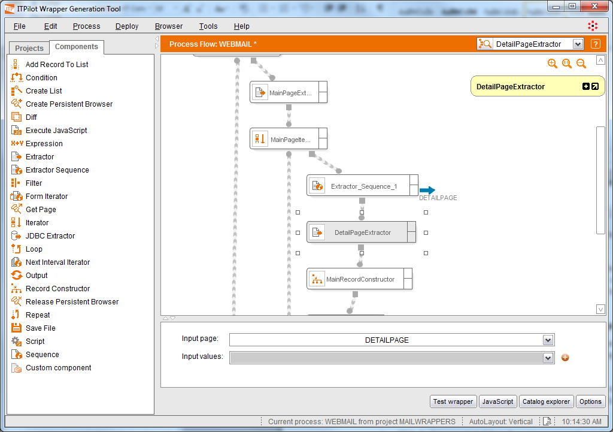

=======================================================
Specifying the Structure of the Detail Page Information
=======================================================

Once ITPilot is able to access the details page for each message, it is
now time to obtain the data of interest from this page. To do so, we
will use an Extractor component once again, as when data was to be
obtained from the first page of results (see section :ref:`Configuration of
the Extractor Component`). Use of the component in the process is shown
in `Use of the Extractor component to obtain information of the detail
pages`_. The component input is the output of the Extractor Sequence
component known as DETAILPAGE.

   Use of the Extractor component to obtain information of the detail pages

In our example, the Extractor component responsible for extracting
information from the detail page will contain one element (“MESSAGE”)
that contains the text of the email. Therefore, we can create a
structure (called, for example, “DETAILSTRUCT”) with a single field
called “MESSAGE”, of “String” type.

