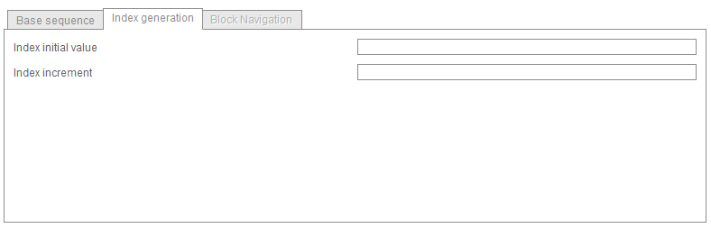
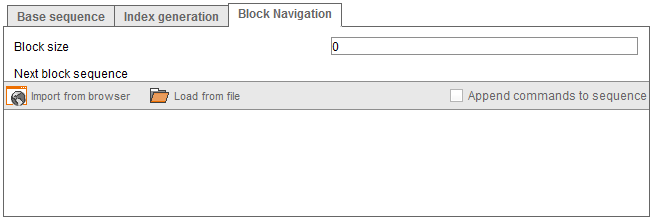

=======================================================
Pagination Using Single Block or Multiple Block Schemes
=======================================================

In addition to the ‘Constant scheme’ used in our example, ITPilot
includes built-in support for other two common pagination schemes.

In the *Single Block Scheme*, it is assumed that the sequence for
accessing the next interval is always the same, except for a variable
that is incremented by a constant value in each iteration. The “Index
initial value” parameter in the “Index generation” tab of the wizard
(see `Index generation tab`_) indicates the initial value of that
variable and the “Index increment” parameter specifies the constant
increment. Consider the following examples:

#. Access to the next interval of results is done by clicking on links
   labeled “2”, “3”, “4” etc. In this case, the variable could be the
   text associated to the links (the navigation sequence for accessing
   the interval number *n* consists in clicking on the anchor with text
   *n*). Therefore, in this case “Index initial value” should be set to
   2 and “Index increment” should be set to 1, so in the first iteration
   the executed sequence will click on the anchor with text “2”, in the
   second iteration the executed sequence will click on the anchor with
   text “3” and so on.
#. Access to the next interval of results is done by using links labeled
   with numerical intervals such as ‘[11-20]’, ‘[21-30]’, etc. In this
   case, the variable could be the text indicating the lower limit of
   the interval. Therefore, “Index initial value” should be set to 11
   and “Index increment” should be set to 10.

   Index generation tab

In most of the websites that follow the single block scheme, ITPilot is
able to auto-detect where the variable should be placed in the
navigation sequence and the correct values for the “Index initial value”
and “Index increment” parameters. Therefore, in these situations, the
user just needs to perform the following steps:

#. Record the navigation sequence to access the next interval from the
   first page of results.
#. Select the *Single Block Scheme* pagination type in the wizard.
#. Import the recorded navigation sequence from the browser.
#. If ITPilot is able to auto-detect the particular format used by the
   source, then a dialog will appear prompting the user if she wishes to
   allow ITPilot to modify the imported sequence to include the required
   variable and to pre-configure the required parameters.
#. Click ‘Yes’, and the configuration will be finished.

.. note:: The Next Interval Iterator can also work with non-numerical
   character indexes, such as “A”, “B”, “C”, etc. In this case, specify the
   desired letter as the initial index, and in the index increment specify
   the number of letters to advance to the next link. For example, initial
   index B and increment 2 would access the links “B”, “D”, “F”, etc.

Advanced users may opt to manually modify the imported navigation
sequence themselves. In that case,
they should know that the navigation sequence specified in the “Base
Sequence” tab must be expressed in function of two variables called
``START`` (denoted ``@{START}``; and ``END`` (typed ``@{END}``). At
execution time, the ``START`` variable will be substituted for the
appropriate value to access the desired interval; in the first
iteration, the value used will be the one indicated in the “Index
initial value”; the value for subsequent iterations will be obtained
adding in each iteration the value specified by the “Index increment”
parameter. The value of the ``END`` variable will be one less than the
``START`` value of the next iteration; in the previous example where a
pagination scheme such as ‘[11-20]’, ‘[21-30]’, etc. was accessed, the
initial index was 11 and the increment 10. With that configuration, a
sequence can access the links ``[@{START}-@{END}]``.

.. note:: Remember that you can use the “Preview Sequences” button to
   review the first ten sequences that are going to be generated by the
   Next Interval Iterator.

The *Multiple Block Scheme* is used when the results intervals are
shown in blocks of pages, so that the pages in the same block can be
accessed in the same way as in the *Single Block scheme* but a different
navigation sequence is needed to access the next block of pages. For
instance, a website using blocks of 5 pages could show in the first page
of results links labeled as 2, 3, 4, and 5 to access the respective
intervals and a “Next” link pointing to the next block. When clicking on
“Next”, the sixth page of results would be showed and links to intervals
7, 8, 9, and 10 would be available.

The configuration of the *Multiple Block Scheme* is identical to the
*Single Block Scheme* but users need to access the “Block Navigation”
tab of the wizard (see `Block navigation tab`_) to configure two
additional parameters: the “Block Size” field and the navigation
sequence that allows navigation from one block to the next (in the
example above, the sequence would define the action of clicking “Next”).

   Block navigation tab

