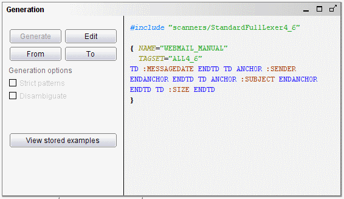
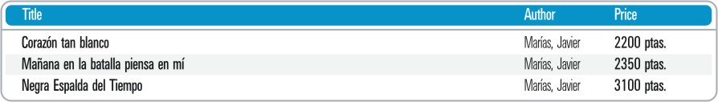

============================================
Creating a DEXTL Specification from the Tags
============================================

After the structure is created and the tokens of the page are known, we
are ready to write the DEXTL specification to extract messages. Click
the “Edit” button of the Generation pane; a warning dialog will appear,
because the default specification uses the “<Extractor\_name>\_ITEM”
name for the root level, but the structure was renamed to
WEBMAIL\_MANUAL. When clicking “Ok”, you can see that the specification
skeleton is changed to reflect the new name of the root level that was
specified in the Structure pane.

To write the specification, we are going to replace the pattern that
appears in the skeleton (“Replace this with Pattern Components”), with
the following:

-  The check box and the index of the message are not going to be extracted;
   for the purposes of this example, we will ignore them.

-  The first item to extract is the date of the message, with structure TD
   “31/01/2007” ENDTD (from the Token Viewer). We want to extract it into
   the MESSAGEDATE field, so we add the following pattern:

      ``TD :MESSAGEDATE ENDTD``

   That will extract the text inside a TD into the MESSAGEDATE field.

-  The next item is the sender of the e-mail, with pattern TD ANCHOR “John
   Smith” ENDANCHOR ENDTD; in a similar way, the pattern that will extract
   this text is

      ``TD ANCHOR :SENDER ENDANCHOR ENDTD``

-  The pattern for the subject (TD ANCHOR “W3C Holds Workshop on Frameworks
   for Semantics in Web Services : 2005-06-09” ENDANCHOR ENDTD ) is very
   similar to the sender one

      ``TD ANCHOR :SUBJECT ENDANCHOR ENDTD``

-  Finally, the pattern for the size of the e-mail is almost the same than
   for the date:

      ``TD :SIZE ENDTD``

In summary, putting all the sub patterns together, the pattern to
extract a message is

``TD :MESSAGEDATE ENDTD TD ANCHOR :SENDER ENDANCHOR ENDTD TD ANCHOR
:SUBJECT ENDANCHOR ENDTD TD :SIZE ENDTD``

The final specification is shown in `DEXTL specification to extract
e-mail data`_; click the “Save” button to accept it. Testing it will
retrieve the same results that were extracted in Part I of the webmail
example.

   DEXTL specification to extract e-mail data

Please read the ITPilot DEXTL manual (:doc:`/itpilot/dextl/index`) for more information about the
syntax of the specifications.

Generating FROM/TO Patterns
=================================================================================

It is sometimes useful to explicitly determine the part of the page at
which the information extraction process is to begin and the part at
which it is to end. A typical example is shown below. `Tabulated Results
of a BookshopResult of the DEXTL Program Test on DETAIL`_ shows the
graphic format used by an on-line bookshop to show information on its
products.

   Tabulated Results of a BookshopResult of the DEXTL Program Test on DETAIL

A DEXTL program generated carelessly could return the heading row as yet
another result, because it might sport the same internal HTML structure
than the table contents.

When DEXTL programs are generated from examples, most of these
situations are either transparently handled by ITPilot or can be solved
using the “Disambiguate” option. Nevertheless, it is also possible to
explicitly limit the part of a document, where matches will be searched. To do this, follow these steps:

1. If you have not done it yet, launch a
   browser using the **Browser > New Browser** menu option and browse to the
   target page
#. Select the text delimiting the beginning of the area in
   the browser (the table heading in the example of `Tabulated Results of a BookshopResult of the DEXTL Program Test on DETAIL`_).

#. Return to the Extractor wizard and
   click on |image2|. The system will extend the DEXTL specification to
   include the search boundary. You can also include a boundary for the end
   of the search zone by using the |image3| button.

