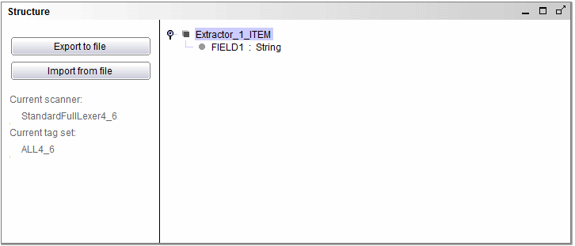

=============================================
Creating a Structure Using the Structure Pane
=============================================

The structure of the data to extract is created using the Structure pane
(`Structure pane`_). Its main area is a tree that represents the
structure of the records. Initially, it has a single node named <name of
the Extractor component>\_ITEM. This node represents the full record.

   Structure pane

When clicking on a node of the tree using the right mouse button,
several options appear:

-  Add Child. It adds a child node from the currently selected node. The
   child nodes represent fields of the record represented by the parent
   node. You will need to create as many children nodes of the root node
   as there are fields in the records to extract. For instance, if you
   are extracting data about books, you will probably need to create
   fields for extracting the title of the book, its authors, ISBN, etc.
-  Change name. It changes the name of the current node. By default, the
   name of the new fields is FIELD1, FIELD2, etc. For instance, if you
   are extracting data about books, you may want to rename the new
   fields as TITLE, AUTHOR, etc. This option is not available for the
   root node. To rename the root node, you should use the Change Record
   Name option. Also, the fields can be renamed by double-clicking on
   their name.
-  Change Record Name. The nodes representing a compound field (i.e. a
   list of records) have two associated names: the name of the field
   (which is of list type), and the name of the records contained in the
   list. This option allows changing the name of the records. Since the
   root node represents the structure of the records that will be
   extracted by the component, this is the option you should use to
   change its name. For instance, if you are extracting data about
   books, you could rename it as BOOK. The record can be also renamed by
   double-clicking on its name.
-  Change Type. If the node represents a simple field, this allows to
   indicate its data type (by default, the new fields have String type).
   The type can be changed also by double-clicking it.
-  Delete. It deletes the selected node. The root node cannot be
   deleted.
-  Regular Expression: This allows you to add a regular expression
   defining the representation format for this element. This is useful
   when the wrapper is going to be verified by the ITPilot verification
   system. The regular expression is defined in Java
   Format for Regular Expression Pattern Representation.
-  Change tagset: This option is only available for compound fields, and
   only when the “Automatic scanner selection” option is not selected
   (see below). With this option, the tagset that will be used for the
   selected field can be manually chosen (consult the section Scanners
   and Tagsets for more information).
-  Flat level: When a field is compound, you can indicate that you want
   its values to be “flattened” at the output.
-  Markup’s attribute value: Check this box if you want to assign the
   value of an attribute of an HTML tag to the selected field.
-  Hidden field: Check this box if the selected field is expected to
   contain sensitive information and you do not want it to show its
   value in the GUI and the logs. If a field is marked as “hidden”, both
   its values in the examples and the source code of the pages that
   contain these values will be stored encrypted in the wrapper’s xml.
   This option is only available for simple fields.
-  Automatic scanner selection: This option is only available for the
   root element, and allows the component to select automatically the
   scanner to use in the extraction of the data (consult the section
   Tagsets and Scanners for more information).

.. note:: There is a set of ITPilot reserved words which cannot be used as
   element names of the generated structure. These keywords are shown in
   section :ref:`Appendix E: List of reserved words`.

In the webmail example, rename the root node to WEBMAIL\_MANUAL and add
the four fields that we used in the automatic DEXTL generation: SENDER,
SUBJECT, MESSAGEDATE and SIZE. Remember to change the data type of the
MESSAGEDATE field to Date, using the date pattern “dd/MM/yyyy” (see
section :doc:`../../generation_envirtonment_tools_-_part_ii/wrapper_advanced_options_specific_browser_pool_and_locale/locale` for information about date patterns syntax). The final
result should look like the `Structure pane configuration for the
webmail example`_.

   Structure pane configuration for the webmail example

