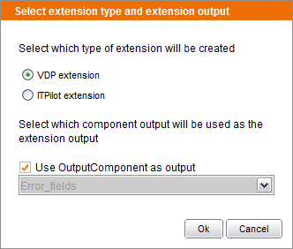

================================
Exporting a Flow as an Extension
================================

Extensions can be programmed directly in Java (see :doc:`/itpilot/developer/index` for further
information), or they can be created as regular wrappers. The rest of
this section will describe the second option.

Create the wrapper that implements the extension as a regular wrapper.
Once the wrapper is completed, select the “File->Save as extension” menu
option. A dialog will appear prompting for the following information
(see `Selecting the extension type and its output`_):

-  Extension type: select between Virtual DataPort extension and ITPilot
   extension.
-  Extension output: select the component of the wrapper that will
   generate the extension output. Checking the “Use OutputComponent as
   output” option will automatically select the output component.

   Selecting the extension type and its output

When the dialog is accepted, the system will show a file chooser to
specify the target directory and filename to save the jar file
containing the generated extension. The saved jar can now be imported in
ITPilot or Virtual DataPort to start using the new extension.
