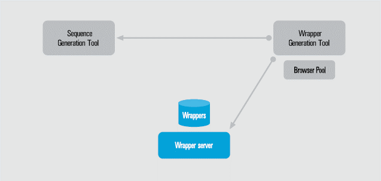
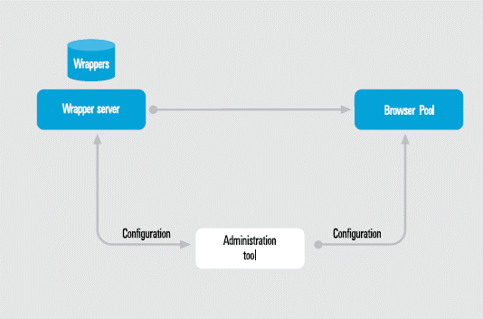
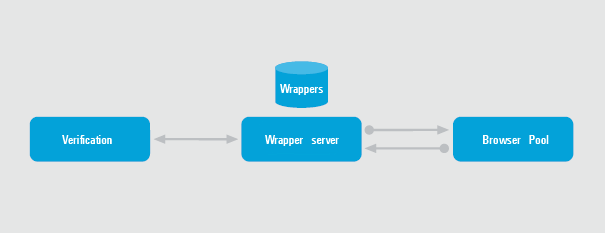

============================
Distribution of Environments
============================

Distribution of the Generation Environment
==========================================

As mentioned in the preceding section, the Generation Environment allows
wrappers to be created in a visual and simple way. This environment
requires the installation of two components: the Wrapper Generator tool
and the Sequences Generator tool. The Wrapper Server of the execution
environment may also be accessible (this is optional: users also have
the option of storing the wrapper in a local file that can be manually
added to the Wrapper Server). `Distribution of the Generation
Environment`_ shows the relationship between the elements.

   Distribution of the Generation Environment

The Wrapper Server belongs to the execution environment, whereby it is
normally installed in a separate machine in the production environment.

This manual does not aim to explain how to install, operate and handle
the tools in this environment. For more information please refer to
the :doc:`/itpilot/generation_environment/index` for instructions on installation and operation and
:doc:`/itpilot/dextl/index`
and :doc:`/itpilot/nseql/index` for detailed information on specification and sequence
definition languages.

Distribution of the Execution Environment
=========================================

Denodo ITPilot operates in the execution environment, where actions are
executed on wrappers that encapsulate the Web sources from which data
are to be extracted. Three components are required in this case: the Web
administration tool (independent of the environment, but used here), the
Wrapper Server and the Browser Pool. `Distribution of the Execution
Environment`_ describes the relationship between these elements.

   Distribution of the Execution Environment

As the Wrapper Server can be used in different environments and due to
its possible workload, it is recommended that it be installed in a
machine that is independent of the rest of the system. The Browser Pool
can be found either in the same machine as the Wrapper Server or in a
separate machine; in general, this depends on the maximum number of
browsers that can be open during system execution.

Distribution of the Verification Environment
============================================

This environment should be executed together with the execution
environment and allows ITPilot to monitor changes in sources from which
data are extracted (see section :ref:`Verification Environment`). The
Verification Server can be executed in the same machine as the Wrapper
Server, although it is a distributed component, whereby we recommend
that it be installed in another machine.

.. important:: The ITPilot Verification Server has been deprecated and may be removed in the next version of the Denodo Platform.

`Relationship Between Execution and Verification Environments`_ shows
the relationship between this environment and the execution environment.

   Relationship Between Execution and Verification Environments

The basic process of the Verification Server is the following: when
executing a query against a wrapper, it is sent along with the produced
results to the verification module. When this module receives the query
and associated results, they will be stored in a relational database
and, at the same time, the necessary tests will be executed in order to
determine whether that wrapper has changed or not.

Each test (configurable by the user, see section :ref:`Configuring the
Verification server`) is executed by handing that query plus its
results as parameters. Each test returns a result between 0 and 100
(where 0 means that the condition is not accomplished at all and 100
that is absolutely successful) which is stored in a result manager.

Next, an evaluating process is launched which determines if the wrapper
has changed in terms of the results of the tests. This evaluator needs
both the results from the last tests, and the evaluation rules.

When the query results are saved in the database, an expiry time is
assigned to each of them. The expired results are deleted on a period
basis.

The next section describes the installation steps for each of the
components.

