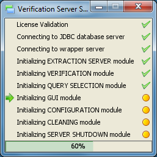
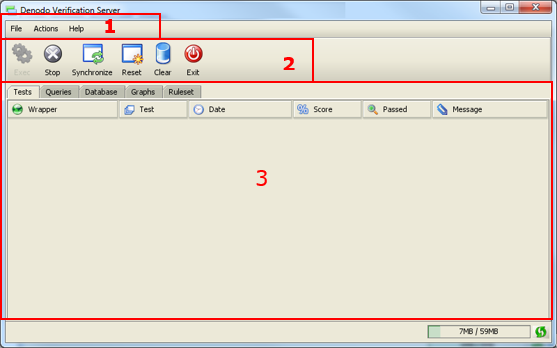

=================================
An Overview of the Graphical Tool
=================================

Alter following the steps described in section :ref:`Starting up the
Verification server with a graphical tool`, the graphical tool will be
started together with the Verification server. Please remember that the
Verification Server cannot be already running. `Verification Graphical
Tool Loading Window`_ shows the window that appears right after
starting.

   Verification Graphical Tool Loading Window

   Main elements of the Verification Graphical Tool

The main screen of the verification configuration and monitoring tool is
divided in three main areas, as shown in `Main elements of the
Verification Graphical Tool`_.

1. Menu: The menu gives access to all functionalities of the administration tool.

   -  File:

      -  Close GUI
      
      -  Exit Application

   -  Actions:

     -  Enable Verification Server engine: it starts the Verification Server
     -  Stop Verification Server: it stops the Verification Server
     -  Wrapper server synchronization: it executes a synchronization process
        with the Wrapper Server.
     -  Database clean & resynchronization: it cleans a re-synchronizes the
        verification database.
     -  Clear screen information
    
   -  Help:

      -  About

2. Actions Buttons:

   -  **Exec**: it starts the Verification Server.
   -  **Stop**: it stops the Verification Server
   -  **Synchronize**: it executes a synchronization process with the
      Wrapper Server
   -  **Reset**: it cleans and re-synchronizes the verification database
   -  **Clear**: it clears the screen information
   -  **Exit**

3. Main tabs: this is the main area of the tool, from where all information
   about wrappers being verified can be configured, and where all their
   rules can be configured (this action is identical to the one offered in
   the Web Administration tool, in section :ref:`Configuring the Verification
   server`) and monitored.

   -  Tests: this tab shows information about each of the performed
      executions, and the configured test results obtained after each
      execution.
   -  Queries: this tab shows information about the different queries
      performed.
   -  Database: this tab shows all information stored in the verification
      database.
   -  Graphs: this tab lets users create different graphs from both the
      wrappers and tests that are executed in a specific period of time.
   -  Ruleset: lets users create and configure different rules, required by
      the Verification Server.
