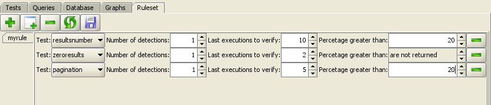

=============================================
Configuration of the Verification Environment
=============================================

The ITPilot automatic Verification Server allows to crate rulesets to
check if the sources have changed and the wrappers are not extracting
the correct results. The administrator may create as many rules as
necessary, and they can affect a single wrapper or the complete set.

   Rule Configuration in the Verification Graphic Tool

`Rule Configuration in the Verification Graphic Tool`_ shows an example,
in which a rule has been defined; this rule is composed by three tests.
For more information about each of the rules, please read section
:ref:`Rules Configuration`. Though defining the rules from the web
administration tool is highly recommended, this action can also be
performed from the monitoring tool:

#.  |image1| *Addition of a new rule*: it creates a new rule for all wrappers in the database, or for a specific one.

#.  |image2| *Addition of a new test*: it creates a new test in the selected rule.

#.  |image3| *Rule deletion*: it deletes the selected rule, without deletion confirmation. After deleting the rule, the |image4| button (“Rule storage”) must be pressed to confirm changes.

#.  |image5| *Return to Previous State*: it goes back to the previous stored state, getting rid of the latest changes.

#.  |image6| *Rule storage*: it stores the latest changes.

#.  |image7| *(to the right of each test) Test deletion*: after deleting the test, the |image8| button (“Rule storage”) must be pressed to confirm changes.

.. |image1| image:: DenodoITPilot.UserGuide-49.png

.. |image6| image:: DenodoITPilot.UserGuide-54.png

.. |image8| image:: DenodoITPilot.UserGuide-56.png
