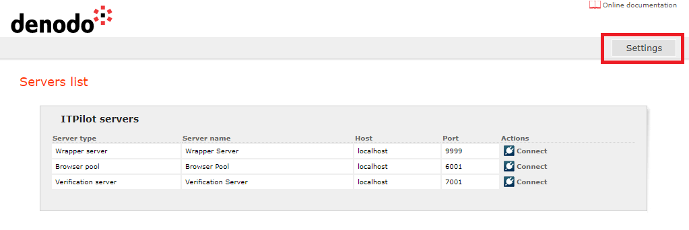
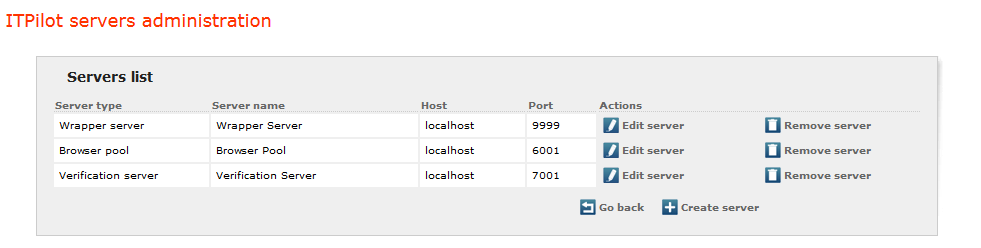
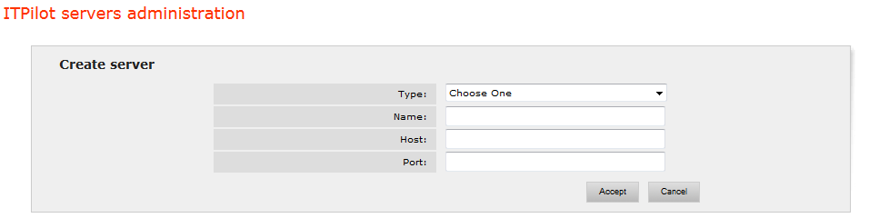

====================================
Adding, Editing and Deleting Servers
====================================

In order for the user to connect to a server and be able to configure
it, that server must be known to the web administration tool, and must
be started and running.

Once the Denodo ITPilot administration tool has started up, it is possible to
configure some parameters that affect this tool by clicking on *Settings*. 
It is important to note that only users with the
maximum privileges (administrator permissions) may access these
sections.

To access the configuration of the Denodo ITPilot administration tool a screen
(`Denodo ITPilot login screen to administrate the web tool`_) is shown in which the user will
have to enter his/her credentials. There is one predefined user for this web
administration tool with login “admin” and password initially set
to “admin” (which can be changed after the user logs in by clicking on
the button *Change password*). 

.. figure:: DenodoITPilot.UserGuide-2.png
   :align: center
   :alt: Denodo ITPilot login screen to administrate the web tool
   :name: Denodo ITPilot login screen to administrate the web tool

   Denodo ITPilot login screen to administrate the web tool

   Denodo ITPilot Admin Tool Settings

Clicking the |image0| button, located below the server list,
will show the page depicted in `ITPilot servers administration page`_.

   ITPilot servers administration page

To add a new server to the tool, the user should click on the |image2|
button located below the server list (see `ITPilot servers
administration page`_). He will be asked for the following information:

-  Type: the type of the server being added: Wrapper Server, Browser
   pool or Verification Server.
-  Name: server name. Used only to identify it within the web
   administration tool.
-  Host: host name or host address where it can be found.
-  Port: server listening port.

   Server Addition Page

This information (except the name) can be modified later by clicking on
the |image4| button.

Any number of servers can be added as needed, although the architectural
considerations in section :ref:`Distribution of Environments` of this
document should be taken into account.

Servers can be deleted from the administration tool by clicking on their
associated |image5| buttons.

