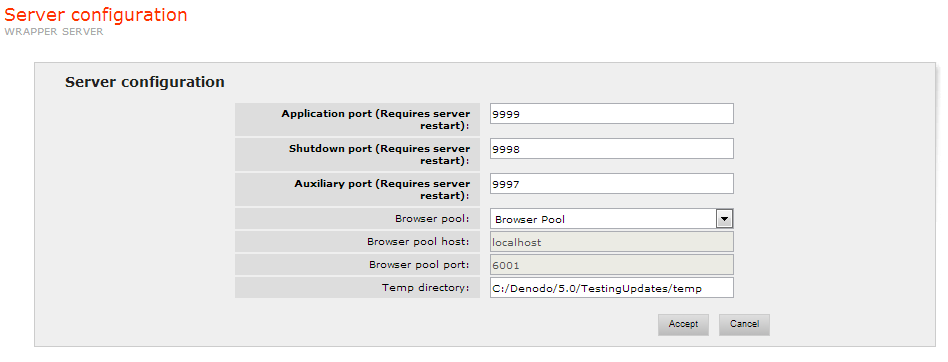

=====================================
Server Configuration (Wrapper Server)
=====================================

This section allows the user to manage several server-wide configuration
parameters:

-  Application Port: port through which the Wrapper Server listens and
   waits for requests.
-  Shutdown Port: port through which the server listens and waits for
   the Shutdown signal.
-  Auxiliary Port: used for communications between the Browser Pool and
   the Wrapper Server.
-  Browser pool, Browser pool host and Browser pool port: the Wrapper
   Server requests browser instances to the Browser Pool Server when a
   wrapper that performs web browsing is executed. The administration
   tool allows configuring what Browser Pool Server is going to receive
   the Wrapper Server requests, by using the selector “Browser” (see
   `Wrapper Server configuration`_). This selector displays all the
   Browser Pool Servers known to the web administration tool plus the
   options “none” and “custom”. Choose “none” in the selector if no
   browser pool will be used and “custom” to enter custom host and port
   values.
-  Temp directory: allows specifying a directory to store temporal data
   like the HTML documents generated by PDF or Word/Excel converters.
   Also, the Save File component saves files to this directory if no
   particular directory is specified in the component configuration.

   Wrapper Server configuration

