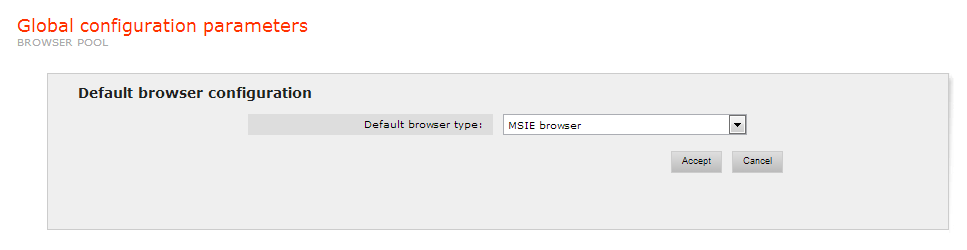
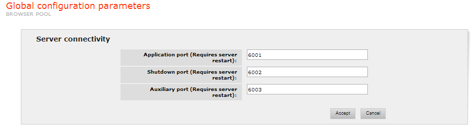

===================================
Global Configuration Parameters
===================================

Default Browser Configuration
=================================================================================

This parameter determines the browser type to be used by default in the
pool server (it will be used by the wrappers configured to use the
‘default’ browser type, instead of some specific browser type chosen at
wrapper-creation time). The available options are:

-  MSIE Browser: Microsoft Internet Explorer browser.
-  Denodo Browser: the Denodo GUI-less browser.

   Browser type configuration

Server Connectivity
=================================================================================

The parameters of this group are:

-  Application Port: port in which the Browser Pool listens to requests.
-  Shutdown Port: port in which the server listens the Shutdown signal
   in order to be stopped.
-  Auxiliary Port: the auxiliary port is used by the pool for
   communications with its clients.

`Server connectivity configuration`_ shows the administration tool page
where to configure those parameters.

   Server connectivity configuration

PDF Conversion Configuration
=================================================================================

The parameters of this group allow configuring the conversion tools from
PDF to HTML so that the content of those resources can be extracted by
ITPilot:

-  PDF To HTML converter: default conversion tool type used to transform
   the PDF resource into HTML

   -  Acrobat HTML: uses the HTML conversion tool from the Adobe Acrobat
      Professional software (it is required that this product be
      installed).
   -  Acrobat Text: uses the plain text conversion tool from the Adobe
      Acrobat Professional software, from which ITPilot generates an HTML
      file (it is required that this product is installed).
   -  PDFBox 0.7.3 and PDFBox 1.X: use the PDFBox library (`Apache PDFBox - A Java PDF Library <https://pdfbox.apache.org/>`_) - bundled with the Denodo Platform - to
      generate the HTML page. Version 1.X of PDFBox (currently PDFBox 1.6)
      is available since ITPilot 4.7; version 0.7.3 was included in
      previous releases of ITPilot and is still available.

-  Conversion Server port: port where the PDF Conversion Server will be
   listening from.

-  Acrobat Prof. Plugins Directory: path where the Acrobat Professional
   plugins reside.

Word / Excel Conversion Configuration
=================================================================================

The parameters of this group allow configuring the conversion tools from
Microsoft Word/Excel to HTML so that the content of those resources can
be extracted by ITPilot:

-  Open Office Directory: path to the OpenOffice installation. Open
   Office is used for the conversions from Microsoft Word and Microsoft
   Excel to HTML.

Conversion Configuration
=================================================================================

The parameters of this group allow setting conversion options that apply
to all converters:

-  Remove the temporal files generated by the PDF, Word and Excel
   converters: if selected, the temporal html files generated in
   document conversions are deleted when the wrapper ends its execution.
   If it is not selected, the files will remain in the temporal
   directory.
