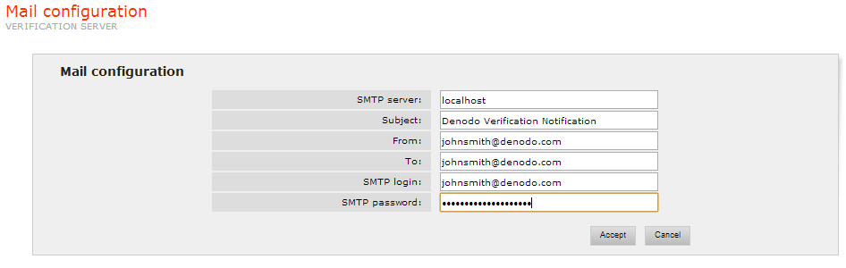

======================
Mail Configuration
======================

These parameters will be used to notify via e-mail those changes
detected in the sources:

-  SMTP Server: name of the mail server
-  From: e-mail address from which the notification is emitted.
-  To: e-mail address to which the notification is sent.
-  Subject: e-mail subject.
-  SMTP Login (optional): login to be used in the SMTP Server if it
   requires authentication.
-  SMTP Password (optional): password to be used in the SMTP Server if
   it requires authentication.

`Wrapper Change Notification Parameters`_ shows the configurable
parameters in this Verification Server section.

   Wrapper Change Notification Parameters

