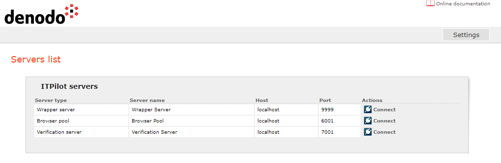

=======================
Web Administration Tool
=======================

.. toctree::
   :hidden:
   
   adding_editing_and_deleting_servers/adding_editing_and_deleting_servers.rst
   configuring_the_browser_pool_server/configuring_the_browser_pool_server.rst
   configuration_of_the_wrapper_server/configuration_of_the_wrapper_server.rst
   configuring_the_verification_server/configuring_the_verification_server.rst
   

The ITPilot administration tool allows managing the execution and
verification environments in a simple and uniform way. It is a web
application which controls the Wrapper Server and the Browser Pool, as
well as the Verification Server, if the latter is deployed.

After the user enters the tool, the page depicted in `Main page of the
Administration tool, showing the list of servers`_ is displayed.

   Main page of the Administration tool, showing the list of servers

This page shows the list of Wrapper Servers, Browser Pools and
Verification Servers known to the administration tool.

In order to administer a specific running server, the user should find
its entry in the list and connect to it by clicking on the Connect
|image2| button. If necessary, he will then be asked for the credentials
pertaining to that server. If the connection is successful, diverse
configuration options for the server will appear, structured as a series
of sections.

.. note:: In general, configuration changes made through the Web
   administration tool do not require the servers to be restarted.
   Properties which require the server to be restarted for changes to take
   effect are marked in the page with the text “(Requires server restart)”.

